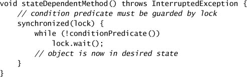

# Chapter 14. Building Custom Synchronizers

* The class libraries include a number of *state-dependent* classes - those having operations with *state-based preconditions* - such as `FutureTask`, `Semaphore`, and `BlockingQueue`.
* You can build your own synchronizers using the low-level mechanisms provided by the language and libraries, including intrinsic *condition queues*, explicit `Condition` objects, and the `AbstractQueuedSynchronizer` framework.

## 14.1 Managing State Dependence

* State-dependent operations that *block* until the operation can proceed are more convenient and less error-prone than those that simply fail.
  * The built-in condition queue mechanism enables threads to block until an object has entered a state that allows progress and to wake blocked threads when they may be able to make further progress.
* Structure of blocking state-dependent actions.

* A bounded buffer provides `put` and `take` operations, each of which has preconditions.

### 14.1.1 Example: Propagating Precondition Failure to Callers

* `GrumpyBoundedBuffer`: Bounded buffer that balks when preconditions are not met.
  * Exceptions are supposed to be for exceptional conditions => the caller must be prepared to catch exceptions and possibly retry for every buffer operation.
  * However, "Buffer is full" is not an exceptional condition for a bounded buffer.

* Client logic for calling `GrumpyBoundedBuffer`.
  * spin waiting versus oversleep.

### 14.1.2 Example: Crude Blocking by Polling and Sleeping

* `SleepyBoundedBuffer`: Bounded buffer using crude blocking.
  * => encapsulating precondition management and simplifying using the buffer.
  * Choosing the sleep granularity => responsiveness versus CPU usage.
  * => the caller should deal with `InterruptedException` => to support cancellation mechanism.
* It would be nice to have a way of suspending a thread but ensuring that is awakened promptly when a certain condition becomes true =>  *condition queues*.

### 14.1.3 Condition Queues to the Rescue

* *condition queue*: a group of threads called *wait set* waiting for a specific condition to become true.
* Each object can act as a condition queue, and the `wait`, `notify`, and `notifyAll` methods in `Object` constitute the API for intrinsic condition queues.
  * `Object.wait` atomically releases the lock and asks the OS to suspend the current thread, allowing other threads to acquire the lock and therefore modify the object state. Upon waking, it reacquires the lock before returning.
* `BoundedBuffer`: Bounded buffer using condition queues.

## 14.2 Using Condition Queues

### 14.2.1 The Condition Predicates

* To use condition queues =>identifying predicates that the object may wait for.
* Document the condition predicate(s) associated with a condition queue and the operations that wait on them.
* The `wait` method releases the lock, blocks the current thread, and waits until the specified timeout expires, the thread is interrupted, or the thread is awakened by a notification.
* Every call to `wait` is implicitly associated with a specific *condition predicate*.

### 14.2.2 Waking Up Too Soon

* A single intrinsic condition queue may be used with more than one condition predicate => returned not true, or returned spuriously.
* Canonical form for state-dependent methods.

### 14.2.3 Missed Signals

* missed signals => occurs when a thread must wait for a specific condition that is already true => result of coding errors.

### 14.2.4 Notification

* When wait on a condition => make sure someone will perform a notification whenever the condition predicate becomes true.
* Calling `notify` causes the JVM to select one thread waiting on that condition queue to wake up; calling `notifyAll` wakes up *all* the threads waiting on that condition queue.
* Use `notifyAll` in preference to single `notify`.
  * => more context switches and contended lock acquisitions for each event => performance concerns.
  * => optimize with *conditional notification*.

### 14.2.5 Example: A Gate Class

* Recloseable gate using `wait` and `notifyAll`.

### 14.2.6 Subclass Safety Issues

* A state-dependent class should either fully expose (and document) its waiting and notification protocols to subclasses, or prevent subclasses from participating in them at all.
* Prohibit subclassing => making the class `final` or hiding the condition queues, locks, and state variables from subclasses.

### 14.2.7 Encapsulating Condition Queues

* Encapsulate the condition queue so that it is not accessible outside the class hierarchy in which it is used.

### 14.2.8 Entry and Exit Protocols

* entry protocol => the operation's condition predicate.
* exit protocol => examining any state variables that have been changed by the operation to see if they might have caused some other condition predicate to become true, and if so, notifying on the associated condition queue.

## 14.3 Explicit Condition Objects

* `Condition` is a generalization of intrinsic condition queues.
  * mutiple threads might wait on the same condition queue for different condition predicates.
  * locking involves exposing the condition queue object.
* A `Condition` is associated with a single `Lock`; to create a `Condition`, call `Lock.newCondition` on the associated lock.
  * => multiple wait sets per lock, interruptible and uninterruptible condition waits, deadline-based waiting, and a choice of fair or nonfair queueing.
* `Condition` Interface.
  * The equivalent of `wait`, `notify`, and `notifyAll` for `Condition` objects are `await`, `signal`, and `signalAll`. However, `Condition` extends `Object`, which means that it also has `wait` and `notify` methods. Be sure to use the proper versions `await` and `signal` instead.

* Bounded buffer using explicit condition variables.
  * Using the more efficient `signal` instead of `signalAll`.

* Use `Condition` if you need its advanced features such as fair queueing or multiple wait sets per lock, and otherwise prefer intrinsic condition queues.

## 14.4 Anatomy of a Synchronizer

* `AbstractQueuedSynchronizer` (AQS) => `Semaphore`, `ReentrantLock`.
  * => act as a gate, allowing a limited number of threads to pass at a time.
  * => allow interruptible, uninterruptible, and timed acquisition attempts, fair and nonfair queueing of waiting threads.
  * => less implementation effort, more scalability.
