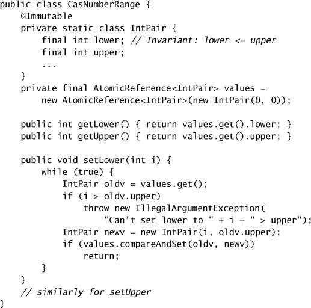
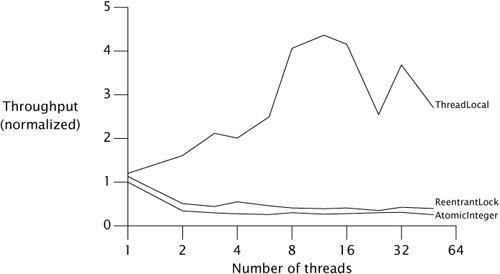
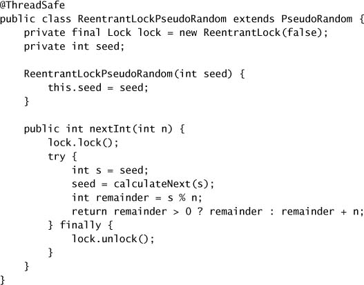
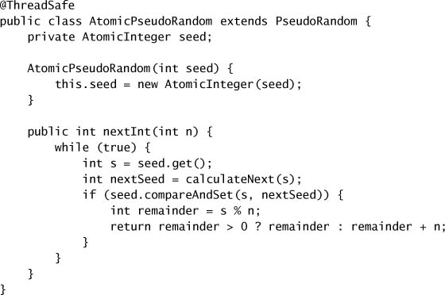

# Chapter 15. Atomic Variables and Nonblocking Synchronization

* Nonblocking algorithms => use low-level atomic machine instructions instead of lcoks.
  * => are used extensively in OS and JVMs for thread and process scheduling, garbage collection, and to implement locks and other concurrent data structures.
  * => offer significant scalability and liveness.
  * => reduce scheduling overhead because they don't block when multiple threads content for the same data.
  * => immune to deadlock and other liveness.
* Atomic variable classes
  * such as `AtomicInteger` and `AtomicReference`.
  * => better volatile variables.
  * => ideal for counters, sequence generators, and statistics gathering while offering better scalability than lock-based alternatives.

## 15.1 Disadvantages of Locking

* JVMs can *only* optimize uncontended lock acquisition and release fairly effectively.
* Volatile variables are lighter-weight and can provide similar visibility guarantees but they cannot be used to construct atomoic compound actions.
* *priority inversion*: a high-priority thread is blocked and waiting for a low-priority thread holding the lock.
* Locking => heavyweight for fine-grained operations.

## 15.2 Hardware Support for Concurrency

* The *optimistic* approach => hopeful you can complete it without interference => relies on *collision detection* => if fails, can retry it.
* Processors provide atomic *test-and-set*, *fetch-and-increment*, *swap* operations.
  * atomic read-modify-write instruction: *compare-and-swap*, *load-linked/store-conditional*.

### 15.2.1 Compare and Swap

* *compare-and-swap* (CAS) instruction
  * a memory location V on which to operation
  * the expected old value A
  * the new value B
  * => atomically updates V to the new value B only if the value in V matches the expected old value A.
  * => when multiple threads attempt, one wins and updates the variable's value, and the rest lose.

### 15.2.2 A Nonblocking Counter

* Nonblocking counter using CAS
  * => fetch the old value, transform it to the new value, use CAS to set the new value.
  * => if the CAS fails, the operation is immediately retried.
  * => the counter does not block, though it may have to retry several times.

* Executing a CAS from within the program involves no JVM code, system calls, or scheduling activity.

### 15.2.3 CAS Support in the JVM

* On platforms supporting CAS, the runtime inlines them into the appropriate machine instruction(s); in the worst case, if a CAS-like instruction is not available the JVM uses a spin lock.
* The low-level JVM support is used by the atomic variable classes.

## 15.3 Atomic Variable Classes

* Atomic variables
  * => limit the scope of contention to a single variable.
  * => the slow path is even faster than the slow path for locks because it does not involve suspending and rescheduling threads.
  * => support atomic conditional read-modify-write oprations.
  * e.g., `AtomicInteger`, `AtomicLong`, `AtomicBoolean`, `AtomicReference`.
* Atomic array classes
  * => element can be updated atomically.
* Atomic variable classes are mutable, whereas the primitive wrapper classes are immutable.

### 15.3.1 Atomics as "Better Volatiles"

* Preserving multi-variable invariants using CAS.

### 15.3.2 Performance Comparison: Locks Versus Atomic Variables

* The performance reversal between locks and atomics at differing levels of contention illustrates the strengths and weaknesses of each.
  * With low to moderate contention, atomics offer better scalability.
  * With high contention, locks offer better contention avoidance.
  * CAS-based algorithms outperform lock-based ones on single-CPU systems.
* `Lock` and `AtomicInteger` Performance Under High Contention.

* `Lock` and `AtomicInteger` Performance Under Moderate Contention.

* Random Number Generator Using `ReentrantLock`.

* Random Number Generator Using `AtomicInteger`.

