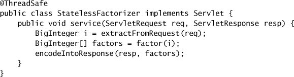
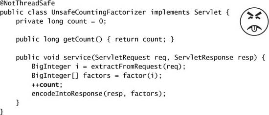
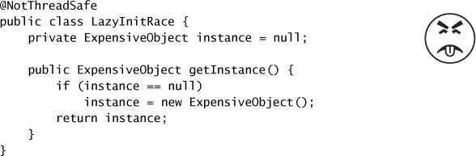
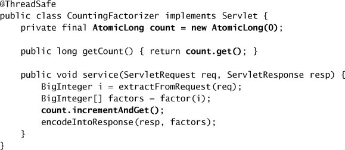

# Chapter 2. Thread Safety

* Writing thread-safe code => managing access to *shared, mutable state*.
  * An object's state: any data that can affect its externally visible behavior.
  * shared: could be accessed by multiple threads.
  * mutable: its value could change during its lifetime.
* Primary synchronization in Java: `synchronized`, `volatile` variables, explicit locks, atomic variables.
* Fix broken multi-threaded programs:
  * => Don't *share* the state variable across threads.
  * => Make the state variable *immutable*.
  * => Use *synchronization* whenever accessing the state variable.
* **It is far easier to design a class to be thread-safe than to retrofit it for thread safety later.**
* **It is always a good practice first to make your code right, and *then* make it fast.**
  * Pursue optimization only if your performance measurements and requirements tell you that you must, your optimizations actually made a difference under realistic conditions.

## 2.1 What is Thread Safety?

* Correctness := a class conforms to its specification.
  * A good specification := *invariants* constraining an object's state and *postcondition* describing the effects of its operations.
* A class is *thread-safe* if it behaves correctly when accessed from multiple threads, regardless of the scheduling or interleaving of the execution of those threads by the runtime environment, and with no additional synchronization or other coordination on the part of the calling code.
  * Thread-safe classes encapsulate any needed synchronization so that clients need not provide their own.
* Stateless objects are always thread-safe.

## 2.2 Atomicity

* `UnsafeCountingFactorizer` =>susceptible to *lost updates* (*read-modify-write* operation) => *race condition* => not thread-safe.
* **Race Conditions**
  * => don't *always* result in failure.
  * *check-then-act*: use a potentially stale observation to make a decision.
  * *lazy initialization*: defer initializing an object until it is actually needed + ensuring it is initialized only once => might use *check-then-act*.

* *compound actions* => if executed atomically => thread-safe.

* `java.util.concurrent.atomic` => *atomic variable* (e.g., `AtomicLong`, `AtomicReference`) => effecting atomic state transitions on numbers and object references.