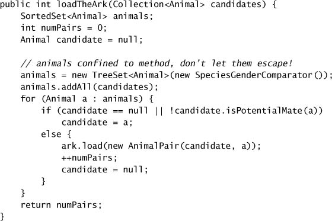
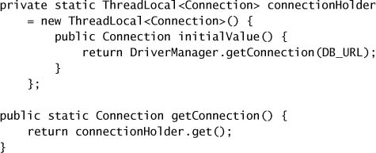

# Chapter 3. Sharing Objects

* Synchronization := *atomicity* ("critical sections") + *memory visibility*.
  * Prevent one thread from modifying the object's state when another is using it.
  * Ensure other threads can *see* the changes that were made by one thread.
* Sharing and publishing objects safely => objects are safely accessed by multiple threads.

## 3.1 Visibility

* There is *no* guarantee that the reading thread will see a value written by another thread on a timely basis.

* **Stale Data**: may see a stale value; even worse, not all-or-nothing => unexpected exceptions, corrupted data structures, inaccurate computations, infinite loops.

* **Nonatomic 64-bit Operations**
  * *out-of-thin-air safety*: a thread at least sees a value that was actually placed.
  * one exception: 64-bit numeric variables (`double` and `long`) => treaded as two separate 32-bit operations => not safe to share mutable `long` and `double` variables unless they are declared `volatile` or guarded by a lock.
* **Locking and Visibility**
  * Synchronize on a common lock => all threads see the most up-to-date values of shared mutable variables => predictable manner.
* **Volatile Variables**
  * A field declared `volatile` => not cached in places hidden from other processors (e.g., registers) => read of a volatile variable always returns the most recent write by any thread => updates to a variable are propagated predictably to other threads.
  * Accessing a volatile performs *no* locking => no block => `volatile` is lighter-weight than `synchronized`.
  * The visibility effects of volatile variables:
    * writing a volatile variable == exiting a `synchronized` block
    * reading a volatile variable == entering a `synchronized` block
  * Code using volatile variables => fragile, hard to understand => atomicity not guaranteed.
  * Use `volatile` variables only when they simplify implementing and verifying your synchronization policy; avoid when verifing correctness would require subtle reasoning about visibility.
    * => ensuring the visibility of one variable's own state.
      * e.g., checking a status flag to determine when to exit a loop.
    * or => indicating the start of an important lifecycle event.

## 3.2 Publication and Escape

* *publish*: make an object available to code outside its current scope, while internals *not* published.
* *escape*: publishing an object when it should not have been. 
* Any object that is *reachable* from a published object by following some chain of nonprivate field references and method calls has also been published.
* publication forms:
  * => store a reference in a public static field.
  * => return a reference from a nonprivate method.
  * => publish an inner class instance (that contains a hidden reference to the enclosing instance).
    * e.g., create and *start* a thread from one object's constructor.
    * e.g., call an overrideable instance method from the constructor.

## 3.3 Thread Confinement

* *thread confinement*: *not share* => thread-safe.
* **Ad-hoc Thread Confinement**
  * => entirely depend on the implementation.
  * => must enforce a single-threaded subsystem.
* **Stack Confinement**
  * => an object can only be reached through local variables => *within-thread* or *thread-local* usage.
  * => must ensure the referent does not escape.

* **`ThreadLocal`**
  * => provide `get` and `set` accessor methods.
  * => maintain a separate copy of the value for each thread that uses it => per-thread value with a value-holding object.
  * used to prevent sharing in designs based on mutable Singleton or global variables.
  * used when a frequently used operation requires a temporary object such as a buffer and wants to avoid reallocating the temporary object on each invocation.
  * `ThreadLocal<T>` == `Map<Thread,T>`
  * from a single-threaded application to a multi-threaded environment => convert shared global variables into `ThreadLocal`s => preserve thread safety.
  * `ThreadLocal` => like global variables => detract from reusability, hidden coupling among classes.

