# Chapter 4. Composing Objects

* Structuring classes => make them thread-safe, maintain them without accidentally undermining their safety guarantees.

## 4.1 Designing a Thread-safe Class

* The design process for a thread-safe class:
  * Identify the variables that form the object's state;
    * An object's state := its fields.
  * Identify the invariants that constrain the state variables;
  * Establish a policy for managing concurrent access to the object's state.
    * *synchronization policy* := what combination of immutability, thread confinement, locking used to maintain thread safety, which variables are guarded by which locks.
    * => defines how an object coordinates access to its state without violating its invariants or postconditions.
    * remember to document the synchronize policy.

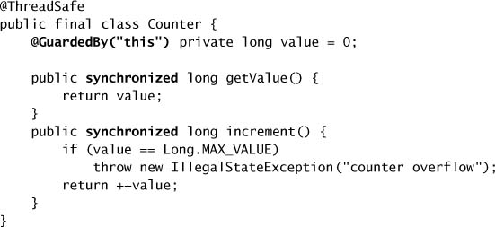

* **Gathering Synchronization Requirements**
  * state space := the range of possible states.
  * smaller state space => easier to reason.
  * using final fields or immutable objects => simpler to analyze the state space.
  * invariants and postconditions => additional synchronization or encapsulation requirements applied on state or state transitions.
* **State-dependent Operations**
  * use existing library classes => wait for state-based preconditions.
    * e.g., blocking queues, semaphores, synchronizers.
* **State Ownership**
  * publish a mutable object => no longer have exclusive control => shared ownership.
  * collection classes owns the state of the collection infrastructure, but client codes owns the objects stored in the collection.

## 4.2 Instance Confinement

* *Instance confinement* := encapsulating data within an object.
  * => confines access to the data to the object's method => combining with locking discipline => ensure used in a thread-safe manner.
  * => flexible choices of locking strategy => build thread-safe classes.
* Confined objects must not escape their intended scope.
  * e.g., `Collections.synchronizedList` wraps `ArrayList` => Decorator pattern => the wrapper object holds the only reachable reference to the underlying collection => thread-safe collection.

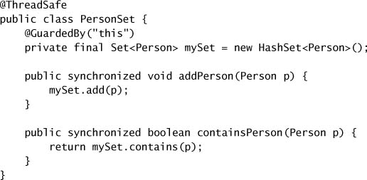

* **The Java Monitor Pattern**
  * An object encapsulates all its mutable state and guards it with the object's own intrinsic lock.
  * Using a private lock => client code cannot acquire it.

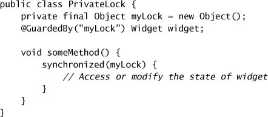

* **Example: Tracking Fleet Variables**
  * Even though `MutablePoint` is not thread-safe, the tracker class is.
    * Neigher the map nor any of the mutable points it contains is ever published.
    * This copies mutable data before returning it to the client.

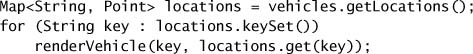

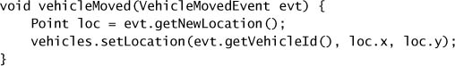

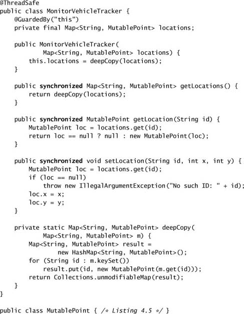

## 4.3 Delegating Thread Safety

* Composing classes out of objects that are thread-safe.
  * e.g., `CountingFactorizer` *delegates* its thread safety responsibilities to the `AtomicLong`: `CountingFactorizer` is thread-safe because `AtomicLong` is.
* **Example: Vehicle Tracker Using Delegation**
  * a thread-safe `Map` implementation `ConcurrentHashMap` > `HashMap`
  * an immutable `Point` > `MutablePoint`
  * this implementation does not use any explicit synchronization.
  * this version returns an unmodifiable but live view of the vehicle locatiosn instead of snapshot of the locations.
  * if an unchanging view of the fleet is required, `getLoctaions` could instead return a shallow copy of the `locations` map.

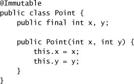

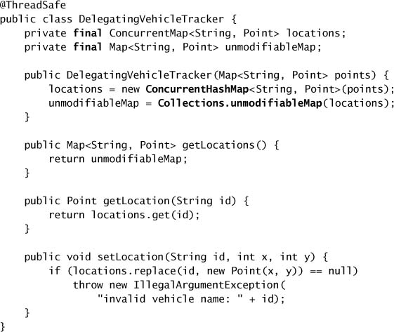

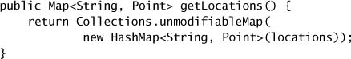

* **Independent State Variables**
  * if underlying state variables are *independent* => we can delagate thread safety to them.
  * `CopyOnWriteArrayList`: a thread-safe `List` implementation suited for managing listener lists.

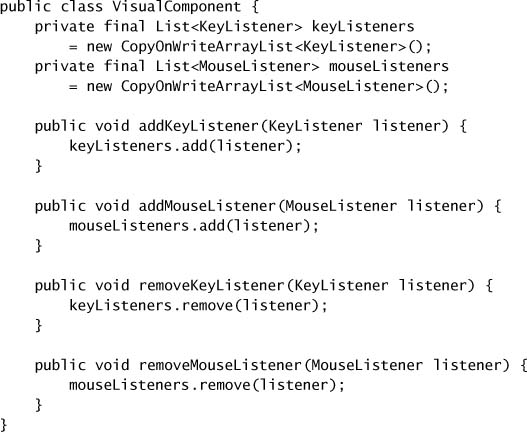

* **When Delegation Fails**
  * When additional constraints are imposed
    * e.g., that the first number be less than or equal to the second.
    * Both `setLower` and `setUpper` are check-then-act sequences => insufficient locking to make them atomic.

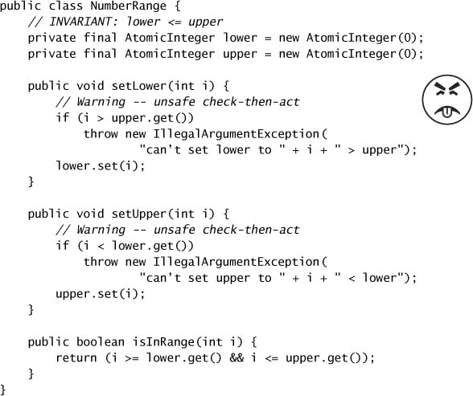

* **Publishing Underlying State Variables**
  * If a state variable is thread-safe, does not participate in any invariants that constrain its value, and has no prohibited state transitions for any of its operations, then it can safely be published.
* **Example: Vehicle Tracker that Publishes Its State**
  * The contents of the `Map` are thread-safe mutable points rather than immutable ones.
  * The `getLocation` method returns an unmodifiable copy of the underlying `Map` => callers can change the location of one of the vehicles by mutating the `SafePoint` values in the returned `Map`.
  * Live nature may be a benefit or a drawback, depending on the requirements.

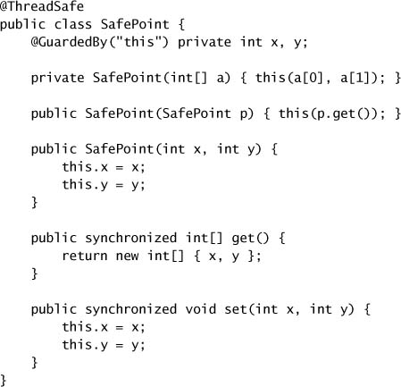

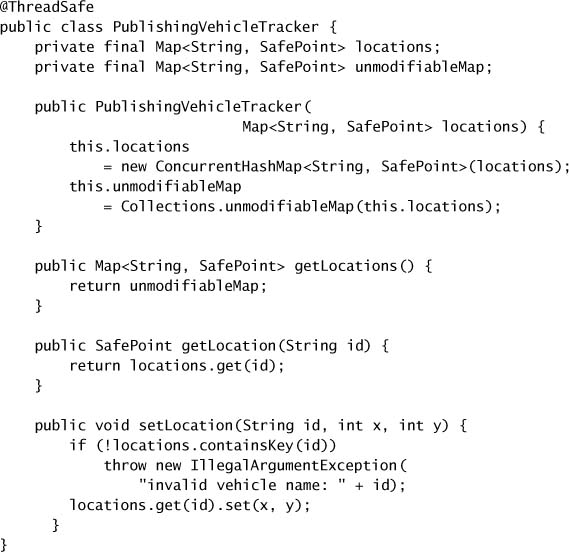

