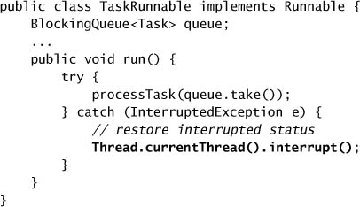
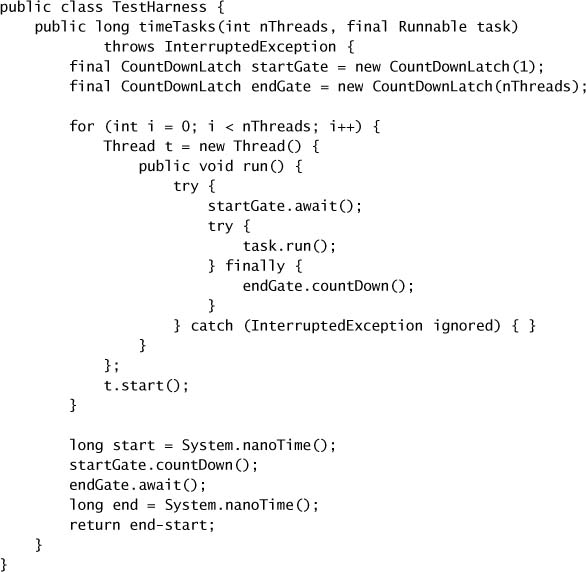
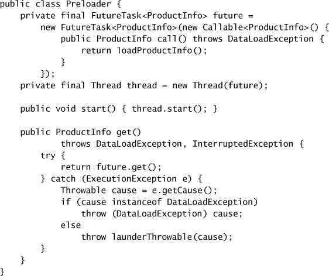
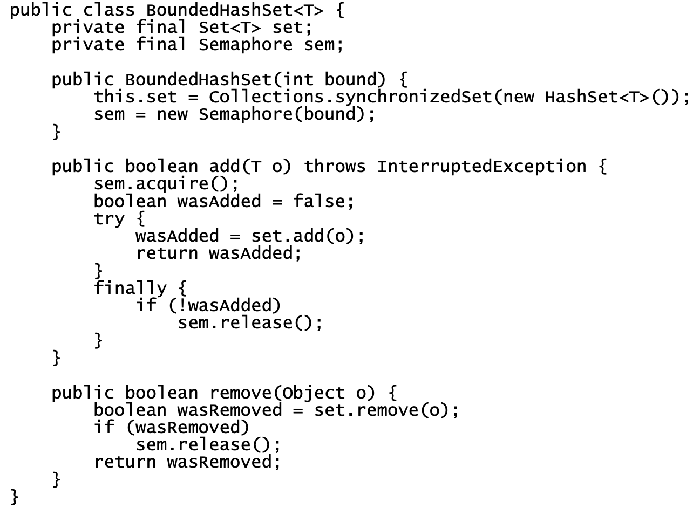
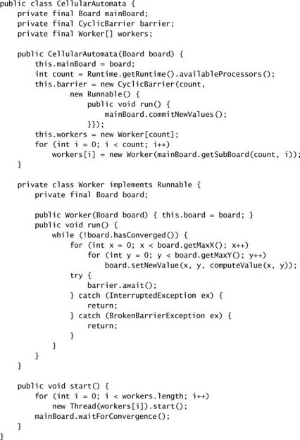

# Chapter 5. Building Blocks

* Concurrent building blocks := thread-safe collections + *synchronizers* that can coordinate the control flow of cooperating threads.

## 5.1 Synchronized Collections

* *synchronized collection classes* := `Vector`, `Hashtable`, the synchronized wrapper classes created by the `Collections.synchronizedXxx` factory methods.
* **Problems with Synchronized Collections**
  * sometimes need additional client-side locking to guard compound actions.
  * common compound actions like iteration, navigation, put-if-absent are technically thread-safe, but may not behave as expected.

* **Iterators and ConcurrentModificationException**
  * Iterate a `Collection` with an `Iterator` => multiple threads can concurrently modify it.
  * The iterators returned by the synchronized collections are *fail-fast* => they throw unchecked `ConcurrentModificationException` when they detect that the collection has changed since iteration began => they don't deal with concurrent modification.
  * Locking a collection during iteration may be undesirable => starvation, deadlock risk, hurts application scalability.
  * An alternative is to clone the collection and iterate the copy instead => thread-confined => no `ConcurrentModificationException`.
* **Hidden Iterators**
  * You have to remember to use locking everywhere a shared collection might be iterated.
  * If hidden iterator wrapped with a `synchronizedXxx`, encapsulating the synchronization, this sort of error would not occur.
  * Iteration is indirectly invoked by
    * `toString`, `hashCode` and `equals` methods.
    * `containsAll`, `removeAll`, `retainAll`.
    * constructors that take collections are arguments.

## 5.2 Concurrent Collections

* Synchronized collections => serialize all access to the collection's state => poor concurrency.
* Concurrent collections => finer-grained locking mechanism => allow a greater degree of shared access => dramatic scalability improvements with little risk.
  * `ConcurrentHashMap`: a replacement for synchronized hash-based `Map` implementations.
  * `CopyOnWriteArrayList`: a replacement for synchronized `List` implementations where traversal is the dominant operation.
  * `ConcurrentMap`: support common compound actions.
  * `Queue`: hold a set of elements temporarily while they await processing.
  * `BlockingQueue`: extends `Queue` to add blocking insertion and retrieval operations.
* **ConcurrentHashMap**
  * *lock striping* => better concurrency and scalability.
  * The iterators returned by `ConcurrentHashMap` are *weakly consistent* => may reflect modifications during iteration => tolerate concurrent modification.
  * `size` and `isEmpty` are allowed to return an approximation instaed of exact result => similarly weakened operations also include `get`, `put`, `containsKey`, and `remove`.
  * Can not lock the map for exclusive access
* **Additional Atomic Map Operations**
  * If you find yourself adding compound functionality to an existing synchronized `Map` implementation, you should consider using a `ConcurrentMap` instead.
* **CopyOnWriteArrayList**
  * => effectively immutable => after safely published => create and republish a new copy of the collection every time it is modified => reasonable to use *only* when iteration is far more common than modification.
    * e.g., event-notification systems => iterating a lits of registered listeners and calling each one of them.
  * The iterators returned by `CopyOnWriteArrayList` do not throw `ConcurrentModificationException` and return the elements exactly as they were at the time the iteartor was created.

## 5.3 Blocking Queues and the Producer-consumer Pattern

* Blocking queues provides
  * blocking `put` and `take` methods.
  * timed equivalents `offer` and `poll`.
* Queues can be
  * bounded => blocking.
  * unbounded: never full => never blocks.
* *Producer-consumer* design pattern
  * supported by blocking queues.
  * producers: place data onto the queue as it becomes available.
  * consumers: retrieve data from the queue when they are ready to take the appropriate action.
* `BlockingQueue` implementations
  * ``LinkedBlockingQueue`, `ArrayBlockingQueue` analogous to `LinkedList` and `ArrayList`, but with better concurrent performance.
  * `PriorityBlockingQueue` is a priority-ordered queue.
  * `SynchronousQueue` provides no storage space, but maintains a list of queued *threads* waiting to enqueue or dequeue an element => producers handoff task to consumers directly.
* **Example: Desktop Search**

* **Serial Thread Confinement**
  * a thread-confined object is owned exclusively by a single thread, but that ownership can be transferred by publishing it safely.
  * Object pools exploit thread confinement => transfer ownership from thread to thread.
* **Deques and Work Stealing**
  * `Deque` and `BlockingDeque` extends `Queue` and `BlockingQueue`.
  * Implementations := `ArrayDeque` and `LinkedBlockingDeque`
  * *work stealing* := every consumer has its own deque; if one exhausts the work, it can steal work from the *tail* of someone else's deque.
  * => well suited to problems in which consumers are also producers.

## 5.4 Blocking and Interruptible Methods

* Threads *block*, or pause, for:
  * waiting for I/O completion,
  * waiting to acquire a lock,
  * waiting to wake up from `Thread.sleep`,
  * waiting for the result of a computation in another thread.
* Thread states := `BLOCKED`, `WAITING`, `TIMED_WAITING`.
* `InterruptedException` thrown by `put` and `take` of `BlockingQueue` and `Thread.sleep`.
* `InterruptedException` => it is a blocking method =>it will make an effort to stop blocking early if it is *interrupted*.
* Respond to interruption:
  * Propagate the InterruptedException.
  * Restore the interrupt.
    * e.g., restore the interrupted status by calling `interrupt` on the current thread.

## 5.5 Synchronizers

* *synchronizer*: an object that coordinates the control flow of threads based on its state.
  * e.g., blocking queues, semaphores, barriers, latches.
* **Latches**
  * a synchronizer that can delay the progress of threads until it reaches its *terminal state*.
  * used when
    * ensuring that a computation does not proceed until resources it needs have been initialized.
    * ensuring that a service does not start until other services on which it depends have started.
    * waiting until all the parties involved in an activity.
  * `CountDownLatch` := a positive number representing the number of events to wait for.
    * `countDown` decrements the counter => an event has occurred.
    * `await` blocks and waits for the counter to reach zero, or the waiting thread is interrupted, or the wait times out.
    * => allow one or more threads to wait for a set of events to occur.

* **FutureTask**: acts like a latch, implements `Future`, which describes an abstract result-bearing computation.
  * implemented with a `Callable`, the result-breaing equivalent of `Runnable`.
  * `Future.get` returns the result immediately if it is completed, or blocks until the task transitions to the completed state.
  * => waits and conveys the result from the executing thread => guarantees the result to be safely published.
  * => can represent asynchronous tasks or any potentially lengthy computation that can be started before the results are needed.

* **Semaphores**
  * => control the number of activities that can access a certain resource or perform a given action *at the same time*.
  * => can be used to implement resource pools or to impose a bound on a collection.
    * e.g., database connection pools, bounded buffer.
  * `Semaphore` := a set of virtual *permits* => activities acquire or release permits.
    * binary semaphore == *mutex*
  * => can turn any collection into a blocking bounded collection.

* **Barriers**
  * wait for *other threads* come together at a barrier *at the same time*.
  * `CyclicBarrier`: allows a fixed number of parties to rendezvous repeatedly at a *barrier point*.
    * => useful in parallel iterative algorithms that break down a problem into a fixed number of independent subproblems.
    * `await` until *all* the threads have reached the barrier point
      * => if times out or a thread is interrupted, all calls to `await` terminate with `BrokenBarrierException`.
      * => if successfully passed, release the barrier and return a unique arrival index for each thread => to be used to elect a leader.
    * => also allow a `Runnable` *barrier action* before releasing blocked threads.
  * `Exchanger` := a two-party barrier in which the parties exchange data at the barrier point.
    * => useful when parties perform asymmetric activities.
      * e.g., one thread fills a buffer with data and the other consumes the data from the buffer.

