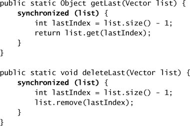
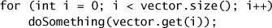
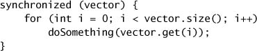
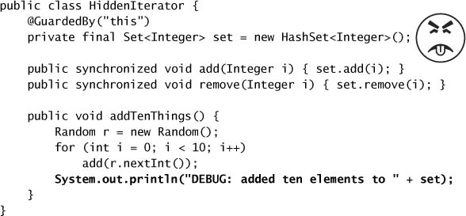
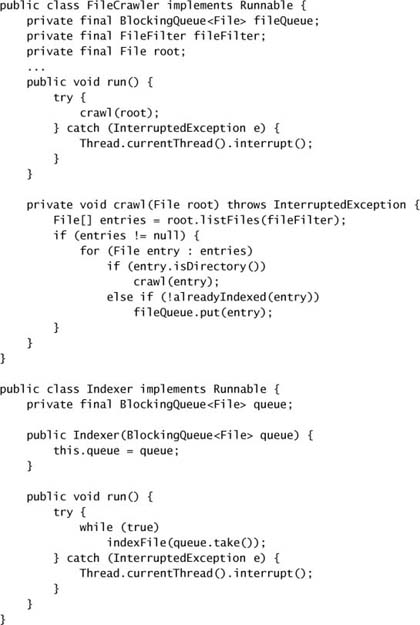

# Chapter 5. Building Blocks

* Concurrent building blocks := thread-safe collections + *synchronizers* that can coordinate the control flow of cooperating threads.

## 5.1 Synchronized Collections

* *synchronized collection classes* := `Vector`, `Hashtable`, the synchronized wrapper classes created by the `Collections.synchronizedXxx` factory methods.
* **Problems with Synchronized Collections**
  * sometimes need additional client-side locking to guard compound actions.
  * common compound actions like iteration, navigation, put-if-absent are technically thread-safe, but may not behave as expected.

* **Iterators and ConcurrentModificationException**
  * Iterate a `Collection` with an `Iterator` => multiple threads can concurrently modify it.
  * The iterators returned by the synchronized collections are *fail-fast* => they throw unchecked `ConcurrentModificationException` when they detect that the collection has changed since iteration began => they don't deal with concurrent modification.
  * Locking a collection during iteration may be undesirable => starvation, deadlock risk, hurts application scalability.
  * An alternative is to clone the collection and iterate the copy instead => thread-confined => no `ConcurrentModificationException`.
* **Hidden Iterators**
  * You have to remember to use locking everywhere a shared collection might be iterated.
  * If hidden iterator wrapped with a `synchronizedXxx`, encapsulating the synchronization, this sort of error would not occur.
  * Iteration is indirectly invoked by
    * `toString`, `hashCode` and `equals` methods.
    * `containsAll`, `removeAll`, `retainAll`.
    * constructors that take collections are arguments.

## 5.2 Concurrent Collections

* Synchronized collections => serialize all access to the collection's state => poor concurrency.
* Concurrent collections => finer-grained locking mechanism => allow a greater degree of shared access => dramatic scalability improvements with little risk.
  * `ConcurrentHashMap`: a replacement for synchronized hash-based `Map` implementations.
  * `CopyOnWriteArrayList`: a replacement for synchronized `List` implementations where traversal is the dominant operation.
  * `ConcurrentMap`: support common compound actions.
  * `Queue`: hold a set of elements temporarily while they await processing.
  * `BlockingQueue`: extends `Queue` to add blocking insertion and retrieval operations.
* **ConcurrentHashMap**
  * *lock striping* => better concurrency and scalability.
  * The iterators returned by `ConcurrentHashMap` are *weakly consistent* => may reflect modifications during iteration => tolerate concurrent modification.
  * `size` and `isEmpty` are allowed to return an approximation instaed of exact result => similarly weakened operations also include `get`, `put`, `containsKey`, and `remove`.
  * Can not lock the map for exclusive access
* **Additional Atomic Map Operations**
  * If you find yourself adding compound functionality to an existing synchronized `Map` implementation, you should consider using a `ConcurrentMap` instead.
* **CopyOnWriteArrayList**
  * => effectively immutable => after safely published => create and republish a new copy of the collection every time it is modified => reasonable to use *only* when iteration is far more common than modification.
    * e.g., event-notification systems => iterating a lits of registered listeners and calling each one of them.
  * The iterators returned by `CopyOnWriteArrayList` do not throw `ConcurrentModificationException` and return the elements exactly as they were at the time the iteartor was created.

## 5.3 Blocking Queues and the Producer-consumer Pattern

* Blocking queues provides
  * blocking `put` and `take` methods.
  * timed equivalents `offer` and `poll`.
* Queues can be
  * bounded => blocking.
  * unbounded: never full => never blocks.
* *Producer-consumer* design pattern
  * supported by blocking queues.
  * producers: place data onto the queue as it becomes available.
  * consumers: retrieve data from the queue when they are ready to take the appropriate action.
* `BlockingQueue` implementations
  * ``LinkedBlockingQueue`, `ArrayBlockingQueue` analogous to `LinkedList` and `ArrayList`, but with better concurrent performance.
  * `PriorityBlockingQueue` is a priority-ordered queue.
  * `SynchronousQueue` provides no storage space, but maintains a list of queued *threads* waiting to enqueue or dequeue an element => producers handoff task to consumers directly.
* **Example: Desktop Search**

* **Serial Thread Confinement**
  * a thread-confined object is owned exclusively by a single thread, but that ownership can be transferred by publishing it safely.
  * Object pools exploit thread confinement => transfer ownership from thread to thread.
* **Deques and Work Stealing**
  * `Deque` and `BlockingDeque` extends `Queue` and `BlockingQueue`.
  * Implementations := `ArrayDeque` and `LinkedBlockingDeque`
  * *work stealing* := every consumer has its own deque; if one exhausts the work, it can steal work from the *tail* of someone else's deque.
  * => well suited to problems in which consumers are also producers.
