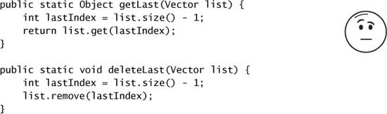

# Chapter 5. Building Blocks

* Concurrent building blocks := thread-safe collections + *synchronizers* that can coordinate the control flow of cooperating threads.

## 5.1 Synchronized Collections

* *synchronized collection classes* := `Vector`, `Hashtable`, the synchronized wrapper classes created by the `Collections.synchronizedXxx` factory methods.
* **Problems with Synchronized Collections**
  * sometimes need additional client-side locking to guard compound actions.
  * common compound actions like iteration, navigation, put-if-absent are technically thread-safe, but may not behave as expected.

* **Iterators and ConcurrentModificationException**
  * Iterate a `Collection` with an `Iterator` => multiple threads can concurrently modify it.
  * The iterators returned by the synchronized collections are *fail-fast* => they throw unchecked `ConcurrentModificationException` when they detect that the collection has changed since iteration began => they don't deal with concurrent modification.
  * Locking a collection during iteration may be undesirable => starvation, deadlock risk, hurts application scalability.
  * An alternative is to clone the collection and iterate the copy instead => thread-confined => no `ConcurrentModificationException`.
* **Hidden Iterators**
  * You have to remember to use locking everywhere a shared collection might be iterated.
  * If hidden iterator wrapped with a `synchronizedXxx`, encapsulating the synchronization, this sort of error would not occur.
  * Iteration is indirectly invoked by
    * `toString`, `hashCode` and `equals` methods.
    * `containsAll`, `removeAll`, `retainAll`.
    * constructors that take collections are arguments.

