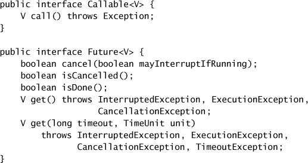

# Chapter 6. Task Execution

* divide the work into tasks => simplify program organization, facilitate error recovery, promote concurrency.

## 6.1 Executing Tasks in Threads

* Identify sensible *task boundaries* => improve flexibility in scheduling, facilitate concurrency.
* Server applications
  * should exhibit both *good throughput* and *good responsiveness*
  * should exhibit *graceful degradation* as they become overloaded
  * use individual client requests as task boundaries => usually appropriate task sizing.
* **Executing Tasks Sequentially**
  * The main thread alternates between accepting requests and processing the associated request.
  * Processing a web request => a mix of computation and I/O => may block due to network congestion or connectivity problems.
* **Explicitly Creating Threads for Tasks**
  * => Task processing is offloaded from the main thread, enabling the main loop to resume waiting for the next incoming connection more quickly => improve responsiveness.
  * => Tasks can be processed in parallel, enabling multiple requests to be serviced simultaneously => improve throughput.
  * => Task-handling code must be thread-safe, because it may be invoked conurrently for multiple tasks.
* **Disadvantages of Unbounded Thread Creation**
  * **Thread lifecycle overhead.**
    * Thread creation and teardown overhead => latency.
    * Even worse if requests are frequent and lightweight.
  * **Resource consumption.**
    * Threads consume memory.
    * If runnable threads more than available processors, threads sit idle.
  * **Stability**
    * There is a limit on how many threads can be created.
    * Hit the limit => `OutOfMemoryErro` => risky to recover it.
  * You need to place some bound on how many threads the application creates, and test thoroughly to ensure that.

## 6.2 The Executor Framework

* `java.util.concurrent` provides a flexible thread pool implementation as part of the `Executor` framework.
  * The primary abstraction for task execution is `Executor`.
  * => decoupling *task submission* from *task execution*, describing tasks with `Runnable`.
  * => let its implementations provide lifecycle support and hooks for statistics gathering, application management, and monitoring.
  * `Executor` is based on the producer-consumer pattern.

* **Example: Web Server Using Executor**

* **Execution Policies**
  * an execution policy := what, where, when, how of a task execution.
  * policy depends on available computing resources and quality-of-service requirements.
  * limiting the number of concurrent tasks => avoid failure due to resource exhaustion or contention for scarce resources.
* **Thread Pools**
  * => manage a homogeneous pool of worker threads => tightly bounded by a *work queue* holding tasks waiting to be executed.
  * worker thread: request the next task from the work queue, execute it, and go back to waiting for another task.
  * executing tasks in thread pool => reusing existing threads amortizes thread creation and teardown costs, can have enough threads to keep the processors busy, while not running out of memory or thrashes due to competition.
  * Create a thread pool through static factory methods in `Executors`:
    * `newFixedThreadPool`: A fixed size thread pool creates threads as tasks are submitted, up to the maximum pool size, and then attempts to keep the pool size constant.
    * `newCachedThreadPool`: A cached thread pool has more flexibility to reap idle threads when the current size of the pool exceeds the demand for processing, and to add new threads when demand increases, but places no bounds on the size of the pool.
    * `newSingleThreadExecutor`: A single-threaded executor creates a single worker thread to process tasks, replacing it if it dies unexpectedly. Tasks are guaranteed to be processed sequentialy according to the order imposed by the task queue (FIFO, LIFO, priority order).
    * `newScheduledThreadPool`: A fixed-size thread pool that supports delayed and periodic task execution, similar to `Timer`.
* **Executor Lifecycle**
  * JVM can't exit until all the threads have terminated => failing to shut down an `Executor` could prevent the JVM from exiting.
  * shutdown := graceful shutdown + abrupt shutdown.
  * `ExecutorService` extends `Executor` to provide methods for lifecycle management (running, shutting down, terminated).
    * Tasks submitted to an `ExecutorService` after it has been shut down are handled by the *rejected execution handler* => might silently discard the task, or might cause `execute` to throw the unchecked `RejectedExecutionException`.
    * It is common to follow `shutdown` immediately by `awaitTermination`.

* **Delayed and Periodic Tasks**
  * `ScheduledThreadPoolExecutor` should be thought of as replacement for `Timer`.
  * `Timer` has some drawbacks.
    * => creates only a single thread for executing timer tasks => if a timer task takes too long => the timing accuracy can suffer.
    * => `TimerTask` throws unchecked exception, while `Timer` thread doesn't catch the exception => `Timer` would assume the entire `Timer` was cancelled => scheduled but not yet executed `TimerTask`s are never run.
  * `DelayQueue`: a `BlockingQueue` implementation that provides the scheduling functionality of `ScheduledThreadPoolExecutor`.
    * => manages a collection of `Delayed` objects.
    * => let you `take` an element only if its delay has expired.
    * => objects are returned by the time associated with their delay.

## 6.3 Finding Exploitable Parallelism

* **Example: Sequential Page Renderer**
  * As text markup is encountered, render it into the image buffer; as image references are encountered, fetch the image over the network and draw it into the image buffer as well.
  * The simplest approach is to process sequentially, but firstly leaving placeholders and going back to replace associated placeholders with appropriate content.

* **Result-bearing Tasks: `Callable` and `Future`**
  * `Runnable` can not return a value or throw checked exceptions.
  * deferred computations := executing a database query, fetching a resource over the network, or computing a complicated function.
  * `Callable` => it expects the main entry point `call`, will return a value and anticipates that it might throw an exception => suitable for deferred computations.
  * `Future`: represents the lifecycle of a task and provides methods to test whether the task has completed or been cancelled, retrieve its result, and cancel the task.
    * `Future.get()` returns immediately or throws an `Exception` if the task has already completed, but if not it blocks until the task completes.
    * If the task completes by throwing an exception, `get` rethrows it wrapped in an `ExecutionException`; if it was cancelled, get throws `CancellationException`. If `get` throws `ExecutionException`, the underlying exception can be retrieved with `getCause`.
  * Create a `Future`:
    * The `submit` methods in `ExecutorService` all return a `Future`.
    * You can explicitly instantiate a `FutureTask` for a given `Runnable` or `Callable`.
    * `ExecutorService` implementations can override `newTaskFor` in `AbstractExecutorService` to control instantiation of the `Future`.

* **Example: Page Renderer with Future**
  * divide the work into two tasks, one that renders the text (CPU-bounded) and one that downloads all the images (I/O-bounded).

* **Limitations of Parallelizing Heterogeneous Tasks**
  * Heterogeneous tasks might have disparate sizes.
  * The real performance payoff of dividing a program's workload into tasks comes when there are a large number of independent *homogeneous* tasks that can be processed concurrently.
* **CompletionService: Executor Meets BlockingQueue**
  * `CompletionService` := `Executor` + `BlockingQueue`
    * submit `Callable` tasks to it => use queue-like methods `take` and `poll` to retrieve completed results, packaged as `Futures`, as they become availability.
  * `ExecutorCompletionService` implements `CompletionService`, delgating the computation to an `Executor`.
    * The constructor creates a `BlockingQueue` to hold completed results.
    * `FutureTask` has a `done` method that is called when the computation completes.
    * Submitted task is wrapped with a `QueueingFuture` (a subclass of `FutureTask` that overrides `done` to place the result on the `BlockingQueue`).
    * The `take` and `poll` methods delegate to the `BlockingQueue`, blocking if results are not yet available.
  *  Multiple `ExecutorCompletionService` can share a single `Executor` => it is sensible to create an `ExecutorCompletionService` that is private to a particular computation while sharing a common `Executor`.

* **Example: Page Renderer with CompletionService**
  * create a separate task for downloading *each* image and execute them in a thread pool => turning the sequential download into a parallel one => reduces total runtime.
  * fetch results from the `CompletionService` and rendering each image as soon as it is available => a dynamic and responsive user interface.

* **Placing Time Limits on Tasks**
  * The timed version of `Future.get` returns as soon as the result is ready, but throws `TimeoutException` if the result is not ready within the timeout period.
  * `Future` can help; if a timed `get` completes with a `TimeoutException`, you can cancel the task through the `Future`.

* **Example: A Travel Reservations Portal**
  * `invokeAll`: submit multiple tasks to an `ExecutorService` and returns a collection of `Future`s.

