# Chapter 7. Cancellation and Shutdown

* Java does not provide any mechanism for safely forcing a thread to stop.
* Instead, it provides *interruption*, a cooperative mechanism that lets one thread ask another to stop.
* We rarely want a task, thread, or service to stop *immediately*, since that could leave shared data structures in an inconsistent state.
* Instead, tasks and services can be coded so that, when requested, they clean up any work currently in progress and *then* terminate.

## 7.1 Task Cancellation

* A number of reasons to cancel an activity:
  * User-requested cancellation.
  * Time-limited activities.
  * Application evnets.
  * Errors.
  * Shutdown.
* Cooperative mechanisms to request cancellation:
  * One is setting a cancellation requested flag that the task checks periodically.

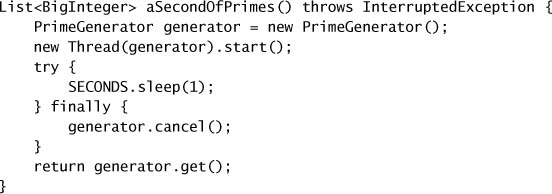

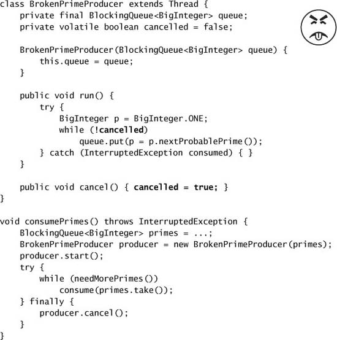

* **Interruption**
  * Each thread has a boolean *interrupted status*.
  * Interrupting a thread sets its interrupted status to true.
  * The poorly named `interrupted` method *clears* the interrupted status and returns its previous value. 
  * Blocking library methods like `Thread.sleep` and `Object.wait` try to detect when a thread has been interrupted and return early.
    * They clear the interrupted status and throw `InterruptedException`, indicate that the blocking operation completed early due to interruption.
  * Interruption => not necessarily interrupt a running thread => just *requests* that the thread interrupt itself at the next *cancellation points*.
    * Some methods like `wait`, `sleep`, and `join` take such requests seriously, throwing an exception.
  * Interruption => cancellation.

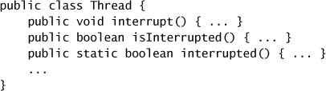

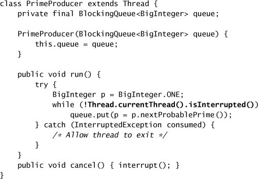

* **Interruption Policies**
  * An interruption policy determines how a thread interprets an interruption request:
    * what it does, when one is detected, what units of work are considered atomic, how quicly it reacts to interruption.
  * Sensible interruption policies: exit as quickly as practical, cleaning up if necessary, and possibly notifying some owning entity that the thread is exiting.
  * Interrupting a worker thread => cancel the current task + shut down the worker thread.
    * Most blocking library methods simple throw `InterruptedException` in response to an interrupt because they never execute in a thread they own.
    * A tack can choose to postpone the interruption until a more opportune time.
    * If one task is not simply going to propagate `InterruptedException` to its caller, it should restore the interruption status through `Thread.currentThread().interrupt()`.
  * The owner of one thread encapsulates knowledge of the thread's interruption policy in an appropriate cancellation mechanism.
* **Responding to Interruption**
  * Two practical strategies for handling `InterruptedException`:
    * Propagate the execption => making method an interruptible blocking method.
      * e.g., adding `InterruptedException` to the `throws` clause.
    * Restore the interruption status so that code higher up on the call stack can deal with it.
      * e.g., calling `interrupt` method again.
  * Activities that do not support cancellation but still call interruptible blocking methods will have to call them in a loop, retrying when interruption is detected.
  * Interruptible methods usually poll for interruption before blocking or doing any significant work => be as responsive to interruption as possible.

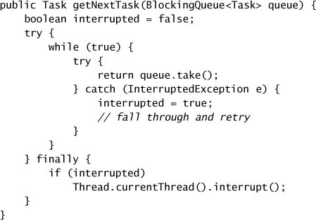

* **Example: Timed Run**
  * Run task in the calling thread and schedule a cancellation task to interrupt it after a given time interval => address the problem of unchecked exception thrown from the task => violate the rule that you should know a thread's interruption policy before interrupting it.
    * If the task completes before the timeout, the cancellation task that interrupts the thread in which `timedRun` was called could go off *after* `timedRun` has returned to its caller.
    * If the task is not responsive to interruption, `timedRun` will not return until the task finishes.

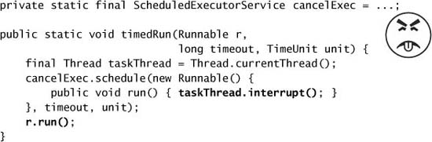

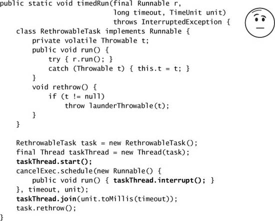

* **Cancellation Via `Future`**
  * `ExecutorService.submit` returns a `Future` describing the task.
  * `Future` has a `cancel` method that takes a boolean argument, `mayInterruptIfRunning`, and returns a value indicating whether the cancellation attemp was successful (whether it has delivered the interruption).
    * When `mayInterruptIfRunning` is `true` and the task is currently running in some thread, then that thread is interrupted.
    * Setting this argument to `false` means "don't run this task if it hasn't started yet", and should be used for tasks that are not designed to handle interruption.
  * The task execution threads created by `Executor` => implement an interruption policy => they can be cancelled using interruption.
  * This shows a version of `timedRun` that submits the task to an `ExecutorService` and retrieves the result with a timed `Future.get`.
    * Good => cancelling tasks whose result is no longer needed.

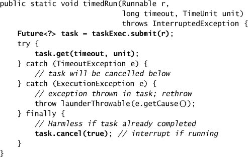

* **Dealing with Non-interruptible Blocking**
  * Sometimes threads are blocked in non-interruptible activities.
  * Synchronous socket I/O in `java.io`.
    * `read` and `write` methods in `InputStream` and `OutputStream` are not responsive to interruption.
    * closing the underlying socket => the blocked thread throws a `SocketException`.
  * Synchronous I/O in `java.nio`.
    * Interrupting a thread waiting on an `InterruptibleChannel` => all threads blocked on the channel throw `ClosedByInterruptException`.
    * Closing an `InterruptibleChannel` => threads blocked on channel operations to throw `AsynchronousCloseException`.
  * Asynchronous I/O with `Selector`.
    * `wakeup` => a thread blocked on `Selector.select` (in `java.nio.channels`) returns prematurely => throwing a `ClosedSelectorException`.
  * Lock acquisition.
    * Nothing you can do to stop a thread blocked waiting for an intrinsic lock.
    * `Lock` classes offer the `lockInterruptibly` method.

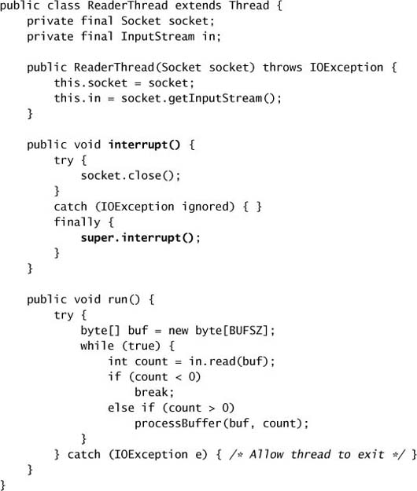

* **Encapsulating Nonstandard Cancellation with `newTaskFor`**
  * The `newTaskFor` hook is a factory method that creates the `Future` representing the task => returns a `RunnableFuture`, an interface that extends both `Future` and `Runnable`, implemented by `FutureTask`.
  * Customizing the task `Future` => override `Future.cancel`.
    * e.g., logging, gather statistics on cancellation, cancel activities that are not responsive to interruption.
  * `SocketUsingTask` implements `CancellableTask` and defines `Future.cancel` to close the socket as well as call `super.cancel` => safely call interruptible blocking methods, while remain responsive to cancellation, also can call blocking socket I/O methods.

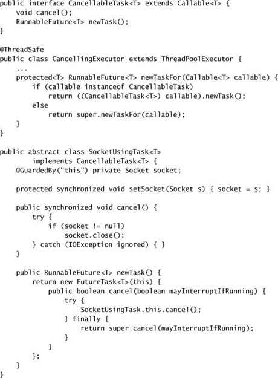

## 7.2 Stopping a Thread-based Service

* A thread pool => own worker threads, take care of them when those threads need to be interrupted.
* The application owns service, the service owns worker threads.
  * The service should provide *lifecycle methods* for shutting itself down, also shut down owned threads.
  * Then the application can shut down the service, and the service can shut down the threads.
* **Example: A Logging Service**
  * We need a way to terminate the logger thread => it does not pervent the JVM from shutting down normally.
  * Abrupt shutdown => discards log messages, threads blocked in `log` will never become unblocked if the queue if full.
  * An alternative is to shutdown `LogWriter` is to set a "shutdown requested" flag to prevent further messages from being submitted => race conditions due to check-then-act sequences => producers might still get blocked before it can observe that service has been shut down.
  * To provide reliable shutdown for `LogWriter` => fix the race condition => making the submission of a new log message atomic => atomically check for shutdown and conditionally increment a counter to reserve the right to submit a message.

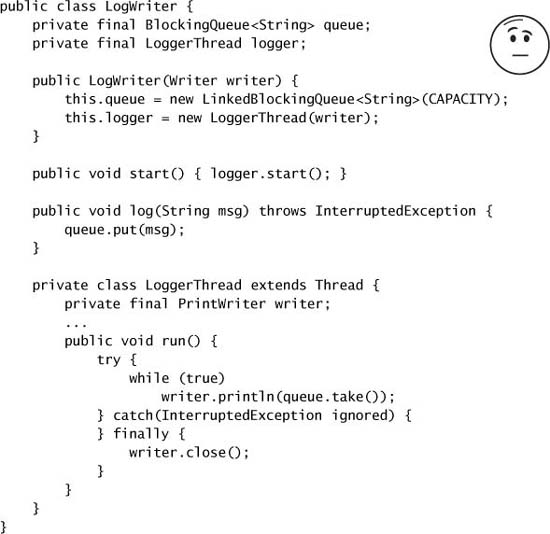

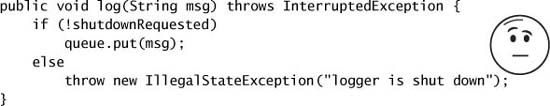

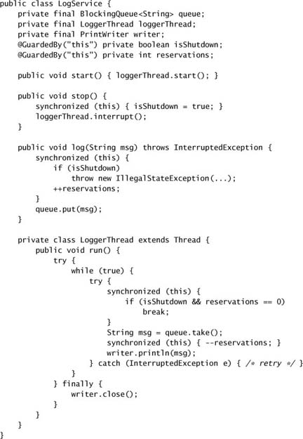

* **`ExecutorService` Shutdown**
  * `ExecutorService` provides the `shutdown` (normal shutdown) and `shutdownNow` (abrupt shutdown) methods.
  * Encapsulate an `ExecutorService` behind a higher-level service that provides its own lifecycle methods => delegate thread management to `ExecutorService` => extend the ownership chain from application to service to thread.

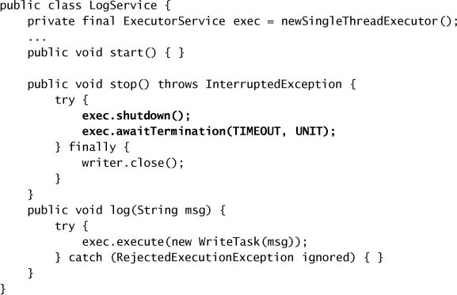

* **Poison Pills**
  * *poison pill*, a recognizable object placed on the queue, also the last work submitted to the FIFO work queue => convince consumers to stop.
  * => Work only when the number of producers and consumers is known.
    * Having each producer place $N_{consumer}$​ pills on the queue.
  * => Work reliably only with unbounded queues.

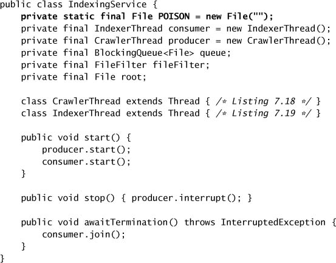

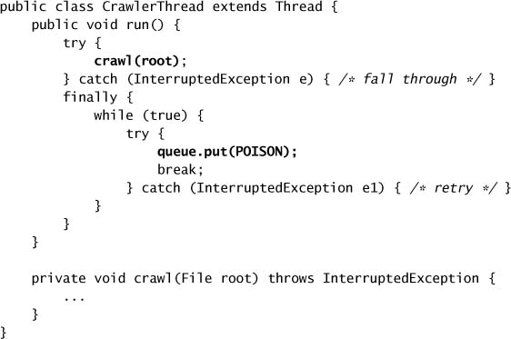

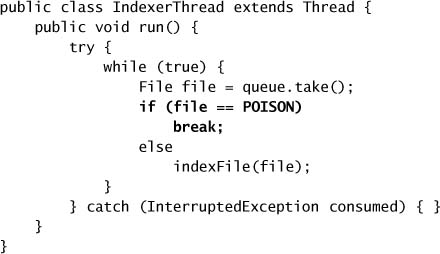

* **Example: A One-shot Execution Service**
  * Using a private `Executor` whose lifetime is bounded by a method call.

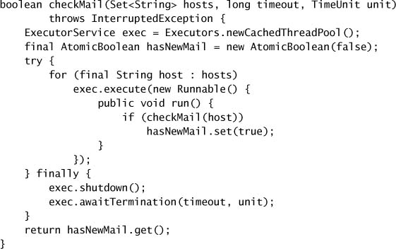

* **Limitation of `shutdownNow`**
  * There is no way of knowing the state of the tasks in progress at shutdown time.
  * In order to identify which tasks started but did not complete normally, the tasks must preserve the thread's interrupted status when they return.
  * `TrackingExecutor` has an unavoidable race condition: tasks are identified as cancelled but actually completed => false positives.
    * Not a problem if tasks are *idempotent*.

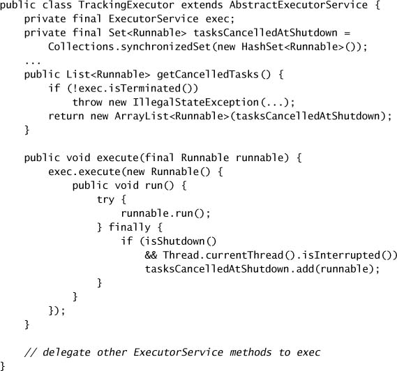

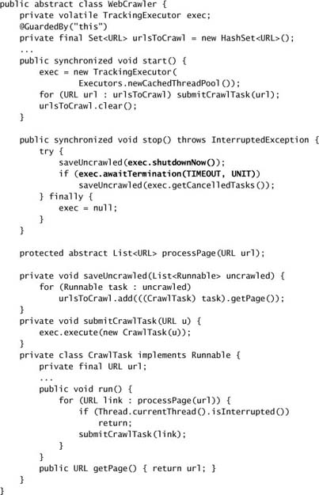

## 7.3 Handling Abnormal Thread Termination

* The leading cause of premature thread death is `RuntimeException` => origramming error or other unrecoverable problem => not caught, and propagate all the way up the stack.
* The consequences of abnormal thread death depedns on the thread's role in the application.
* Untrusted code through an abstraction such as `Runnable` are skeptical => might want to catch `RuntimeException`.
* Typical Thread-pool Worker Thread Structure
  * If a task throws an unchecked exception => allow the thread to dead after notifying the framework.
  * The framework may replace the worker thread with a new thread, or may do nothing.

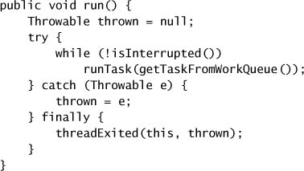

* **Uncaught Exception Handlers**
  * The Thread API provides the `UncaughtExceptionHandler` facility => let you detect when a thread dies due to an uncaught exception.
  * In long-running applications, always use uncaught exception handlers for all threads that at least log the exception.
  * To set an `UncaughtExceptionHandler` for pool threads, provide a `ThreadFactory` to the `ThreadPoolExecutor` constructor.
    * => Use a `try-finally` block to be notified when this happens so the thread can be replaced.
    * => Without an uncaught exception handler or failure notification, tasks can appear to fail silently.
    * Wrap the task with a `Runnable` or `Callable` that catches the exception or override the `afterExecute` hook in `ThreadPoolExecutor` => take some task-specific recovery action.

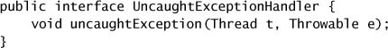

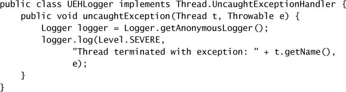
