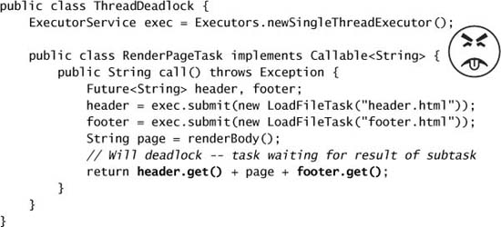

# Chapter 8. Applying Thread Pools

* Task execution framework => manage task and thread lifecycles => decoupling task submission from execution policy.
* Application of thread pools => tuning thread pools, hazards. advanced options.

## 8.1 Implicit Couplings Between Tasks and Execution Policies

* Type of tasks that require specific execution policies include:
  * **Dependent tasks.**
    * => constraints := timing, results, side effects of other tasks.
    * => need to avoid liveness problems
  * **Tasks that exploit thread confinement.**
    * single-threaded executors => not executed concurrently => objects are confined to the task thread => coupling the task and the execution policy.
  * **Response-time-sensitive tasks.**
    * submitting long-running tasks to a thread pool with a small number of threads => impair the responsiveness of the service.
  * **Tasks that use `ThreadLocal`.**
    * `ThreadLocal` => each thread has its own private version of a variable.
    * `ThreadLocal` can only be used when the thread-local value has a lifetime bounded by that of a task => can not communicate between tasks.
* Thread pools work best when tasks are *homogeneous* and *independent*.
* **Thread Starvation Deadlock**
  * whenever a pool task initiates an unbounded blocking wait for some resource or condition that can succeed only through the action of another pool task => *thread starvation deadlock*.
  * Task that deadlocks in a single-threaded `Executor` => Don't do this.

* **Long-running Tasks**
  * To mitigate the ill effects of long-running tasks => use timed resource waits instead of unbounded waits.
    * Most blocking methods come in both untimed and timed versions.
      * e.g., `Thread.join`, `BlockingQueue.put`, `CountDownLatch.await`, `Selector.select`.
    * If the wait times out => mark the task as failed and abort or requeue it for execution later => guarantees that each task eventually makes progress.
  * If a thread pool is frequently full of blocked tasks => a sign that the pool is too small.