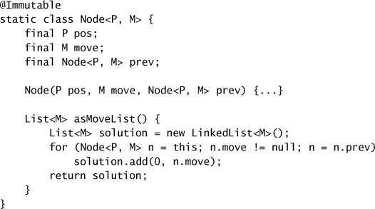

# Chapter 8. Applying Thread Pools

* Task execution framework => manage task and thread lifecycles => decoupling task submission from execution policy.
* Application of thread pools => tuning thread pools, hazards. advanced options.

## 8.1 Implicit Couplings Between Tasks and Execution Policies

* Type of tasks that require specific execution policies include:
  * **Dependent tasks.**
    * => constraints := timing, results, side effects of other tasks.
    * => need to avoid liveness problems
  * **Tasks that exploit thread confinement.**
    * single-threaded executors => not executed concurrently => objects are confined to the task thread => coupling the task and the execution policy.
  * **Response-time-sensitive tasks.**
    * submitting long-running tasks to a thread pool with a small number of threads => impair the responsiveness of the service.
  * **Tasks that use `ThreadLocal`.**
    * `ThreadLocal` => each thread has its own private version of a variable.
    * `ThreadLocal` can only be used when the thread-local value has a lifetime bounded by that of a task => can not communicate between tasks.
* Thread pools work best when tasks are *homogeneous* and *independent*.
* **Thread Starvation Deadlock**
  * whenever a pool task initiates an unbounded blocking wait for some resource or condition that can succeed only through the action of another pool task => *thread starvation deadlock*.
  * Task that deadlocks in a single-threaded `Executor` => Don't do this.

* **Long-running Tasks**
  * To mitigate the ill effects of long-running tasks => use timed resource waits instead of unbounded waits.
    * Most blocking methods come in both untimed and timed versions.
      * e.g., `Thread.join`, `BlockingQueue.put`, `CountDownLatch.await`, `Selector.select`.
    * If the wait times out => mark the task as failed and abort or requeue it for execution later => guarantees that each task eventually makes progress.
  * If a thread pool is frequently full of blocked tasks => a sign that the pool is too small.

## 8.2 Sizing Thread Pools

* Thread pool sizes should be provided by a configuration mechanism or computed dynamically by consulting `Runtime.availableProcessors`.
* Size a thread pool properly => understand your computing environment, resource budget, the nature of tasks.
  * Determine the number of CPUs using `Runtime`:
    * `int N_CPUS = Runtime.getRuntime().availableProcessors();`
* Estimate the ratio of waiting time to compute time for your tasks through pro-filing or instrumentation.
  * $$N_{cpu} = number\ of \ CPUs$$​
  * $$U_{cpu} = target\ CPU\ utilization, 0 \le U_{cpu} \le 1$$​
  * $$\frac{W}{C} = ratio\ of\ wait\ time\ to\ compute\ time$$​
  * $$N_{threads} = N_{cpu} * U{cpu} * (1 + \frac{W}{C})$$​
* Alternatively, tune by running the application using several different pool sizes under a benchmark load and observing the level of CPU utilization.
* Thread pool size and resource pool size affect each other.
  * Resource := CPU cycles, memory, file handles, socket handles, database connections.

## 8.3 Configuring `ThreadPoolExecutor`

* `ThreadPoolExecutor` provides the base implementation of executors and allows a variety of customizations.

### 8.3.1 Thread Creation and Teardown

* The core size: target size => maintain the pool at this size, will not create more threads than this unless the work queue is full.
* The maximum pool size: the upper bound on how many pool threads can be active at once.
* A thread that has been idle for longer than the keep-alive time becomes a candidate for reaping and can be terminated if the current pool size exceeds the core size.

### 8.3.2 Managing Queued Tasks

* Requests wait in a queue of `Runnable`s managed by the `Executor` instead of queueing up as threads contending for the CPU.
* `ThreadPoolExecutor` allows you to supply a `BlockingQueue` (unbounded, bouned, or synchronous handoff) to hold tasks awaiting execution.
  * The default is an unbounded `LinkedBlockingQueue`.
  * Bounded queue => prevent resource exhaustion, must have saturation policies to decide what to do when the queue is full => stable resource management strategy.
  * For very large or unbounded pools => use a `SynchronousQueue` to hand off tasks from producers to worker threads => a practical choice if the pool is unbounded or if rejecting excess tasks is acceptable.
  * For more control over task execution order, use a `PriorityBlockingQueue`.

### 8.3.3 Saturation Policies

* Specify the *saturation policy* by calling `setRejectedExecutionHandler`.
  * also applied when the executor has been shut donw.
  * e.g., `AbortPolicy`, `CallerRunsPolicy`, `DiscardPolicy`, `DiscardOldestPolicy`.
* *abort* => causes `execute` to throw the unchecked `RejectedExecutionException`; the caller can catch this exception and implement its own overflow handling as it sees fit.
* *discard* => silently discards the newly submitted task if it cannot be queued for execution.
* *discard-oldest* => discards the task that would otherwise be executed next and tries to resubmit the new task.
* *caller-runs* => implements a form of throttling that neither discards tasks nor throws an exception, but instead tries to slow down the flow of new tasks by pushing some of the work back to the caller.
  * It executes the newly submitted task not in a pool thread, but in the thread that calls `execute`.
* Creating a fixed-sized thread pool with a bounded queue and the caller-runs saturation policy.

* There is no predefined saturation policy to make `execute` block when the work queue is full => but can be accomplished by using a `Semaphore` to bound the injection rate.

### 8.3.4 Thread factories

* The default thread factory creates a new, nondaemon thread.
* `ThreadFactory` has a single method, `newThread`, that is called whenever a thread pool needs to create a new thread.

* Reasons to use a custom thread factory:
  * => Specify an `UncaughtExceptionHandler` for pool threads.
  * => Instantiate an instance of a custom `Thread` class.
  * => Modify the priority (not a good idea).
  * => Set the daemon status (not a good idea).
  * => Give pool threads more meaningful names.

* Use `privilegedThreadFactory` factory method in `Executors` => to take advantages of specific permissions to particular codebase.
  * It creates pool threads that have the same permissions, `AccessControlContext`, and `contextClassLoader` as the thread creating the `privilegedThreadFactory`.

### 8.3.5 Customizing `ThreadPoolExecutor` After Construction

* Most of the options of `ThreadPoolExecutor` can be modified after construction via setters.
  * You can cast the instance to `ThreadPoolExecutor` to access the setters.
  * `Executors.unconfigurableExecutorService` takes an existing `ExecutorService` and wraps it with one exposing only the methods of `ExecutorService` so it cannot be further configured => prevent the execution policy from being modified.

## 8.4 Extending `ThreadPoolExecutor`

* `ThreadPoolExecutor` provides hooks for subclasses to override.
  * e.g., `beforeExecute`, `afterExecute`, `terminate`.
  * `beforeExecute` and `afterExecute` are called in the thread that executes the task.
  * The task completes by returning normally or by throwing an `Exception` (not an `Error`) => calling `afterExecute`.
  * If `beforeExecute` throws a `RuntimeException`, the task if not executed and `afterExecute` is not called.
  * `terminated` is called when the thread pool completes the shutdown process => can be used to release resources allocated by the `Executor`, perform notification or logging, or finalize statistics gathering.

### 8.4.1 Example: Adding Statistics to a Thread Pool

## 8.5 Parallelizing Recursive Algorithms

* Loops whose bodies contain nontrivial computation or perform potentially blocking I/O => good candidates for parallelization.
  * If iterations are independent and we don't need to wait for all of them to complete before proceeding => we can use an `Executor` to transform a sequential loop into a parallel one.
  * If you want to submit a set of tasks and wait for them all to complete => use `ExecutorService.invokeAll`.
  * If you want to retrieve the results as they become available => use a `CompletionService`.

* Some recursive designs can be parallelized => each iteration does not require the results of the recursive iterations it invokes.

* Waiting for results to be calculated in parallel => using `shutdown` and `awaitTermination`.

### 8.5.1 Example: A Puzzle Framework

* An appealing application of this technique is solving puzzles that involves finding a sequence of transformations from some initial state to reach a goal state.
* puzzle := an initial position, a goal position, a set of rules that determine valid moves.
  * rule := computing the list of legal moves from a given position + computing the result of applying a move to a position.

* `SequentialPuzzleSolver`: depth-first search of the puzzle space => can exploit concurrency and compute next moves and evaluate the goal condition in parallel.

* `ConcurrentPuzzleSolver`: uses an inner `SolverTask` class that extends `Node` and implements `Runnable`.
  * To avoid infinite loop, the sequential version maintains a `Set` of previously searched positions; the concurrent one uses a `ConcurrentHashMap` for this purpose.
  * `ConcurrentPuzzleSolver` uses the internal work queue of the thread pool instead of the call stack to hold the state of the search.

* We need a way to determine whether any thread has found a solution yet => to stop searching when found a solution => a *result-bearing latch*.
  * `ValueLatch` uses a `CountDownLatch` to provide the needed latching behavior, and uses locking to ensure that the solution is set only once.
  * `getValue` in `ValueLatch` blocks until some thread has set the solution.
  * To avoid having to deal with `RejectedExecutionException`, the rejected execution handler should be set to discard submitted tasks.

* `ConcurrentPuzzleSolver` does not deal well with the case where there is no solution => need to keep a count of active solver tasks and set the solution to null when the count drops to zero.

* We can also impose several termination conditions.
  * => Time limit like using a timed `await`.
  * => Puzzle-specific metric such as searching only up to a certain number of positions.
  * => Provide a cancellation mechanism and let the client make its own decisions about when to stop searching.