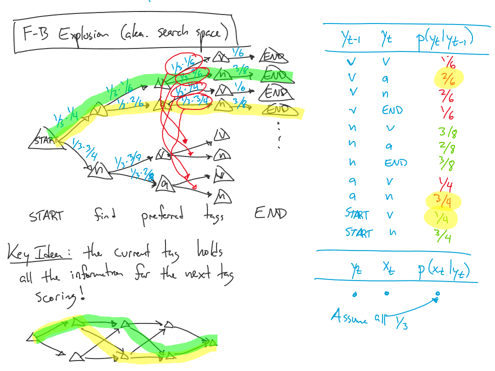
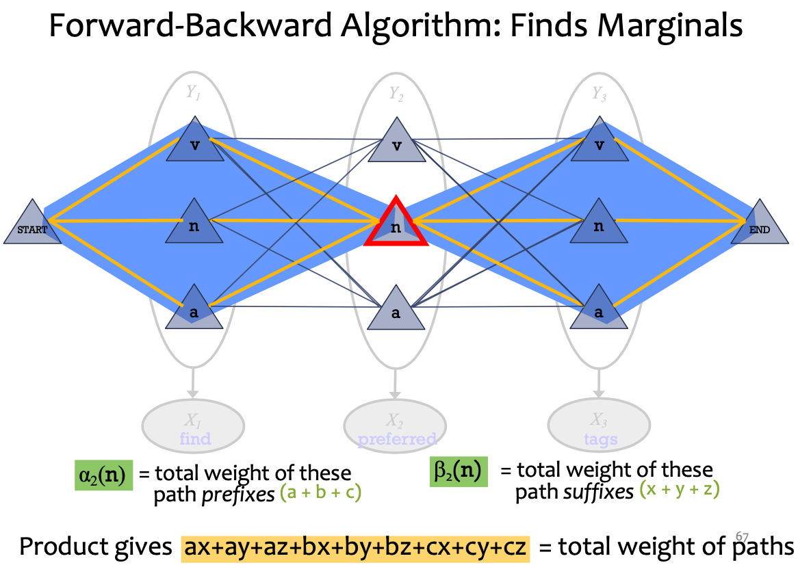
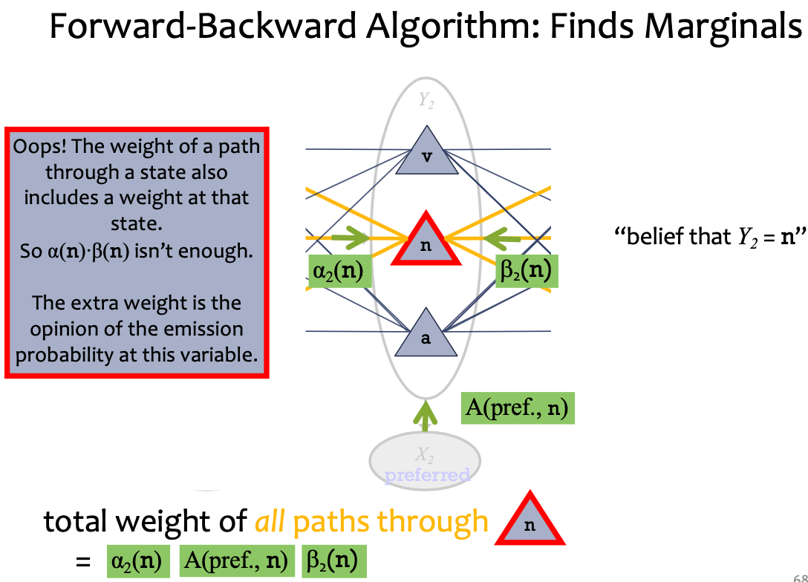
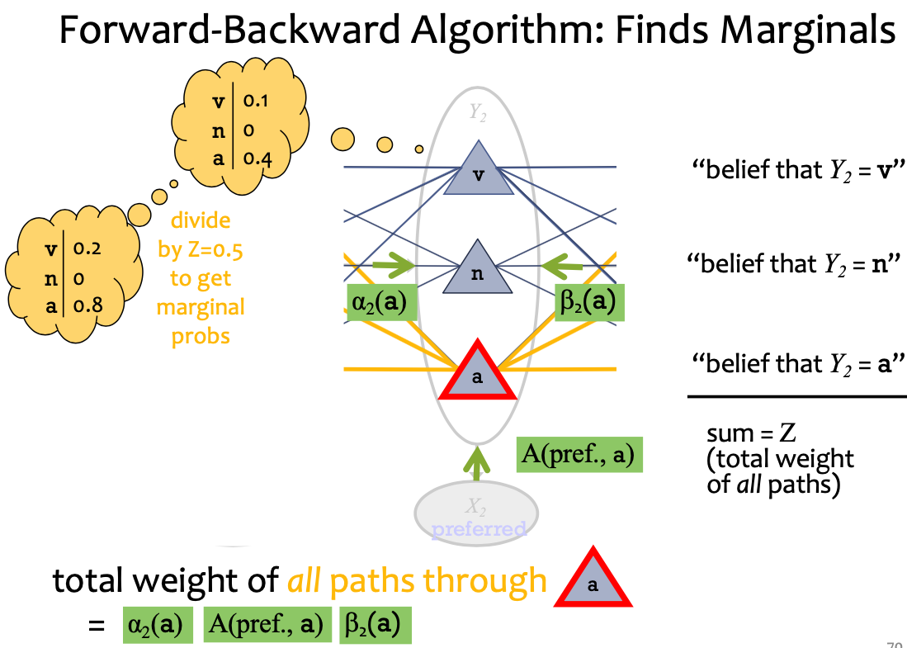

# Lecture 20 Hidden Markov Models (Part II)

## High-order HMMs

* 1st-order HMM (i.e. bigram HMM)
* 2nd-order HMM (i.e. trigram HMM)
* 3rd-order HMM
* Hidden States - y
  * The joint probability of the observations and the hidden states in an HMM is given by $P(X=x,Y=y) = C_{y_1}[\prod_{t=1}^T A_{y_t,x_t}][\prod_{t=1}^{T-1} B_{y_t,y_{t+1}}]$
* Observations - x
  * The probability of the observations (marginal probability) in an HMM is given by $P(X=x) = \sum_{y \in Y} p(x=\vec{x},y=\vec{y})$

## 3 Problems for an HMM

### Evaluation

* Compute the probability of a given sequence of observations
* $p(\vec{x}) = \sum_{\vec{y} \in Y_{\vec{x}}} p(\vec{x},\vec{y})$

### Viterbi Decoding

* Find the most likely sequence of hidden states, given a sequence of observations
* $\hat{y} = argmax_{\vec{y} \in Y_{\vec{x}}} p(\vec{y}|\vec{x})$

### Marginals

* Compute the marginal distribution for a hidden state, given a sequence of observations
* $p(y_t=k|\vec{x}) = \sum_{\vec{y}=y_\vec{x} s.t. y_t=k} p(\vec{y}|\vec{x})$

### Examples of 3 Problems

| y1   | →    | y2   | →    | y3   |
| ---- | ---- | ---- | ---- | ---- |
| ↓    |      | ↓    |      | ↓    |
| x1   |      | x2   |      | x3   |

1. Evaluation: $p(x_1,x_2,x_3)=\sum_{y_1} \sum_{y_2} \sum_{y=3} p(x_1,x_2,x_3,y_1,y_2,y_3)$
2. Viterbi Decoding: $\hat{y_1}, \hat{y_2}, \hat{y_3} = argmax_{\vec{y}} p(y_1,y_2,y_3|x_1,x_2,x_3)$
3. Marginals: $p(y_2=V|x_1,x_2,x_3) = \sum_{y_1} \sum_{y_3} p(y_1,y_2,y_3|x_1,x_2,x_3)$
4. Joint distribution: $p(x_1,x_2,x_3,y_1,y_2,y_3) = p(y_1)p(x_1|y_1)p(x_2|y_2)p(x_3|y_3)p(y_2|y_1)p(y_3|y_2)$
5. $p(\vec{y}|\vec{x}) = \frac{p(\vec{x},\vec{y})}{p(\vec{x})}$
6. For $|\vec{y}|=T$ and $y_t \in {1,\cdots,K}$ there are $K^T$ possible values of $\vec{y}$

## Forward-Backward Algorithm

### Dataset for Supervised Part-of-Speech (POS) Tagging

| Sample1 | n    | v     | p    | d    | n     | $y^{(1)}$ |
| ------- | ---- | ----- | ---- | ---- | ----- | --------- |
|         | time | flies | like | an   | arrow | $x^{(1)}$ |
| Sample2 | n    | n     | v    | d    | n     | $y^{(2)}$ |
|         | time | flies | like | an   | arrow | $x^{(2)}$ |

### Brute-Force Algorithm

```text
def eval(vec_x):
    p_x = 0                # p(vec_c)
    for y in all_y(vec_x): # y_x
        p_x += joint(x, y) # p(x,y)
    return p_x
```

### Forward-Backward Algorithm

#### Forward-Backward Search Space



* **Key Idea: the current tag holds all the information for the next tag scoring**
* **Viterbi Algorithm: Most Probable Assignment**
  * Numbers associated with edges and nodes of path
  * Most probable assignment = **path with highest product**
  * p(v a n) = (1/Z) * product weight of one path
* **Marginal probability** $p(Y_2=a|X)$ = (1/Z) * total weight of **all paths through a**
* Find Marginals
  * $\alpha_2(n)$ = total weight of these path prefixes
  * $\beta_2(n)$ = total weight of these path suffixes
  * found by dynamic programming: matrix-vector products
  * Product of $\alpha_2(n)$ and $\beta_2(n)$ gives $ax+ay+az+bx+by+bz+cx+cy+cz$ = total weight of paths, which is more efficient
  * We also need $A(pref., n)$, the opinion of the emission probability at this variable
  * total weight of all paths through n = $\alpha_2(n) A(pref.,n) \beta_2(n)$
  * sum = Z (total weight of all paths) => $p(\vec{x}) = \sum_{\vec{y}} p(\vec{x},\vec{y})$
  * Divided by Z to get marginal probability $p(y_i|\vec{x})$

#### Forward-Backward Algorithm

* Define:
  * $\alpha_t(k) \simeq p(x_1,\cdots,x_t,y_t=k)$
  * $\beta_t(k) \simeq p(x_{t+1},\cdots,x_T,y_t=k)$
* Assume:
  * $y_0 = START$
  * $y_{T+1} = END$
* Initialize
  * $\alpha_0(START) = 1$ $\alpha_0(k) = 0, \forall k \neq START$
  * $\beta_0(END) = 1$ $\beta_{T+1}(k) = 0, \forall k \neq END$
* (Forward Algo.) For $t = 1,\cdots,T$
  * For $k = 1,\cdots,K$
    * $\alpha_t(k) = p(x_t|y_t=k) \sum_{j=1}^K \alpha_{t-1}(j)p(y_t=k|y_{t-1}=j)$
    * the alphas include the emission probabilities so that we don't multiply them in separately
* (Backward Algo.) For $t = T,\cdots,1$
  * For $k = 1,\cdots,K$
    * $\beta_t(k) = \sum_{j=1}^K p(x_{t+1}|y_{t+1}=j) \beta_{t+1}(j) p(y_{t+1}=j|y_t=k)$
* Compute evaluation $p(\vec{x}) = \alpha_{T+1}(END)$
* Compute marginals $p(y_t=k|\vec{x}) = \frac{\alpha_t(k)\beta_t(k)}{p(\vec{x})}$







