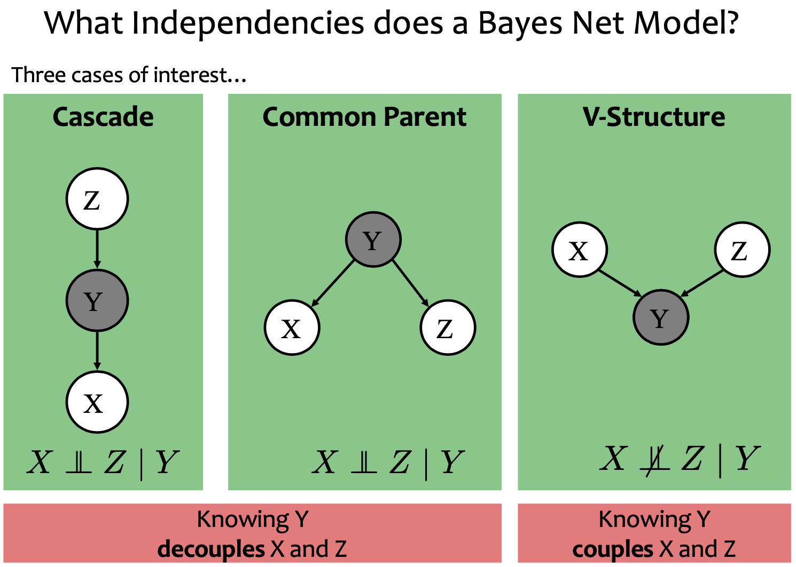
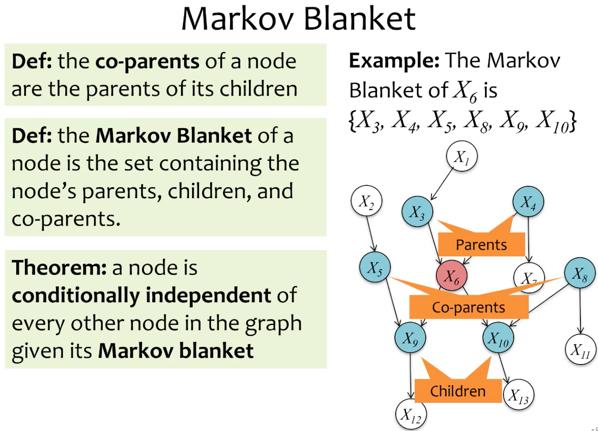
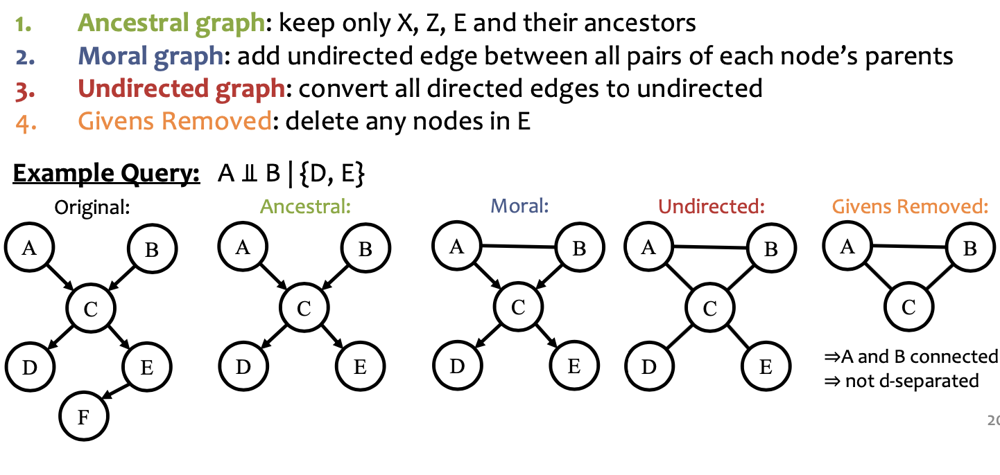
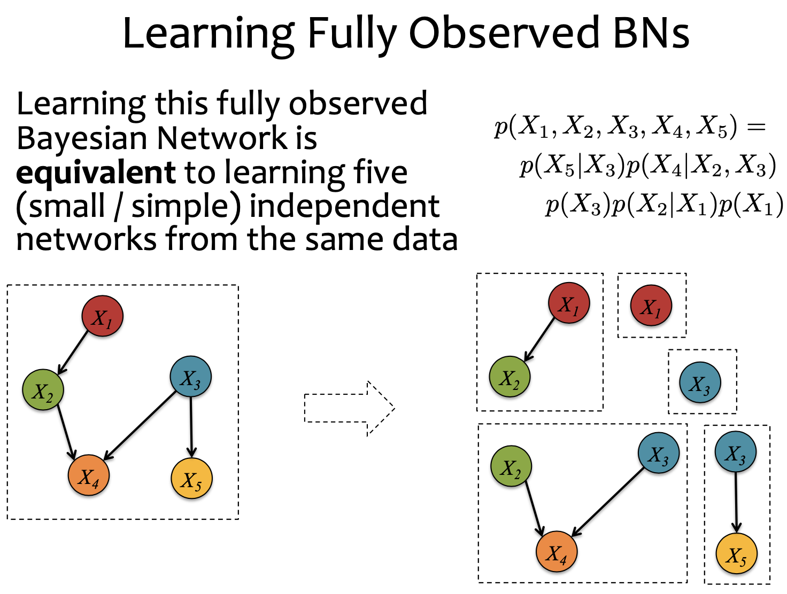

# Lecture 21 Bayesian Networks

## The Forward-Backward Algorithm

### Forward-Backward Algorithm

* Define:
  * $\alpha_t(k) \simeq p(x_1,\cdots,x_t,y_t=k)$
  * $\beta_t(k) \simeq p(x_{t+1},\cdots,x_T|y_t=k)$
* Assume:
  * $y_0 = START$
  * $y_{T+1} = END$
* Initialize
  * $\alpha_0(START) = 1$ $\alpha_0(k) = 0, \forall k \neq START$
  * $\beta_0(END) = 1$ $\beta_{T+1}(k) = 0, \forall k \neq END$
* (Forward Algo.) For $t = 1,\cdots,T$
  * For $k = 1,\cdots,K$
    * $\alpha_t(k) = p(x_t|y_t=k) \sum_{j=1}^K \alpha_{t-1}(j)p(y_t=k|y_{t-1}=j)$
    * the alphas include the emission probabilities so that we don't multiply them in separately
* (Backward Algo.) For $t = T,\cdots,1$
  * For $k = 1,\cdots,K$
    * $\beta_t(k) = \sum_{j=1}^K p(x_{t+1}|y_{t+1}=j) \beta_{t+1}(j) p(y_{t+1}=j|y_t=k)$
* Compute evaluation $p(\vec{x}) = \alpha_{T+1}(END)$
* Compute marginals $p(y_t=k|\vec{x}) = \frac{\alpha_t(k)\beta_t(k)}{p(\vec{x})}$

### Derivation of Forward Algorithm

* Definition:
  * $\alpha_t(k) \simeq p(x_1,\cdots,x_t,y_t=k)$
* Derivation:
  * $\alpha_T(END) = p(x_1,\cdots,x_T,y_T=END) \\ = p(x_1,\cdots,x_T|y_T=END)p(y_T=END) \\ = p(x_T|y_T=END)p(x_1,\cdots,x_{T-1}|y_T=END)p(y_T=END) \\ = p(x_T|y_T=END)p(x_1,\cdots,x_{T-1},y_T=END) \\ = p(x_T|y_T=END)\sum_{y_{T-1}} p(x_1,\cdots,x_{T-1},y_{T-1},y_T=END) \\ = \cdots \\ = p(x_T|y_T=END) \sum_{y_{T-1}} \alpha_{T-1}(y_{T-1})p(y_T|y_{T-1})$

### Viterbi Algorithm

* Define:
  * $\alpha_t(k) \simeq \max_{y_1,\cdots,y_{t-1}} p(x_1,\cdots,x_t,y_1,\cdots,y_t=k)$
  * (Backpointers) $\beta_t(k) \simeq argmax_{y_1,\cdots,y_{t-1}} p(x_1,\cdots,x_t,y_1,\cdots,y_t=k)$
* Assume:
  * $y_0 = START$
* Initialize
  * $w_0(START) = 1$
  * $w_0(k) = 0, \forall k \neq START$
*  For $t = 1,\cdots,T$
  * For $k = 1,\cdots,K$
    * $w_t(k) = \max_{j \in \{1,\cdots,K\}} p(x_t|y_t=k)w_{t-1}(j)p(y_t=k|y_{t-1}=j)$
    * $b_t(k) = argmax_{j \in \{1,\cdots,K\}} p(x_t|y_t=k)w_{t-1}(j)p(y_t=k|y_{t-1}=j)$
* (Decoding) Compute Most Probable Assignment
  * Follow the back pointers
  * $\hat{y_T} = b_{T+1}(END)$
  * For $t = T-1,\cdots,1$
    * $\hat{y_t} = b_{t+1}(\hat{y_{t+1}})$

### Inference in HMMs

* What is the computational complexity of inference for HMMs?
* The naive (brute force) computations for Evaluation, Decoding, and Marginals take exponential time, $O(K^T)$
* The forward-backward algorithm and Viterbi algorithm run in polynomial time, $O(T*K^2)$

### Shortcomings of Hidden Markov Models

* HMM models capture dependences between each state and **only** its corresponding observation
* Mismatch between learning objective function and prediction objective function
  * HMM learns a joint distribution of states and observations $P(Y,X)$, but in a prediction task, we need the conditional probability $P(Y|X)$

### Minimum Bayes Risk (MBR) Decoding

* MBR Decoding: Find the lowest loss sequence of hidden states, given a sequence of observations (Viterbi decoding is a special case)
* Suppose we given a loss function $\ell(y',y)$ and are asked for a single tagging
* A MBR decoder $h(x)$ returns the variable assignment with minimum expected loss under the model's distribution
* $h_\theta(x) = argmin_{\hat{y}} E_{y \sim p_\theta(·|x)}[\ell(y',y)] \\ = argmin_{\hat{y}} \sum_y p_\theta(y|x)\ell(\hat{y},y)$

#### Loss Functions

* The **0-1 loss function** returns 1 only if the two assignments are identical and 0 otherwise
  * $\ell(\hat{y},y) = 1 - I_A(\hat{y},y)$
  * Thus the MBR decoder is
    * $h_\theta(x) = argmax_{\hat{y}} p_\theta(\hat{y}|x)$
    * which is exactly the viterbi decoding problem
* The **Hamming loss** corresponds to accuracy and returns the number of incorrect variable assignments:
  * $\ell(\hat{y},y) = \sum_{i=1}^V 1 - I_A(\hat{y_i},y_i)$
  * Thus the MBR decoder is
    * $\hat{y_i} = h_\theta(x)_i = argmax_{\hat{y_i}} p_\theta(\hat{y_i}|x)$
    * which is marginal from Forward-Backward

## Bayesian Network

* Definition: $P(X_1,\cdots,X_n) = \prod_{i=1}^n P(X_i|parents(Xi))$
* A Bayesian Network is a **Directed Graphical Models**
* It consists of a graph G and the conditional probabilities P
* These two parts full specify the distribution:
  * Qualitative Specification: G
  * Quantitative Specification: P

### Qualitative Specification

* Prior knowledge of causal relationships
* Prior knowledge of modular relationships
* Assessment from experts
* Learning from data (i.e. structure learning)
* We simply prefer a certain architecture (e.g. a layered graph)

### Quantitative Specification

* Example: Conditional probability density functions (CPDs)
  * $P(a,b,c,d) = P(a)P(b)P(c|a,b)P(d|c)$

### Independencies of Bayesian Network

* In order for a Bayesian Network to model a probability distribution, the following must be true:
  * Each variable is conditionally independent of all its non-descendants in the graphing given the value of all its parents
* This follows from
  * $P(X_1,\cdots,X_n) = \prod_{i=1}^n P(X_i|parents(X_i)) = \prod{i=1}^n P(X_i|X_1,\cdots,X_{i-1})$
  * chain rule

## Markov Blanket

### D-Separation

* If variables X and Z are d-separated given a set of variables E Then X and Z are conditionally independent given the set E
* Definition #1: Variables X and Z are d-separated given a set of evidence variables E iff every path from X to Z is “blocked”
* Definition #2: Variables X and Z are d-separated given a set of evidence variables E iff there does not exist a path in the undirected ancestral moral graph with E removed.

## Supervised Learning for Bayesian Network

### Learning Fully Observed Bayesian Network

* $\theta* = argmax_\theta \log{p(X_1,X_2,X_3,X_4,X_5)} \\ = argmax_\theta \log{p(X_5|X_3,\theta_5)} + \log{p(X_4|X_2,X_3,\theta_4)} + \log{p(X_3|\theta_3)} + \log{p(X_2|X_1,\theta_2)} + \log{p(X_1|\theta_1)}$
* $\theta_1* = argmax_{\theta_1} \log{p(X_1|\theta_1)}$
* $\theta_2* = argmax_{\theta_2} \log{p(X_2|X_1,\theta_2)}$
* $\theta_3* = argmax_{\theta_3} \log{p(X_3|\theta_3)}$
* $\theta_4* = argmax_{\theta_4} \log{p(X_4|X_2,X_3,\theta_4)}$
* $\theta_5* = argmax_{\theta_5} \log{p(X_5|X_3,\theta_5)}$

## Inference For Bayesian Networks

* How do we compute the probability of a specifc assignment to the variables?
  * $P(T=t,H=h,A=a,C=c)$
* How do we draw a sample from the joint distribution?
  * $t,h,a,c \sim P(T,H,A,C)$
* How do we compute marginal probabilities?
* How do we draw samples from a conditional distribution?
  * $t,h,a \sim P(T,H,A|C=c)$
* How do we compute conditional marginal probabilities?
  * $P(H|C=c)$

### Gibbs Sampling

* Question: How do we draw samples from a conditional distribution?
  * $y_1,y_2,\cdots,y_J \sim p(y_1,y_2,\cdots,y_J|x_1,x_2,\cdots,x_J)$
* Solution:
  * Initialize $y_1^{(0)},y_2^{(0)},\cdots,y_J^{(0)}$
  * For $t = 1,2,\cdots$
    * $y_1^{(t+1)} \sim p(y_1|y_2^{(t)},\cdots,y_J^{(t)},x_1,x_2,\cdots,x_J)$
    * $y_2^{(t+1)} \sim p(y_2|y_1^{(t+1)},y_3^{(t)},\cdots,y_J^{(t)},x_1,x_2,\cdots,x_J)$
    * $y_3^{(t+1)} \sim p(y_3|y_1^{(t+1)},y_2^{(t+1)},y_4^{(t)},\cdots,y_J^{(t)},x_1,x_2,\cdots,x_J)$
    * $y_J^{(t+1)} \sim p(y_J|y_2^{(t)},\cdots,y_{J-1}^{(t+1)},x_1,x_2,\cdots,x_J)$
* Properties:
  * This will eventually yield samples from $p(y_1,y_2,\cdots,y_J|x_1,x_2,\cdots,x_J)$
  * But it might take a long time - just like other Markov Chain Monte Carlo methods

