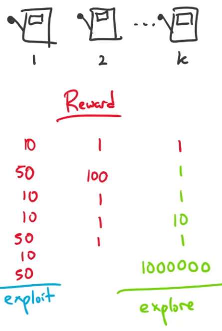
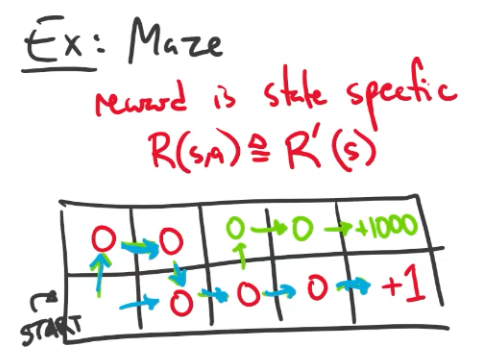

# Lecture 22 Markov Decision Processes

## Learning Paradigms

| Paradigm                 | Data                                                         |
| ------------------------ | ------------------------------------------------------------ |
| Supervised               | $D = \{x^{(i)},y^{(i)}\}_{i=1}^N$ $x \sim p^*(·) \space and \space y = c^*(·)$ |
| -> Regression            | $y^{(i)} \in R$                                              |
| -> Classification        | $y^{(i)} \in \{1,\cdots,K\}$                                 |
| -> Binary classification | $y^{(i)} \in \{+1,-1\}$                                      |
| -> Structured Prediction | $y^{(i)}$ is a vector                                        |
| Unsupervised             | $D = \{x^{(i)}\}_{i=1}^N, x \sim p*(·)$                      |
| Semi-supervised          | $D = \{x^{(i)},y^{(i)}\}_{i=1}^{N_1} \cup \{x^{(j)}\}_{j=1}^{N_2}$ |
| Online                   | $D = \{(x^{(1)},y^{(1)}),(x^{(2)},y^{(2)}),(x^{(3)},y^{(3)}),\cdots\}$ |
| Active Learning          | $D = {x^{(i)}}_{i=1}^N$ and can query $y^{(i)} = c*(·)$ at a cost |
| Imitation Learning       | $D = \{(s^{(1)},a^{(1)}),(s^{(2)},a^{(2)}),\cdots\}$         |
| Reinforcement Learning   | $D = \{(s^{(1)},a^{(1)},r^{(1)}),(s^{(2)},a^{(2)},r^{(2)}),\cdots\}$ |

## Reinforcement Learning

* **Reinforcement Learning** is learning how to **map states to actions**, so as to **maximize a numerical reward** over time
* Unlike other forms of learning, it is a **multistage decision-making process** (often Markovian)
* A reinforcement learning agent must learn by **trail-and-error** (Not entirely supervised, but interactive)
* Actions may affect not only the immediate reward but also subsequent rewards (**Delayed effect**)

### The Precise Goal

* To find a policy that maximizes the **value function**.
  * transitions and rewards usually not available
* **Value iteration** and **Policy iteration** are two classic approaches to this problem. But essentially both are **dynamic programming**.
* **Q-learning** is a more recent approaches to this problem. Essentially it is a **temporal-difference method**.

## Markov Decision Process

* For reinforcement learning we assume our data comes from a **Markov Decision Process**
* Component:
  * $S$ - Set of states
  * $A$ - Set of actions
  * $R(s,a)$ - Reward function $R:S \times A \rarr R$
    * Immediate expectation $R(s,a)=E_{r \sim p(r|s,a)}[r]$
  * $p(s'|s,a)$ - Transition probabilities
    * Markov Assumption $p(s_{t+1}|s_t,a_t,\cdots,s_1,a+1) = p(s_{t+1}|s_t,a_t)$
    * Non-deterministic case
    * Aside: deterministic case
      * $p(s'|s,a) =$
        * $1$ if $f(s,a)=s'$
        * $0$ otherwise
        * $S \times A \rarr S$ is a transition function
* Model:
  * Start in state $S_0$
  * At each time $t$, agent observes $s_t \in S$
    * then chooses $a_t \in A \larr a_t = \pi(s_t)$
    * then receives $r_t \in R \larr r_t = R(s_t,a_t)$
    * and changes to $s_{t+1} \in S \larr s_{t+1} \sim p(·|s_t,a_t)$
  * Total payoff is $(r_0+\gamma r_1+\gamma^2 r_2+\gamma^3 r_3+\cdots)$
    * $\gamma$ is a discount factor, $0<\gamma<1$
  * Def: we execute a policy $\pi$ by taking action $a=\pi(s)$ when in satte $s$
  * Def: a policy is $\pi:S \rarr A$
* Goal:
  * Learn a policy $\pi:S \rarr A$ for choosing "good" actions that maximize $E[total payoff] = E[r_0+\gamma r_1+\gamma^2 r_2+\gamma^3 r_3+\cdots] = \sum_{t=0}^{+\infty} \gamma^t E[r_t]$
  * "infinite horizon expected future discounted reward"

## Exploration vs. Exploitation

### Ex: k-Armed Bandits Problem

* MDP where:
  * single state: $|S| = 1$
  * k-actions: $|A| = k$
  * reward is nondeterministic
  * always transition to same state

## Ex: Maze

* reward is state specific
* $R(s,a) \equiv R'(s)$

## Fixed Point Iteration

* Fixed point iteration is a general tool for solving systems of equations
* It can also be applied to optimization
* **Fixed Point Iteration**
  * Given objective function: $J(\theta)$
  * Compute derivative, set to zero (call this function $f$) $\frac{dJ(\theta)}{d\theta_i} = 0 = f(\theta)$
  * Rearrange the equation s.t. one of parameters appears on the LHS $0 = f(\theta) => \theta_i = g(\theta)$
  * Initialize the parameters
  * For $i$ in $\{1,\cdots,K\}$, update each parameter and increment $t$: $\theta_i^{(t+1)} = g(\theta^{(t)})$
  * Repeat #5 until convergence

## Value Iteration

* State trajectory
  * Given $S_0,\pi,p(s_{t+1}|s_t,a_t)$ there exists a distribution over
  * state trajectories $S_0 \rarr^{a_0=\pi(S_0)} S_1 \rarr^{a_1=\pi(S_1)} S_2$
* Value function
  * $V^\pi(s) \equiv E[total \space payoff \space from \space starting \space in \space s \space and \space using \space \pi] \\ = E_{\pi,p(s'|s,a)}[R(s_0,a_0)+\gamma R(s_1,a_1)+\gamma^2 R(s_2,a_2)+\cdots|s_0=S] \\ = R(s_0,a_0)+\gamma E_{\pi,p(s'|s,a)}[R(s_1,a_1)+\gamma R(s_2,a_2)+\gamma^2 R(s_3,a_3)+\cdots|s_0=S]\\ = R(s_0,a_0)+\gamma \sum_{s_1 \in S} p(s_1|s_0,a_0)[R(s_1,a_1)+\gamma E_{\pi,p(s'|s,a)}[R(s_2,a_2)+\cdots|s_1]]$
  * $E_{x,y \sim p(x,y)}[f(x)+g(y)] = \sum_x p(x)[f(x)+E_{y \sim p(y|x)[g(y)]}]$ 
* Bellman equations
  * $V^\pi(s) = R(s_0,a_0) + \gamma \sum_{s_1 \in S} p(s_1|s_1,a_0)V^\pi(s_1)$
  * for fixed $\pi$, system of $|S|$ equations and $|S|$ variables
* Optimal policy
  * $\pi^* \equiv argmax_\pi V^\pi(s), \forall s$
* Optimal value function
  * $V^* \equiv V^{\pi^*}$
* Computing value function
  * Given $V^*$, $R(s,a)$, $p(s'|s,a)$ we can compute $\pi^{*}$
  * $\pi^*(s) = argmax_{a \in A} R(s,a) + \gamma \sum_{s' \in S}p(s'|s,a)V^*(s')$
  * Best action / Immediate reward / Discounted reward / future
  * $V^*(s) = max_{a \in A} R(s,a) + \gamma \sum_{s' \in S} p(s'|s,a)V^*(s')$

### Value Iteration Algorithm

#### With Q(s,a) table

* Initialize value function $V(s) = 0$ or randomly
* `while` not converged `do`
  * `for` $s \in S$ `do`
    * `for` $a \in A$ `do`
      * $Q(s,a) = R(s,a) + \gamma \sum_{s' \in S} p(s'|s,a)V(s')$
    * $V(s) = max_a Q(s,a)$
* Let $\pi(s) = argmax_a Q(s,a), \forall s$
* `return` $\pi$

#### Without Q(s,a) table

* Initialize value function $V(s) = 0$ or randomly
* `while` not converged `do`
  * `for` $s \in S$ `do`
    * $V(s) = max_a {R(s,a) + \gamma \sum_{s' \in S} p(s'|s,a)V(s')}$
* Let $\pi(s) = argmax_a {R(s,a) + \gamma \sum_{s' \in S} p(s'|s,a)V(s')}, \forall s$
* `return` $\pi$

### Synchronous vs. Asynchronous Value Iteration

* Asynchronous updates:
  * compute and update $V(s)$ for each state one at a time
* Synchronous updates:
  * compute all the fresh values of V(s) from all the stale values of $V(s)$, then update $V(s)$ with fresh values

### Value Iteration Convergence

* Theorem 1
  * $V$ converges to $V^*$, if each state is visited infinitely often
  * Holds for both synchronous and asynchronous updates
* Theorem 2
  * if $max_s|V^{t+1}(s)-V^t(s)| < \epsilon$ then $max_s|V^{t+1}(s)-V^*(s)| < \frac{2\epsilon \gamma}{1-\gamma}$
  * provides reasonable stopping criterion for value iteration
* Theorem 3
  * greedy policy will be optimal in a finite number of steps (even if not converged to optimal value function)
  * often greedy policy converges well before the value function

## Policy Iteration

### Policy Iteration Algorithm

* Initialize policy $\pi$ randomly
* `while` not converged `do`
  * Solve Bellman equations for fixed policy $\pi$
    * $V^\pi(s) = R(s,a) + \gamma \sum_{s' \in S} p(s'|s,a)V^\pi(s')$
  * Improve policy $\pi$ using new value function
    * $\pi(s) = argmax_a {R(s,a) + \gamma \sum_{s' \in S} p(s'|s,a)V^\pi(s')}$
* `return` $\pi$

### Policy Iteration Convergence

* Greedy policy might remain the same for a particular state if there is no better action

### Value Iteration vs. Policy Iteration

* Value iteration requires $O(|A||S|^2)$
* Policy iteration requires $O(|A||S|^2+|S|^3)$
* In practice, policy iteration converges in fewer iterations