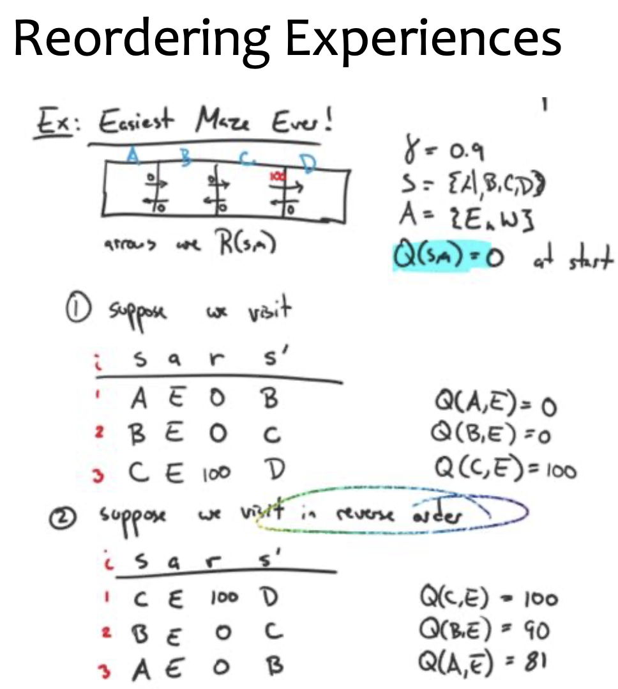
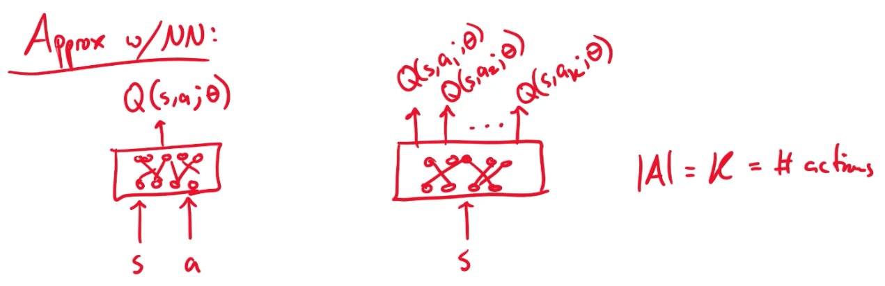
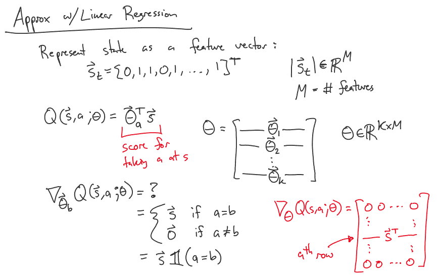

# Lecture 24 Q-Learning

## Q-Learning

* What if we have zero knowledge of the environment

### Q-Function

* Let $Q^*(s,a)$ be true expected discounted future reward for taking action $a$ at state $t$

  * $V^*(s) = max_a Q^*(s,a)$
  * $Q^*(s,a) = R(s,a) + \gamma \sum_{s'} p(s'|s,a)V^*(s') \\ = R(s,a) + \gamma \sum_{s'} p(s'|s,a)[max_{a'} Q(s',a')] $
  * => $\pi^*(s) = argmax_a Q^*(s,a)$
  * If we can learn $Q^*$, we can define $\pi^*$ without $R(s,a)$ and $p(s'|s,a)$

* Case #1: Deterministic Environment

  * $p(s'|s,a) =$

    * $1, if \space f(s,a)=s'$
    * $0, otherwise$

  * $Q^*(s,a) = R(s,a) + \gamma [max_{a'} Q(f(s,a),a')]$

  * Algo #1:

    * 1. Initialize $Q(s,a) = 0, \forall s,a$

    * 2. Do forever

      * a. Select action $a$ and execute
      * b. Receive reward $r$
      * c. Observe next state $s'$
      * d. Update the table entry $Q(s,a)$
        * $Q(s,a) \larr r + \gamma max_{a'} Q(s',a')$

    * ($r$ and $s$ are given by the environment when the agent interacts with it)

    * (produces a training example <s,a,r,s'>)

  * $\epsilon$-greedy variant of Algo #1:

    * Choose hyperparameter $\epsilon$
    * New step 2a:
      * with probability $(1-\epsilon)$
        * select action $a = max_{a'} Q(s,a')$
        * exploit
      * with probability $(\epsilon)$
        * select random action $a \in A$
        * explore

* Case #2: Nondeterministic Environment

  * $p(s'|s,a) are stochastic
  * Algo #2:
    * Exactly the same as Algo #1 except for step 2d
    * New step 2d:
      * update table entry $Q(s,a)$
      * $Q(s,a) \larr (1-\alpha_n)Q(s,a) + \alpha_n(r+\gamma max_{a'} Q(s',a'))$
      * where $\alpha_n = \frac{1}{1+visits(s,a,n)}$
      * visits(s,a,n) = # of visits to <s,a> up to and including step n
      * that is current value in table + q-learning update rule from Algo #1
      * mistrust the updates b/c of stochasticity

* $Q$ converges to $Q^*$ with probability 1

  * assuming
    * 1. each <s,a> is visited infinitely often
    * 2. $0 \leq \gamma < 1$
    * 3. rewards are bounded $|R(s,a)| < \beta$
    * 4. Initial $Q$ values are finite

* Q-Learning is exploration insensitive

  * any state visitation strategy will work assuming 1
  * takes thousands of iteration to converge in practice

### Ex: Reordering Experiences

## Deep Reinforcement Learning

* TD Gammon -> Alpha Go
* Play Atari with Deep RL
  * Setup: RL system observes the pixels on the screen
  * It receives rewards as the game score
  * Actions decide how to move the joystick / buttons

## Deep Q-Learning

* What if our state space S is too large to represent with a table?
  * Use a parametric function to approximate the table entries
* Key Idea:
  * Use a neural network $Q(s,a;\theta)$ to approximate $Q^*(s,a)$
  * Learn the parameters $\theta$ via SGD with training examples $<s_t,a_t,r_t,s_{t+1}>$

### Ideal Loss (Strawman loss function)

* $\ell(\theta) = \sum_{s \in S} \sum_{a \in A} (Q^*(s,a) - Q(s,a;\theta))^2$
* $S$ to large $Q^*$ unknown

### Approximate the Q function with a neural network

### Approximate the Q function with a linear model

### Deep Q-Learning Algorithm

* Initialize $\theta^{(0)}$
* Do forever: $t=1,2,3,\cdots$
  * Receive example <s,a,r,s'>
  * Define squared error loss
    * $\ell(\theta^{(t)},\theta^{(t-1)}) = (([r+\gamma max_{a'} Q(s',a';\theta^{(t-1)}])-Q(s,a;\theta^{(t)}))^2$
    * the first term is y = target (TD-target) and we want $Q(s,a;\theta)$ to be this value (same as RHS of Q-Learning updating rule)
      * $Q(s,a;\theta) \larr r + \gamma max_{a'} Q(s',a';\theta)$
      * which is impossible
    * the second term is current NN estimate of table entry
  * Take step opposite the gradient
    * $\theta^{(t)} \larr \theta^{(t-1)} - \nabla_{\theta^{(t)}} \ell(\theta^{(t)},\theta^{(t-1)})$
    * where $\nabla_{\theta^{(t)}}\ell(\theta^{(t)},\theta^{(t-1)}) = -2 (y-Q(s,a;\theta^{(t)}))\nabla_{\theta^{(t)}} Q(s,a;\theta^{(t)})$
    * the second term is TD-error
    * the third term is computed by backpropagation

### Experience Replay

* Problems with online updates for deep q-learning
  * not i.i.d. as SGD would assume
  * Quickly forget rare experiences that might later be useful to learn from
* Uniform Experience Replay
  * Keep a replay memory $D=\{e_1,e_2,\cdots,e_N\}$ of N most recent experiences $e_t = <s_t,a_t,r_t,s_{t+1}>$
  * Alternate two steps:
    * Repeat T times: randomly sample $e_i$ from D and apply a Q-Learning update to $e_i$
    * Agent selects an action using $\epsilon$-greedy policy to receive new experience that is added to $D$
* Prioritized Experience Replay
  * similar to Uniform ER, but sample so as to prioritize experiences with high error