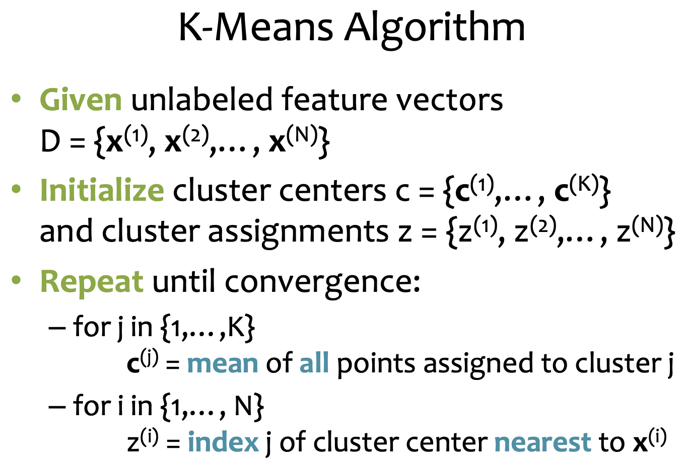

# Lecture 25 K-Means

## Clustering

* Goal: Automatically partition **unlabeled data** into groups of similar datapoints
* Question: When and why would we want to do this?
* Useful for:
  * Automatically organizing data
  * Understanding hidden structure in data

## Optimization Background

### Coordinate Descent

* Goal:
  * Minimize a function $J(\vec{\theta})$
    * $\vec{\theta} = argmin_{\vec{\theta}} J(\vec{\theta})$
* Idea:
  * Pick one dimension and minimize along that dimension
  * Looping the other dimensions fixed

### Block Coordinate Descent

* Goal:
  * $\vec{\alpha},\vec{\beta} = argmin_{\vec{\alpha},\vec{\beta}} J(\alpha,\beta)$
  * $\vec{\alpha} \in R^A, \vec{\beta} \in R^B$
* Idea:
  * Minimize over an entrie group at a time
* Algo:
  * Choose initial $\vec{\alpha},\vec{\beta}$
  * Repeat until stopping criterion satisfied
    * $\vec{\alpha} \larr argmin_{\vec{\alpha}} J(\vec{\alpha},\vec{\beta})$
    * $\vec{\beta} \larr argmin_{\vec{\beta}} J(\vec{\alpha},\vec{\beta})$

## K-Means Algorithm

* Input:
  * unlabeled feature vectors $D=\{x^{(1)},x^{(2)},\cdots,x^{(N)}\}$
* Goal: find an assignment of points to clusters
  * $\vec{z} = \{z^{(1)},z^{(2)},\cdots,z^{(N)}\}, z^{(i)} \in \{1,\cdots,K\}$
  * K = # of clusters is a hyperparameter
* Cluster centers:
  * $c=\{c^{(1)},\cdots,c^{(N)}\}$
* Decision rule:
  * assign each point $\vec{x}^{(i)}$ to its nearest cluster center $\vec{c}_j$
* Objective:
  * $c = argmin_c \sum_{i=1}^N min_j ||\vec{x}^{(i)}-\vec{c}_j||_2^2 \\ = argmin_c \sum_{i=1}^N min_{z^{(i)}} ||\vec{x}^{(i)}-\vec{c}_{z^{(i)}}||_2^2$
  * $c,\vec{z} = argmin_{c,\vec{z}} \sum_{i=1}^N ||\vec{x}^{(i)}-\vec{c}_{z^{(i)}}||_2^2 \\ = argmin_{c,\vec{z}} J(c,\vec{z})$

### K-Means in Practice

* Given $\vec{x}^{(1)},\cdots,\vec{x}^{(N)}$
* Initialize centers $c = \{c^{(1)},c^{(2)},\cdots,c^{(K)}\}$ and  $\vec{z} = \{z^{(1)},z^{(2)},\cdots,z^{(N)}\}$
* Repeat until convergence:
  * $c = argmin_c J(c,\vec{z})$
    * $J(c,\vec{z}) = \sum_{i=1}^N ||\vec{x}^{(i)}-\vec{c}_{\vec{z}^{(i)}}||_2^2 \\ = \sum_{j=1}^K \sum_{i:z^{(i)}=j} ||\vec{x}^{(i)}-\vec{c}_j||_2^2$
    * $\vec{c}_j = \frac{1}{N_j} \sum_{i:\vec{z^{(i)}}=j} \vec{x}^{(i)}$
  * $\vec{z} = argmin_{\vec{z}} J(c,\vec{z})$
    * $\vec{z}^{(1)} = argmin_j ||\vec{x}^{(1)}-\vec{c_j}||_2^2$
    * $\vec{z}^{(N)} = argmin_j ||\vec{x}^{(N)}-\vec{c_j}||_2^2$
    * find the closest cluster center $\vec{c_j}$ for each point $\vec{x}^{(i)}$

### K-Means Performance

* Lloyd's method: Random Initialization
  * Select initial centers at random
  * Assign each point to its nearest center
  * Recompute optimal centers given a fixed clustering
  * It always converges, but it may converge at a local optimum that is different from the global optimum, and in fact could be arbitrarily worse in terms of its score
  * every point is assigned to its nearest center and every center is the mean value of its points