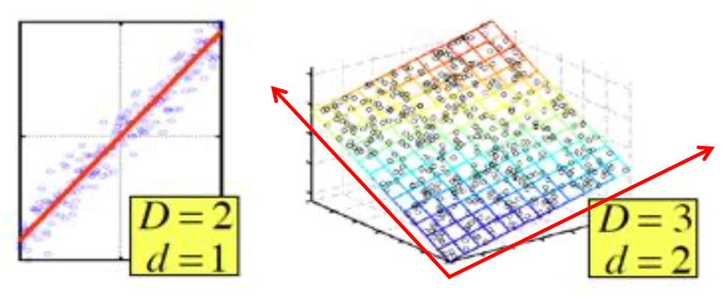
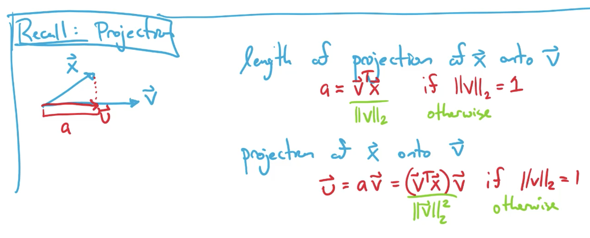
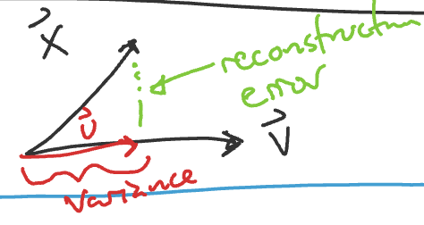
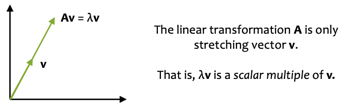
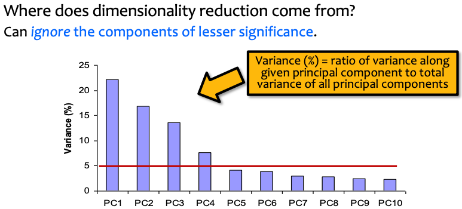

# Lecture 26 Dimensionality Reduction: PCA

## Principal Component Analysis (PCA)

* Powerful unsupervised learning techniques for extracting hidden (potentially lower dimensional) structure for high dimensional datasets
* In case where data lies on or near a low d-dimensional linear subspace, axes of this subspace are an effective representation of the data
* Identifying the axes is known as Principal Components Analysis, and can be obtained by using classic matrix computation tools (Eigen or Singular Value Decomposition)

### Data for PCA

* $D=\{x^{(i)}\}_{i=1}^N$
* $X = [(x^{(1)})^T,(x^{(2)})^T,\cdots,(x^{(N)})^T]^T$
* $x^{(i)} \in R^M$
* We assume the data is centered
  * $\mu = \frac{1}{N} \sum_{i=1}^N{x^{(i)}}$
* The sample covariance matrix is given by
  * $\Sigma_{jk} = \frac{1}{N} \sum_{i=1}^N{(x_j^(i)-\mu_j)(x_k^{(i)}-\mu_k)}$
  * $\Sigma \in R^{M \times M}$
* Since the data matrix is centered, we rewrite as:
  * $\Sigma = \frac{1}{N} X^TX$

### Strawman: Random Linear Projection

* Goal: project from $M$ dimensions down to $K$ dimensions
* Algo:
  * Randomly sample matrix $V \in R^{K \times M}$
  * Project down: $\vec{v}^{(i)} = V\vec{x}^{(i)}, \forall i$
    * $x^{(i)} \in R^{M \times 1}$
  * Resonstruct up: $\widetilde{x}^{(i)} = V^T \vec{v}^{(i)}$
    * $\widetilde{x}^{(i)} \in R^{M \times 1}$
    * $V^T \in R^{M \times K}$
    * $\vec{v}^{(i)} \in R^{K \times 1}$
* **PCA carefully construct $V$ to preserve as much information as possible**

### Definition of PCA

* Given $K$ vectors $\vec{v_1},\vec{v_2},\cdots,\vec{v_K}$ where $\vec{v} \in R^M$
* the projection of a vector $x^{(i)} \in R^M$ to a lower K-dimensional space is $\vec{v}^{(i)} \in R^K$ where
  * $\vec{v}^{(i)} = [\vec{v_1^T}\vec{x}^{(i)},\vec{v_2^T}\vec{x}^{(i)},\cdots,\vec{v_K^T}\vec{x}^{(i)}]^T$
  * where $V=[\vec{v_1^T},\vec{v_2^T},\cdots,\vec{v_K^T}]^T$
* Def: PCA repreatedly chooses a next vector $\vec{v_j}$ that minimizes the reconstruction error s.t. $\vec{v_j}$ is orthogonal to $\vec{v_1},\vec{v_2},\cdots,\vec{v_{j-1}}$
  * Recall: two vectors $\vec{a}$ and $\vec{b}$ are orthogonal iff $\vec{a^T}\vec{b}=0$

### Objective Functions of PCA

* Minimize the reconstruction error
  * $\vec{v} = argmin_{\vec{v}} \frac{1}{N} \sum_{i=1}^N ||\vec{x}^{(i)}-(projection \space of \space x^{(i)})||_2^2$
* Maximize the variance
  * $\vec{v} = argmax_{\vec{v}} \frac{1}{N} \sum_{i=1}^N (projection \space length \space of \space \vec{x}^{(i)})^2 \\ = argmax_{\vec{v}} \frac{1}{N} \vec{v}^T(X^TX)\vec{v} \space s.t. ||v||_2=1 \\ = argmax_{\vec{v}} \vec{v}^T \sum \vec{v} \space s.t. ||v||_2=1$
* These two objective functions give back the same $\vec{v}$

### Eigenvectors & Eigenvalues

* For a square matrix $A$ (n x n matrix), the vector $v$ (n x 1 matrix) is an eigenvector iff there exists eigenvalue $\lambda$ (scalar) such that:
  * $Av = \lambda v$

* Theorem 1: The vector that maximizes the variance is the eigenvector of $\Sigma$ with largest eigenvalue
* Theorem 2: The eigenvectors of a symmetric matrix are orthogonal to each other
* Fact: $\Sigma$ is a symmetric matrix

### PCA Projections

* $\vec{v}^{(i)} = [\vec{v_1^T}\vec{x}^{(i)},\cdots,\vec{v_K^T}\vec{x}^{(i)}]^T$
* $\vec{v_k}$ is the eigen vector with k-th largest eigenvalue

### Algorithms for PCA

* Power iteration (aka. Von Mises iteration)
  * finds each principal component one at a time in order
* Singular Value Decomposition (SVD)
  * finds all the principal components at once
  * For any arbitrary matrix $A$, SVD gives a decomposition:
    * $A = U \Lambda V^T$ where $\Lambda$ is a diagonal matrix, and $U$ and $V$ are orthogonal matrices
    * rewrite $\Sigma = \frac{1}{N}X^TX$ so that $\Sigma = \frac{1}{N} V(\Lambda)^2V^T$
* Stochastic Methods (approximate)
  * very efficient for high dimensional datasets with lots of points

### Principal Component Analysis

* $(XX^T)v = \lambda v$,so $v$ (the first PC) is the eigenvector of sample correlation/covariance matrix $XX^T$
* Sample variance of projection $v^TXX^Tv = \lambda v^Tv$
* Thus, the eigenvalue $\lambda$ denotes the amount of variability captured along that dimension (aka amount of energy along that dimension)
* How Many PCs?
  * For $M$ original dimensions, sample covariance matrix is $M \times M$, and has up to $M$ eigenvectors
  * So $M$ PCs
* You do lose some information, but if the eigenvalues are small, you don’t lose much
  * **$M$ dimensions in original data**
  * **calculate $M$ eigenvectors and eigenvalues**
  * **choose only the first $D$ eigenvectors, based on their eigenvalues**
  * **final data set has only $D$ dimensions**

