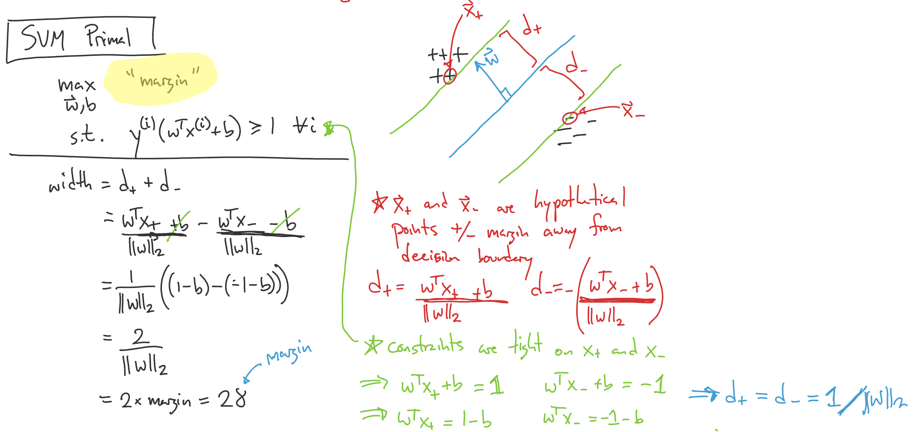
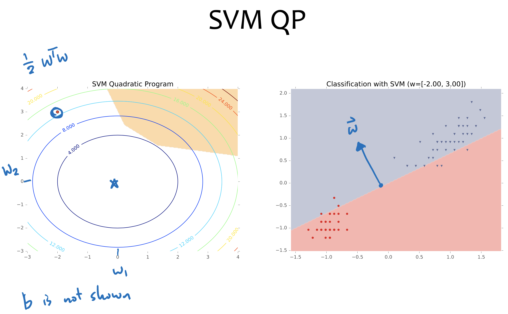
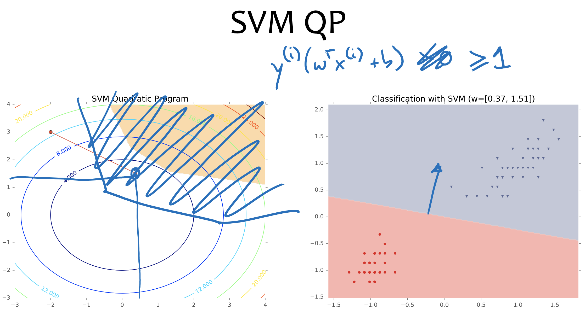
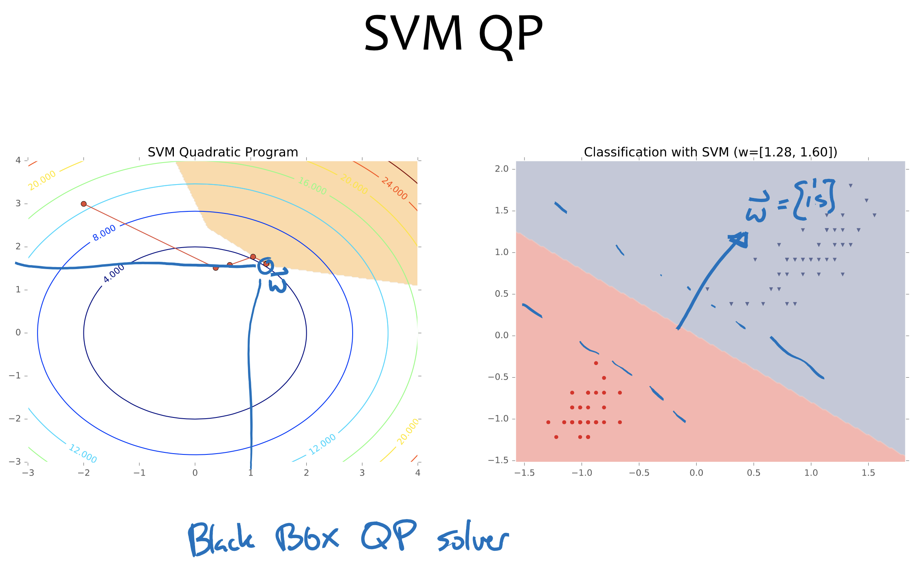
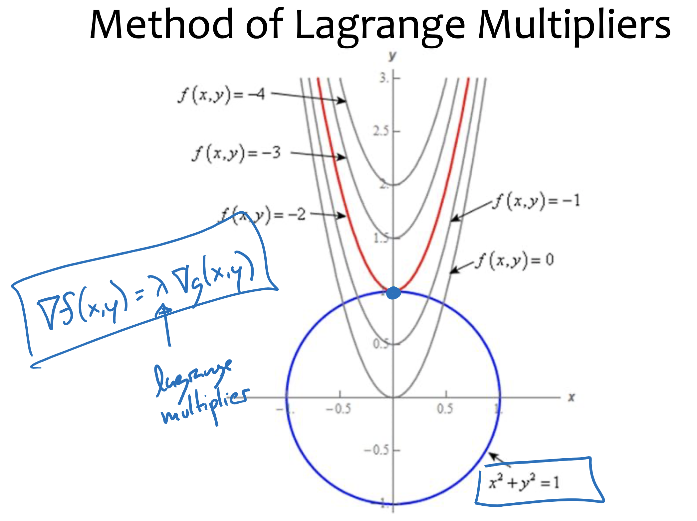
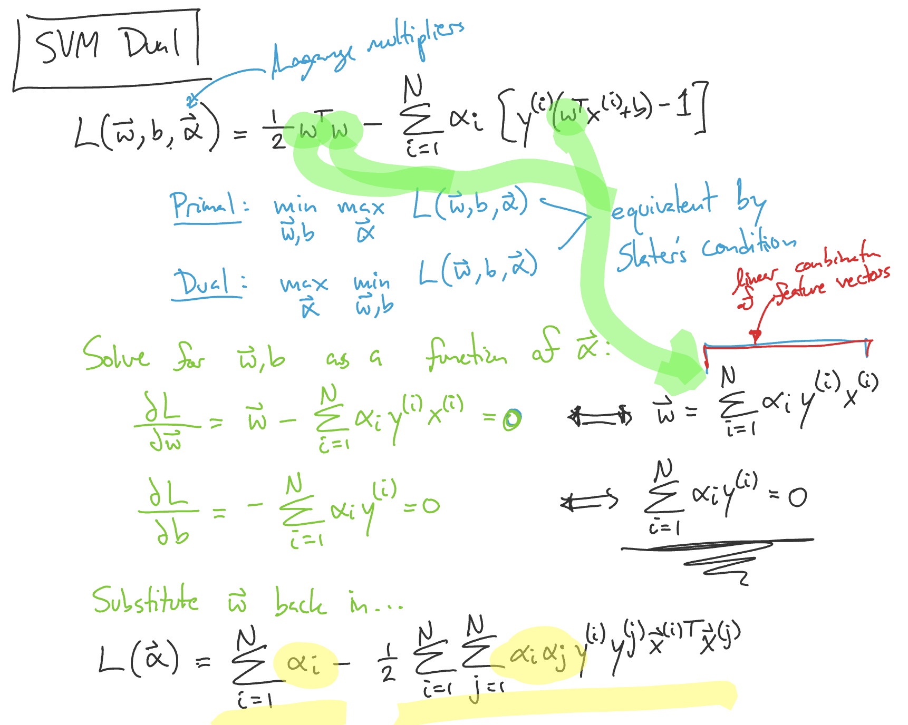
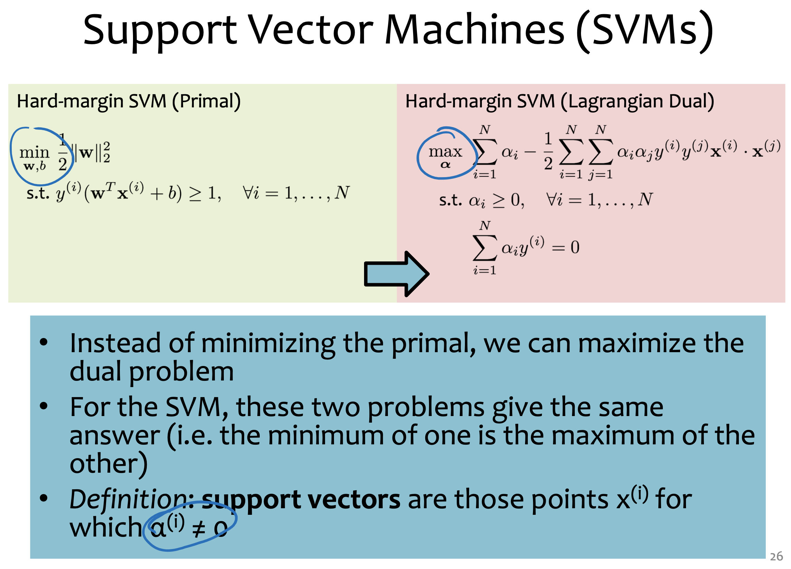
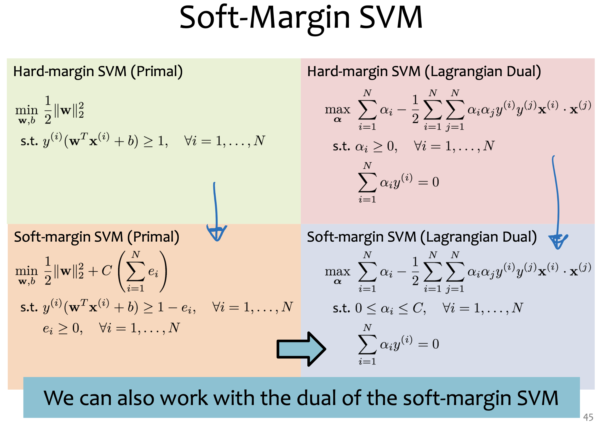
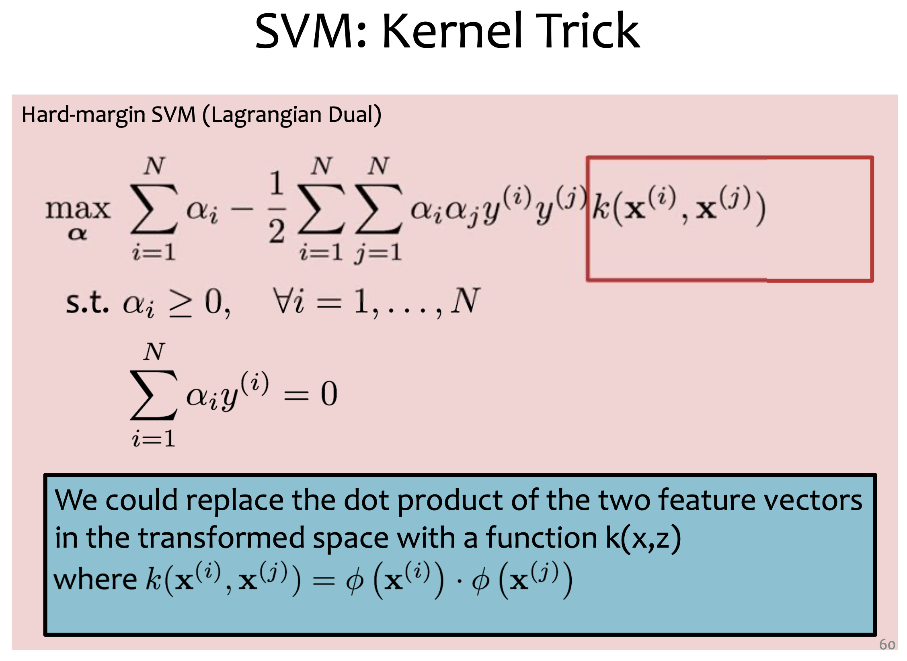
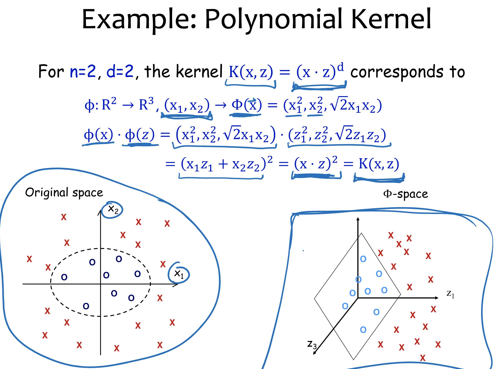

# Lecture 27 Support Vector Machines + Kernels

## Optimization Background

### Constrained Optimization

* Unconstrained optimization
  * $min_{\vec{\theta}} J(\vec{\theta})$
* Constrained optimization
  * $min_{\vec{\theta}} J(\vec{\theta}) \space (Linear \space Objective) \\ s.t. g(\vec{\theta}) \leq \vec{b} \space (Linear \space Constraints)$

### Linear Programming

* $min_{\vec{x}} \vec{c}^T\vec{x} \space s.t. A\vec{x} \leq \vec{b}$
  * $\vec{c} \in R^M, \vec{x} \in R^M, A \in R^{N \times M}, \vec{b} \in R^N$
* Solvers:
  * Simplex Algo
  * Interior points

### Quadratic programming

* $min_{\vec{x}} \vec{x}^TQ\vec{x} + \vec{c}^T\vec{x} \\ s.t. A\vec{x} \leq \vec{b}$
  * $Q \in R^{M \times M}$
* Solvers:
  * Conjugate gradient
  * Elipsoid methods
  * Interior points
* Special case: if $Q$ is positive-definite ($a^TQa > 0, \forall a \in R^M$), the problem is convex

## Support Vector Machines (SVM)

* Key Idea: find linear separator with maximum margin

### Linear Separability

* Recall: Data $D = \{(x^{(i)},y^{(i)})\}_{i=1}^N$ is linearly separable iff
  * $\exists \vec{w},b \space s.t. \\ w^Tx^{(i)}+b > 0 \space if \space y^{(i)} = +1 \\ w^Tx^{(i)}+b < 0 \space if \space y^{(i)} = -1$
  * $\exists \vec{w},b \space s.t. y^{(i)}(w^Tx^{(i)}+b) > 0, \forall i$
  * $\exists \vec{w},b,c \space s.t. y^{(i)}(w^Tx^{(i)}+b) \geq c, \forall i \space and \space c > 0$
  * $\exists \widetilde{\vec{w}},\widetilde{b} \space s.t. y^{(i)}(\widetilde{w}^Tx^{(i)}+\widetilde{b}) \geq 1$
    * $\widetilde{\vec{w}} = \frac{\vec{w}}{c}$
    * $\widetilde{b} = \frac{b}{c}$

### SVM Primal

* $max_{\vec{w},b} margin \\ s.t. y^{(i)}(w^Tx^{(i)}+b) \geq 1, \forall i$
* $d_+ = \frac{w^Tx_+ + b}{||w||_2}$
* $d_- = - \frac{w^Tx_- + b}{||w||_2}$
* $d_+ = d_- = \frac{1}{||w||_2}$
* $width = d_+ + d_- \\ = \frac{w^Tx_+ + b}{||w||_2} - \frac{w^Tx_- - b}{||w||_2} \\ = \frac{1}{||w||_2}((1-b)-(-1-b)) \\ = \frac{2}{||w||_2} \\ = 2 \times margin = 2 \delta$
* **Objective function**
  * $max \space margin <==> max \frac{2}{||w||_2} <==> min \frac{1}{2}||w||_2 <==> min \frac{1}{2} ||w||_2^2$
    * $||w||_2 = \sqrt{w^Tw}$
* **SVM Quadratic Programming (primal)**
  * $min \frac{1}{2}w^Tw \\ s.t. y^{(i)}(w^Tx^{(i)}+b) \geq 1, \forall i \in \{1,\cdots,N\}$
  * **Equivalent to L2 regularization**

### Method of Language Multipliers

* Goal: $min f(\vec{x}) \space s.t. \space g(\vec{x}) \leq c$
* Construct Lagrangian
  * $L(\vec{x},\lambda) = f(\vec{x}) - \lambda(g(\vec{x})-c)$
* Solve
  * $min_{\vec{x}} max_\lambda L(\vec{x},\lambda)$
  * $\nabla L(\vec{x},\lambda) = 0 \space s.t. \space \lambda \geq 0,g(\vec{x}) \leq c$
  * Equivalent to solving:
    * $\nabla f(\vec{x}) = \lambda \nabla_S(\vec{x}) \space s.t. \space \lambda \geq 0,g(\vec{x}) \leq c$

### SVM Dual

* $L(\vec{w},b,\vec{a}) = \frac{1}{2}w^Tw - \sum_{i=1}^N{\alpha_i[y^{(i)}(w^Tx^{(i)}+b)-1]} \space (Lagrange \space multipliers)$
  * Primal: $min_{\vec{w},b} max_{\vec{\alpha}} L(\vec{w},b,\vec{a})$
  * Dual: $max_{\vec{\alpha}} min_{\vec{w},b} L(\vec{w},b,\vec{a})$
  * equivalent by Slater's condition
* Solve for $\vec{w},b$ as a function of $\vec{\alpha}$:
  * $\frac{dL}{d\vec{w}} = \vec{w} - \sum_{i=1}^N{\alpha_i y^{(i)} x^{(i)}} = 0$
  * $\frac{dL}{d\vec{b}} = - \sum_{i=1}^N{\alpha_i y^{(i)}} = 0$
  * $\vec{w} = \sum_{i=1}^N{\alpha_i y^{(i)}} x^{(i)}$
  * $\sum_{i=1}^N{\alpha_i y^{(i)}} = 0$
* Substitute $\vec{w}$ back in
  * $L(\vec{\alpha}) = \sum_{i=1}^N{\alpha_i} - \frac{1}{2} \sum_{i=1}^N \sum_{j=1}^N \alpha_i \alpha_j y^{(i)} y^{(j)} {\vec{x}^{(i)}}^T \vec{x}^{(j)}$

### SVM Dual QP

* $max_{\alpha} L(\vec{\alpha}) \space s.t. \space 0 \leq \alpha_i, \sum_{i=1}^N{\alpha_i y^{(i)}} = 0$
* Most popular algorithm for solving SVMs:
  * sequential minimal optimization (SMO)
    * which relies on the SVM Dual
    * very easy to implement and  performs very fast

### Soft-Margin SVM

* If the dataset is not linearly separable, can we still use an SVM?
* Not the hard􏰇􏰇 margin version
  * It will never find a feasible solution
* In the soft􏰇􏰇margin version, we add “**slack variables**” that **allow some points to violate** the large􏰇􏰇margin constraints
* The constant $C$ dictates **how large** we should allow the slack variables to be

### Multiclass SVMs

* The SVM is **inherently** a **binary** classification method, but can be extended to handle K􏰇class classification in many ways
* one􏰇-vs􏰇-rest
  * build K binary classifiers
  * train the k-th classifier to predict whether an instance has label k or something else
  * predict the class with largest score
* One-vs-one
  * build (K choose 2) binary classifiers
  * train one classifier for distinguishing between each pair of labels
  * predict the class with the most “votes” from any given classifier

## Kernel

* Motivation
  * Motivation #1: Inefficient Features
    * Non􏰇linearly separable data requires high dimensional representation
    * Might be prohibitively expensive to compute or store
  * Motivation #2: Memory-􏰇based Methods
    * k􏰇Nearest Neighbors (KNN) for facial recognition allows a distance metric between images 􏰇􏰇 no need to worry about linearity restriction at all

### Kernel Methods

* Key idea:
  * Rewrite the algorithm so that we only work with dot products $x^Tz$ of feature vectors
  * Replace the dot products $x^Tz$ with a kernel function $k(x,z)$
* The kernel $k(x,z)$ can be any legal definition of a dot product
  * $k(x,z) = \phi(x)^T\phi(z)$ for any function $\phi:X \rightarrow R^D$
  * So we only compute the $\phi$ dot product implicitly
* This “kernel trick” can be applied to many algorithms:
  * classification: perceptron, SVM
  * regression: ridgeregression
  * Clustering: k-means

### Example: Polynomial Kernel

### Kernel Examples

| Name                                | Kernel Function                                | Feature Space                                              |
| ----------------------------------- | ---------------------------------------------- | ---------------------------------------------------------- |
| Linear                              | $K(x,z) = x^Tz$                                | Same as original input space                               |
| Polynomial (v1)                     | $K(x,z) = (x^Tz)^d$                            | All polynomial of degree d                                 |
| Polynomial (v2)                     | $K(x,z) = (x^Tz+1)^d$                          | All polynomials up to degree d                             |
| Gaussian                            | $K(x,z) = exp(-\frac{||x-z||_2^2}{2\sigma^2})$ | Infinite dimensional space                                 |
| Hyperbolic Tangent (Sigmoid) Kernel | $K(x,z) = tanh(\alpha x^Tz+c)$                 | (With SVM, this is equivalent to a 2-layer neural network) |

## SVM + Kernel Takeaways

* Maximizing the margin of a linear separator is a good training criteria
* Support Vector Machines (SVMs) learn a max􏰇-margin linear classifier
* The SVM optimization problem can be solved with black􏰇box Quadratic Programming (QP) solvers
* Learned decision boundary is defined by its support vectors
* Kernel methods allow us to work in a transformed feature space without explicitly representing that space
* The kernel􏰇-trick can be applied to SVMs, as well as many other algorithms