# Lecture28 Ensemble Methods + Recommender Systems

## Ensemble Methods

### Weighted Majority Algorithm

* **Given**: pool *A* of binary classifiers (that you know nothing about)
* **Data:** stream of examples (i.e. online learning setting)
* **Goal:** design a new learner that uses the predictions of the pool to make new predictions
* **Algorithm**:
  - Initially weight all classifiers equally
  - Receive a training example and predict the (weighted) majority vote of the classifiers in the pool
  - Down-weight classifiers that contribute to a mistake by a factor of $\beta$

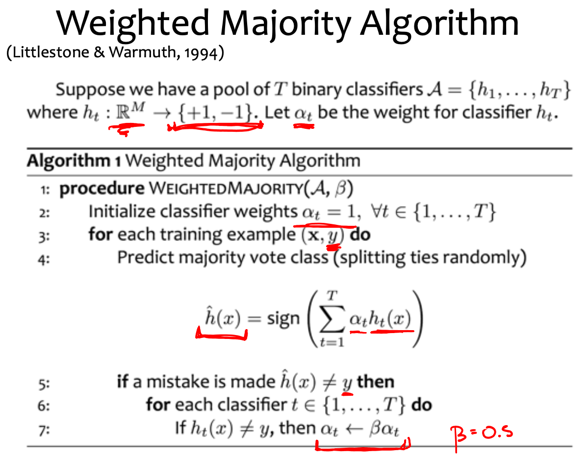

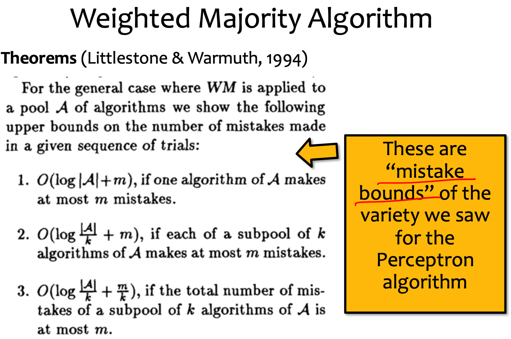

## AdaBoost

* **AdaBoost**
  * an example of a boosting method
  * simultaneously learns:
    * the classifiers themselves
    * (majority vote) weight for each classifiers
* With comparision to Weighted Majority Algorithm
  * an example of an ensemble method
  * assumes the classifiers are learnedaheadoftime
  * only learns (majority vote) weight for each classifiers

### AdaBoost: Toy Example

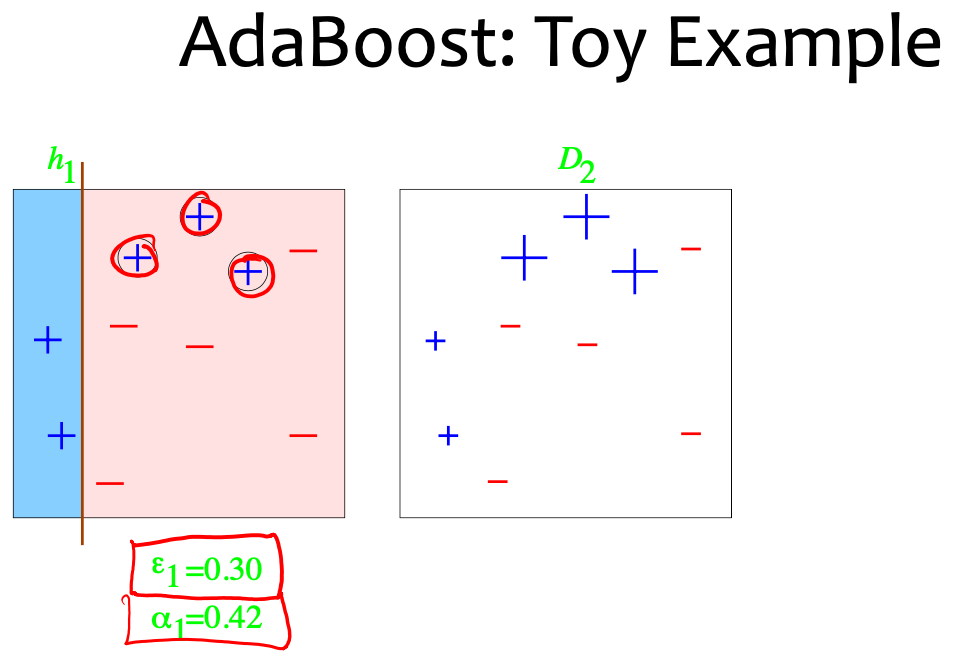

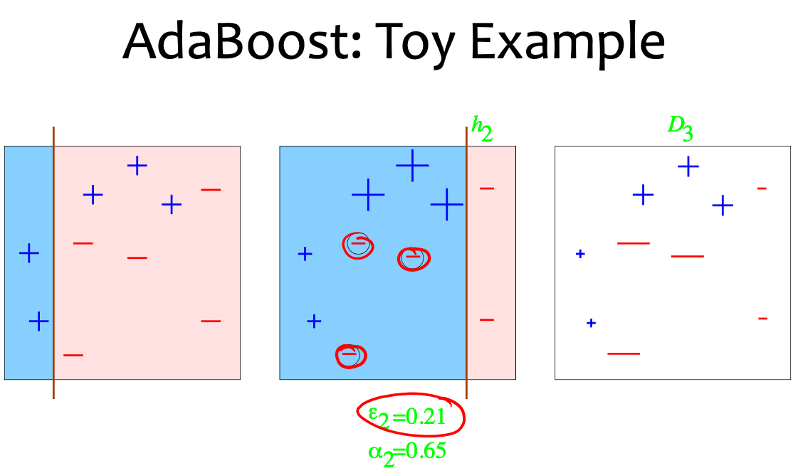

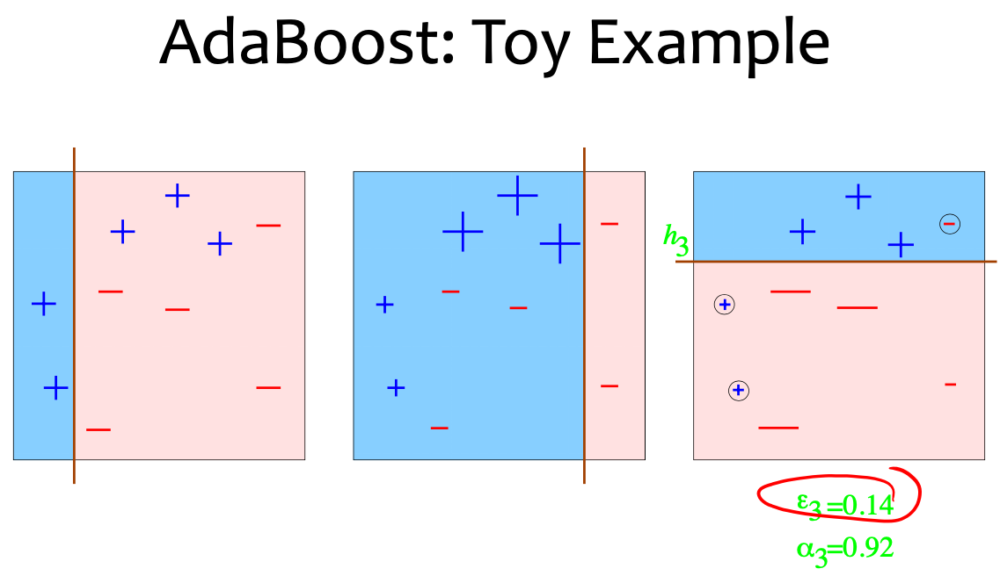

### AdaBoost Algorithm

* Given: $(x_1,y_1),\cdots,(x_m,y_m)$ where $x_i \in X, y_i \in Y = {-1, +1}$
* Initialize $D_1(i) = 1 / m$
* For $t = 1,\cdots,T$
  * Train weak learner using distribution $D_t$
  * Get weak hypothesis $h_t : X \rightarrow \{-1,+1\}$ with error $\epsilon_t = Pr_{i \sim D_t}[h_t(x_i) \neq y_i]$
  * Choose $\alpha_t = \frac{1}{2} \ln(\frac{1-\epsilon_t}{\epsilon_t})$
  * Update
    * $D_{t+1}(i) = \frac{D_t(i)}{Z_t} \times \\ e^{-\alpha_t} \space if \space h_t(x_i) = y_i \\ e^{\alpha_t} \space if \space h_t(x_i) \neq y_i \\ = \frac{D_t(i)exp(-\alpha_t y_i h_t(x_i))}{Z_t}$
    * where $Z_t$ is a a normalization factor (chosen so that $D_{t+1}$ will be a distribution)
* Output the final hypothesis
  * $H(x) = sign(\sum_{t=1}^N \alpha_t h_t(x))$

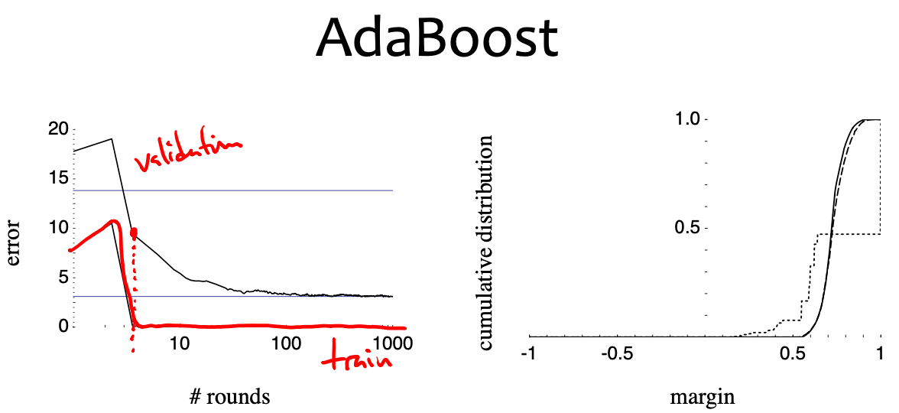

## Recommender Systems

* A common challenge
  * Assume you’re a company selling items of some sort: movies, songs, products, etc
  * Company collects millions of ratings from users of their items
  * To maximize profit / user happiness, you want to **recommend** items that users are likely to want
* Setup
  * Items
  * Users
  * Feedback
* Key assumptions:
  * Can represent ratings numerically as a user/item matrix
  * Users only rate a small number of items (the matrix is sparse)

### Content Filtering

* Example: `Pandora.com` music recommendations
* **Con:** Assumes access to side information about items (e.g. properties of a song)
* **Pro:** Got a new item to add? No problem, just be sure to include the side information

### Collaborative Filtering

* Example: `Netflix` movie recommendations
* **Pro:** Does not assume access to side information about items (e.g. does not need to know about movie genres)
* **Con:** Does not work on new items that have no ratings
* **Common insight**: personal tastes are correlated

#### Neighborhood Methods

* **Find neighbors** based on similarity of movie preferences
* **Recommend** movies that those neighbors watched

#### Latent Factor Methods

* Assume that both movies and users live in some **low- dimensional space** describing their properties
* **Recommend** a movie based on its **proximity** to the user in the latent space
* **Example Algorithm**: Matrix Factorization

## Matrix Factorization

### Low-Rank Factorization

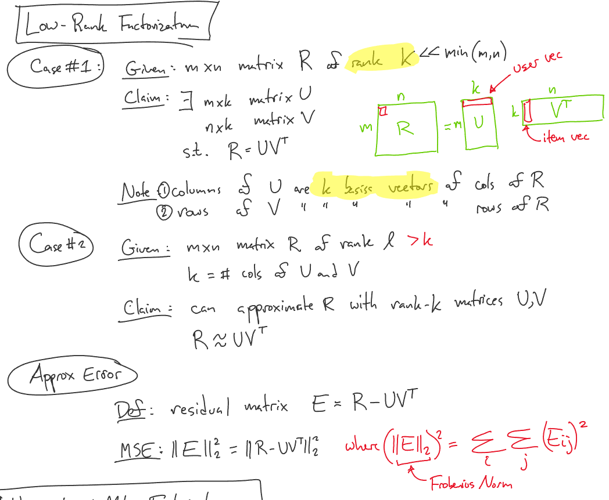

### Example: Matrix Factorization for Netflix Problem

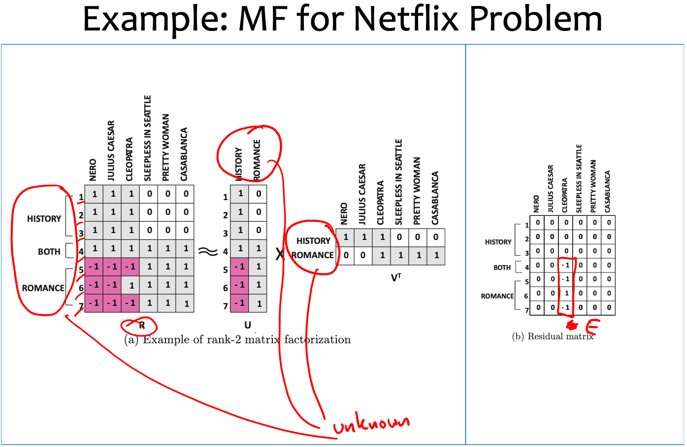

### Regression vs. Collaborative Filtering

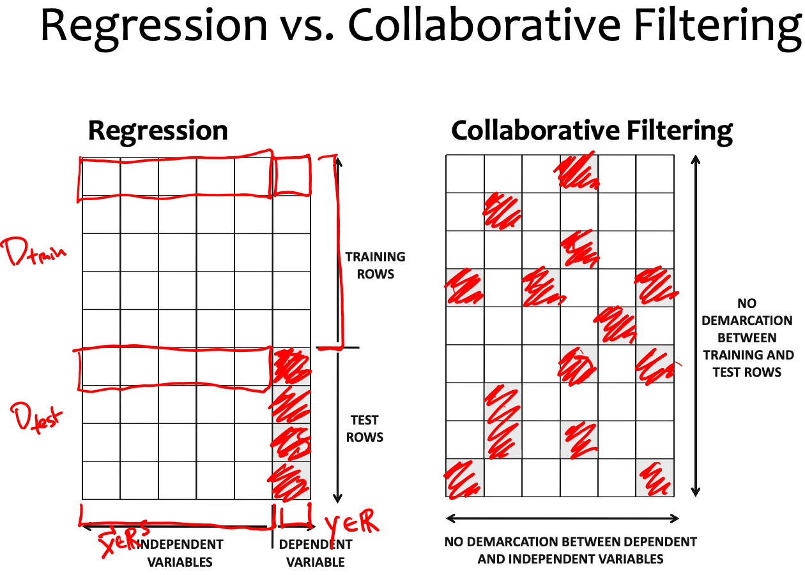

### Unconstrained Matrix Factorization

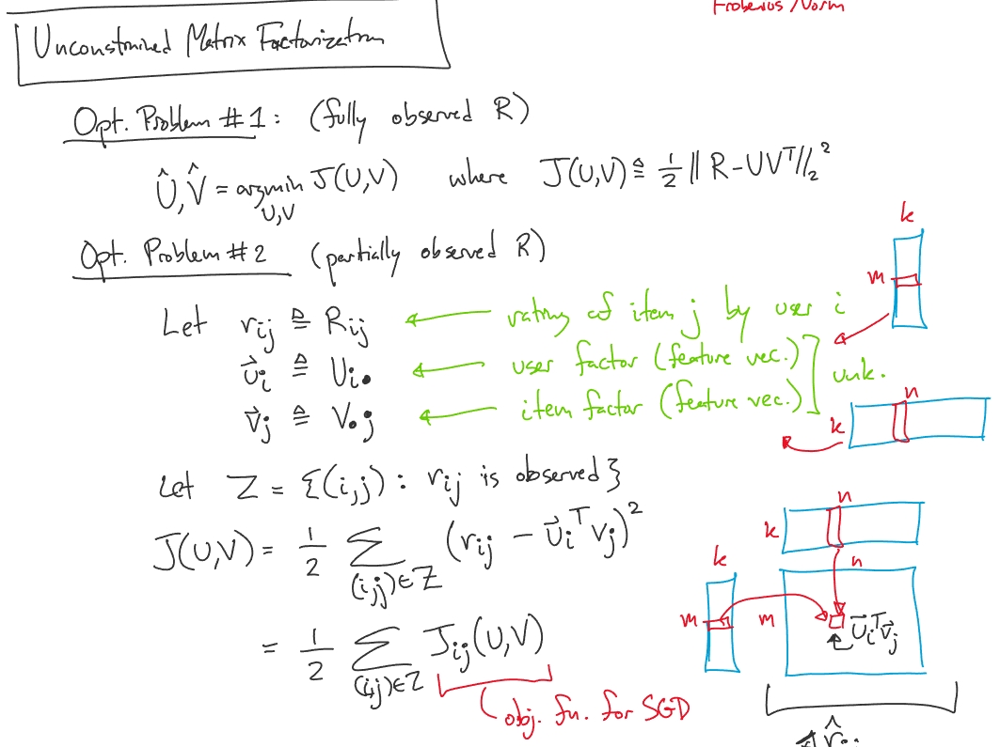

### Recipe for Matrix Factorization

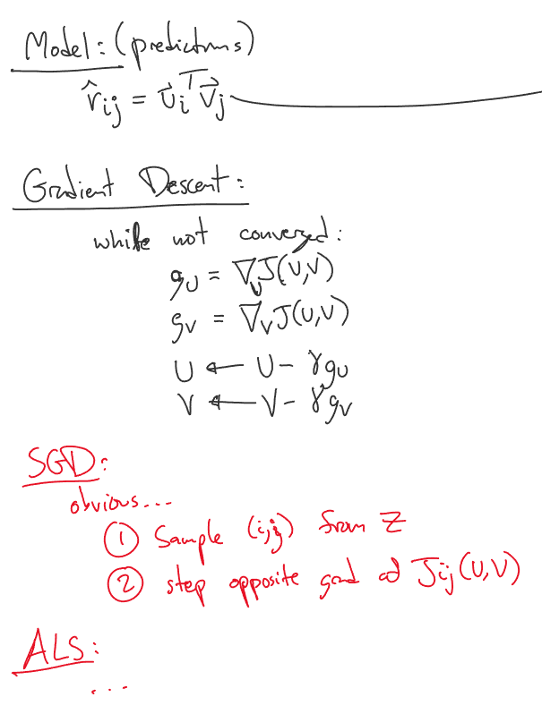
