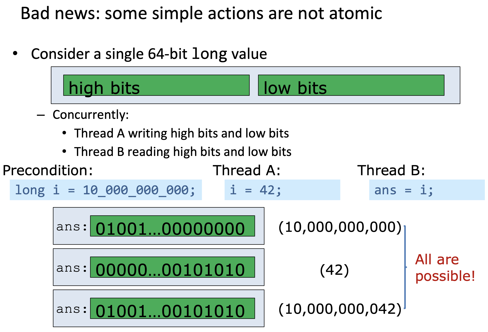

# Lecture 18 Concurrency: Java Primitives

## Concurrency Then And Now

* In the past, multi-threading just a convenient abstraction
  * GUI design: event dispatch thread
  * Server design: isolate each client's work
  * Workflow design: isolate producers and consumers
* Now: required for scalability and performance

## Java Concurrency

* Java is inherently multithreaded
* To utilize modern processors, we must write multithreaded code
* Excellent libraries exist (e.g. java.util.concurrent)

### Basic Concurrency in Java

* An interface representing a task

```java
public interface Runnable {
  void run();
}
```

* A class to execute a task in a CPU thread

```java
public class Thread {
  public Thread(Runnable task);
  public void start();
  public void join();
}
```

### Safety failure vs. Liveness failure

* A race condition for shared data
* Reads and writes interleaved randomly
* Not enough concurrency control: safety failure
  * Incorrect computation
* Too much concurrency control: liveness failure
  * Possibly no computation at all (deadlock or livelock)

### Java's intrinsic locks

* `synchronized` (lock)
  * Synchronizes entire block on object `lock`; cannot forget to unlock
  * exclusive: One thread at a time holds the lock
  * reentrant: A thread can repeatedly get same lock
* synchronized on instance methods for entire method
* synchronized on a static method in class for entire method

### Example: Serial number genration

```java
public class SerialNumber {
  private static long nextSerialNumber = 0;
  
  public static synchronized long generateSerialNumber() {
    return nextSerialNumber++;
  }
  
  public static void main(String []args) throws InterruptedException {
    Thread threads[] = new Thread[5];
    for (int i = 0;i < threads.length; i++) {
      threads[i] = new Thread(() -> {
        for (int j = 0; j < 1_000_000; j++) {
          generateSerialNumber();
        }
      })
      threads[i].start();
    }
    for (Thread thread : threads) {
      thread.join();
    }
    System.out.println(generateSerialNumber());
  }
}
```

* A better one with using `java.util.concurrent`

```java
public class SerialNumber {
	private static AtomicLong nextSerialNumber = new AtomicLong();
  
  public static long generateSerialNumber() {
		return nextSerialNumber.getAndIncrement();
  }

  public static void main(String[] args) throws InterruptedException{ 
    Thread threads[] = new Thread[5];
		for (int i = 0; i < threads.length; i++) {
			threads[i] = new Thread(() -> {
				for (int j = 0; j < 1_000_000; j++)
          generateSerialNumber();
				});
				threads[i].start();
    }
    for(Thread thread : threads) thread.join();
		System.out.println(generateSerialNumber()); 
  }
}
```

### Atomicity

* An action is atomic if it is indivisible
* In java, integer increment is not atomic
  * Load data from variable i
  * Increment value
  * Store data into variable i again
* Reading an `int` is atomic
* Writing an `int` is atomic



### Cooperative Thread Termination

```java
public class StopThread {
  private static boolean stopRequested;

  public static void main(String[] args) throws Exception {
    Thread backgroundThread = new Thread(() -> {
      while (!stopRequested)
        /* Do something */ ;
		});
    backgroundThread.start();
    
		TimeUnit.SECONDS.sleep(1);
		stopRequested = true;
  }
}
```

* In the absence of synchronization, there is no guarantee as to when, **if ever**, one thread will see changes made by another

* **JVMs can and do perform this optimization (“hoisting”):**

  * ```java
    while (!done)
      /* do something */ ;
    ```

* **becomes:**

  * ```java
    if (!done)
      while (true)
        /* do something */ ;
    ```
  
* A possible fix with using `synchronized`:

  * You **must** lock write and read!
  
  * *Otherwise, locking accomplishes* **nothing**
  
  * ```java
    public class StopThread {
    	private static boolean stopRequested;
      
    	private static synchronized void requestStop() {
    		stopRequested = true;
      }
      private static synchronized boolean stopRequested() {
        return stopRequested;
    	}
    	public static void main(String[] args) throws Exception {
        Thread backgroundThread = new Thread(() -> {
          while (!stopRequested())
            /* Do something */ ;
    		});
        backgroundThread.start();
        
    		TimeUnit.SECONDS.sleep(10);
        requestStop();
      }
    }
    ```

### Volatile

* Java `volatile` keyword is used to mark a Java variable as "**being stored in main memory**"
* `volatile` is synchronization without mutual exclusion
* In a multithreaded application where the threads operate on non-volatile variables, each thread may copy variables from main memory into a CPU cache while working on them, for performance reasons

```java
public class StopThread {
  private static volatile boolean stopRequested;
  
  public static main(String[] args) {
    Thread backgroundThread = new Thread(() -> {
      while(!stopRequested)
        /*Do something*/;
    })
    backgroundThread.start();
    
    TimeUnits.SECONDS.sleep(5);
    stopRequested = true;
  }
}
```

### Summary

* Avoid shared mutable state
* Even atomic oprations require synchronization
* Some things that look atomic aren't (e.g., `i++`)