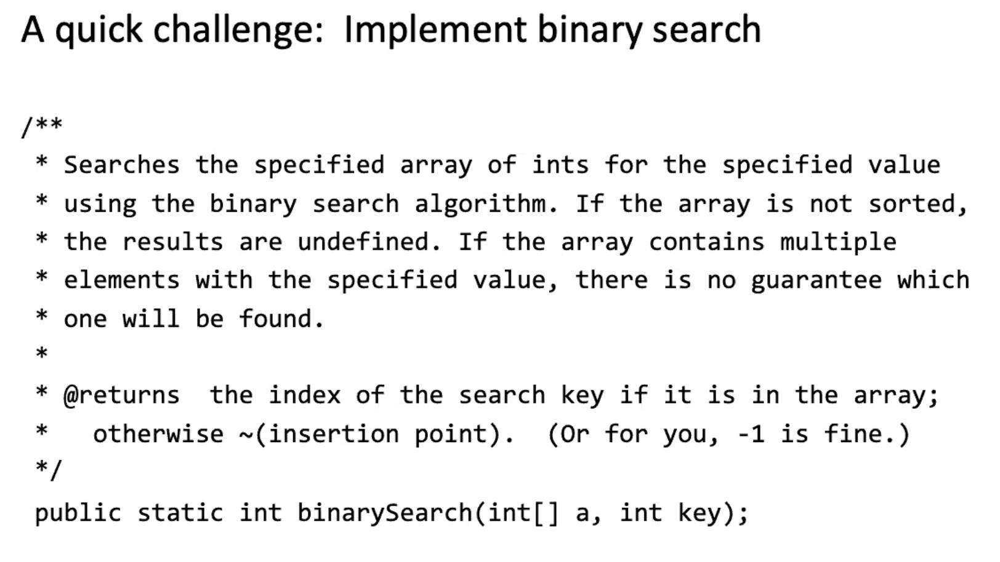
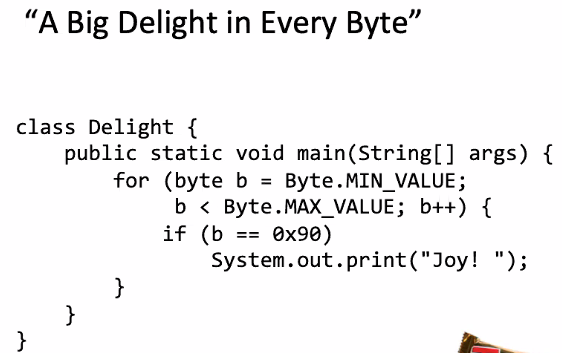
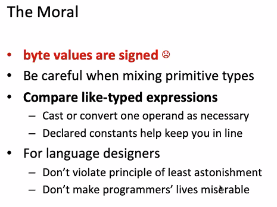
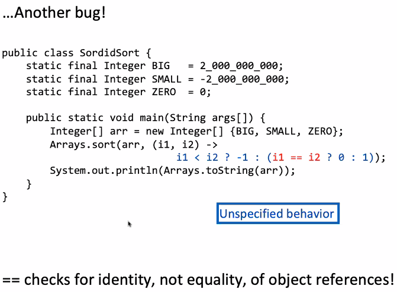
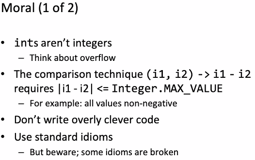
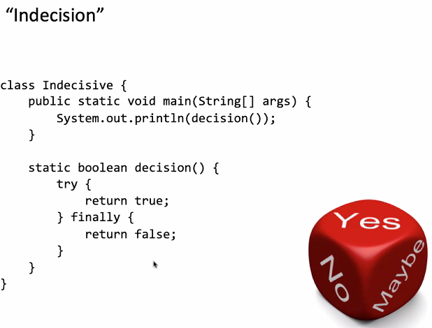
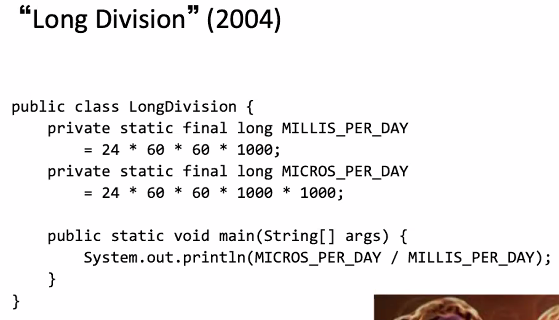
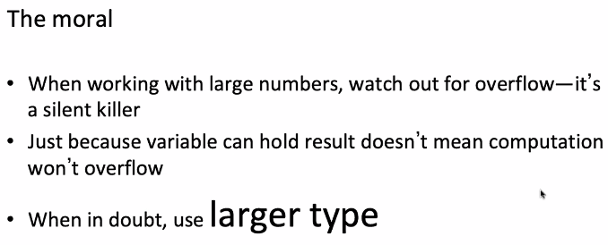
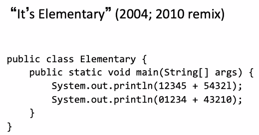

# Lecture 26 A Puzzling Finale

## Implement Binary Search

## Java CAFEBABE

* Java compilers make Java source code into bytecode
* All Java classes start with the word CAFEBABE
* $(CAFEBABE)_{16} = (3405691582)_{10}$

## A Big Delight in Every Byte

### The Moral of Byte

## Sordid Sort

* The answer should be unspecified:
* In practice, `[2000000000, -2000000000, 0]`

### The Moral of Integer

## Indecision

* It returns `false`

### The Moral of Indecision

## Long Division

* It returns `5`
* Since `MICROS_PER_DAY` >> `Integer.MAX_VALUE`

### The Moral of Long Division

## It's Elementary

* The answer should be `17777 43878`
* `1` is the numeral one
* `l` is the lower case letter el
* $01234$ is an octal literal equal to $1,234_8$, which is 668

### The Moral of Elementary

