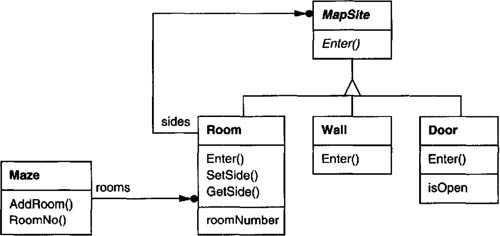
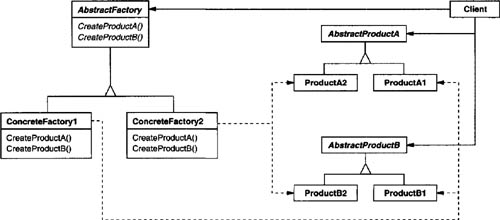
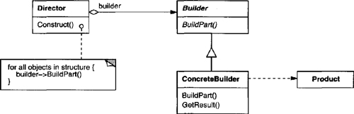
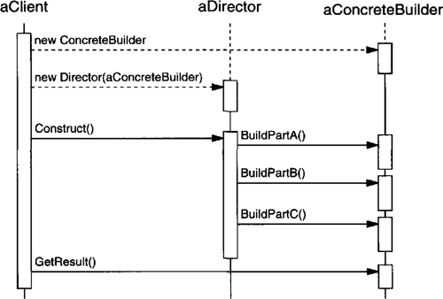
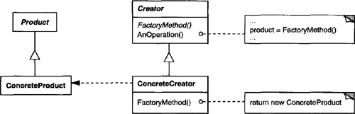
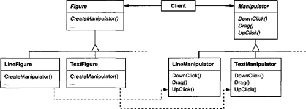
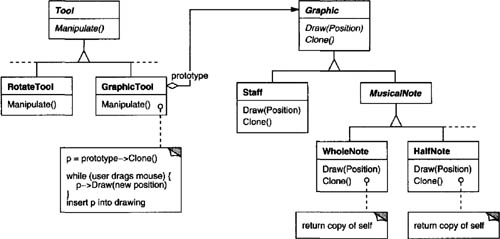
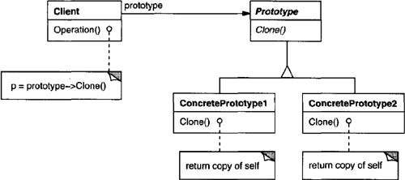

# Chapter 3. Creational Patterns

* “Creational design patterns abstract the instantiation process. ”
  * Independent of how its objects are created, composed, and represented.
  * Class creational pattern uses inheritance to vary the class that's instantiated.
  * Object creational pattern delegates instantiation to another object.
* Creational design patterns depend more on object composition than class inheritance.
* Creational patterns -> flexibility for *what* gets created, *who* creates it, *how* it gets created, and *when* -> objects vary widely in structure and functionality.
* Relationship among creational patterns:
  * Competitors: Either Prototype or Abstract Factory
  * Complementary: Builder can use one of the other patterns to implement which components get built, Prototype can use Singleton in its implementation.
* This chapter uses a common example - building a maze for a computer game - to illustrate their implementations.
  * Don't want hard-coding maze layout.
  * Changing the layout -> override and reimplement member function -> error-prone + doesn't promote reuse.
  * Creational patterns -> more flexible -> easy to change components of a maze.

## Object Creational: Abstract Factory

* **Intent**
  * Provide an interface for creating families of related or dependent objects without specifying their concret classes.
* **Also Known As**
  * Kit
* **Motivation**
  * Hard-code widgets for particular standard -> not portable -> hard to change the standard in the future.
  * Abstract factory class creates each basic kind of widget -> solve this problem.
    * Concrete subclass of abstract factory class for each standard and each subclass implements the operations.
    * Clients can ignore the classes implementing widgets for a particular standard.
* **Applicability**
  * Use when
    * “a system should be independent of how its products are created, composed, and represented.”
    * “a system should be configured with one of multiple families of products.”
    * “a family of related product objects is designed to be used together, and you need to enforce this constraint.”
    * “you want to provide a class library of products, and you want to reveal just their interfaces, not their implementations.”
* **Structure**

* **Participants**
  * **AbstractFactory**
    * declares an interface for operations that create abstract product objects.
  * **ConcreteFactory**
    * Implements the operations to craete concrete product objects.
  * **AbstractProduct**
    * declares an interface for a type of product object.
  * **ConcreteProduct**
    * defines a product object to be created by the corresponding concrete factory.
    * implements the AbstractProduct interface.
  * **Client**
    * uses only interfaces declared by AbstractFactory and AbstractProduct classes.
* **Collaborations**
  * One instance of a ConcreteFactory class is created at run-time.
  * Clients uses different concrete factories to create different product objects.
  * AbstractFactory defers creation of product objects to its ConcreteFactory subclass.
* **Consequences**
  * It isolates concrete classes.
  * It makes exchanging product families easy.
  * It promotes consistency among products.
  * Supporting new kinds of products is difficult.
    * Supporting new kinds of products -> extending the factory interface -> changing the AbstractFactory class and all of its subclasses.
* **Implementation**
  * Factories as singletons.
  * Creating the products.
    * Define a factory method for each product.
    * A concrete factory will specify its products by overriding the factory method for each.
    * If many product families are possible, the concrete factory can be implemented using the Prototype pattern.
      * The concrete factory is initialized with a prototypical instance of each product in the family, and it creates a new product by cloning its prototype.
  * Defining extensible factories.
    * Add a parameter to specify the kind of object to be created -> only need a single "Make" operation with a parameter indicating the kind -> more flexible, less safe.
* **Related Patterns**
  * Factory Method -> implement AbstractFactory classes.
  * A concrete factory -> always a Singleton.

## Object Creational: Builder

* **Intent**
  * Separate the construction of a complex object from its representation so that the same construction process can create different representations.
* **Motivation**
  * The problem with open-ended number of components to build one object -> the need to add a new component without modifying the object.
* **Applicability**
  * Use when
    * “the algorithm for creating a complex object should be independent of the parts that make up the object and how they’re assembled.”
    * “the construction process must allow different representations for the object that’s constructed.”

* **Structure**

* **Participants**
  * **Builder**
    * specifies an abstract interface for creating parts of a Product object.
  * **ConcreteBuilder**
    * constructs and assembles parts of the product by implementing the Builder interface.
    * defines and keeps track of the representation it creates.
    * provides an interface for retrieving the product.
  * **Director**
    * constructs an object using the Builder interface.
  * **Product**
    * represents the complex object under construction.
    * includes classes that define the constituent parts, including interfaces for assembling the parts into the final result.
* **Collaborations**
  * The client creates the Director object and configures it with the desired Builder object.
  * Director notifies the builder whenever a part of the product should be built.
  * Builder handles requests from the director and adds parts to the product.
  * The client retrieves the product from the builder.

* **Consequences**
  * It lets you vary a product's internal representation.
  * It isolates code for construction and representation.
  * It gives you finer control over the construction process.
* **Implementation**
  * Assembly and construction interface.
    * Builders construct their products in step-by-step fashion.
    * A model of appending requests is usually sufficient.
  * Why no abstract class for products?
    * The produced products differ greatly -> no need to have a common parent class.
  * Empty methods as default in Builder.
    * Empty methods -> let clients override the ones needed.
* **Related Patterns**
  * A Composite is what the builder often builds.

## Class Creational: Factory Method

* **Intent**
  * Define an interface for creating an object, but let subclasses decide which class to instantiate. Factory Method lets a class defer instantiation to subclasses.
* **Also Known As**
  * Virtual Constructor
* **Motivation**
  * The framework cannot instantiate because it only knows about abstract classes that know little about implementation.
  * The Factory Method pattern encapsulates the knowledge of subclasses of the abstract class.
* **Applicability**
  * Use when
    * a class can't anticipate the class of objects it muct create.
    * a class wants its subclasses to specify the objects it creates.
    * classes delegate responsibility to one of several helper subclasses, and you want to localize the knowledge of which helper subclass is the delegate.
* **Structure**

* **Participants**
  * **Product**
    * defines the interface of objects the factory method creates.
  * **ConcreteProduct**
    * implements the Product interface.
  * **Creator**
    * declares the factory method, which returns an object of type Product.
    * may call the factory method to create a Product object.
  * **ConcreteCreator**
    * overrides the factory method to return an instance of a ConcreteProduct.
* **Collaborations**
  * Creator relies on its subclasses to define the factory method so that it returns an instance of the appropriate ConcreteProduct.
* **Consequences**
  * Factory methods eliminate the need to bind application-specific classes into your code.
  * Clients might have to subclass the Creator class just to create a particular ConcreteProduct object.
  * Provides hooks for subclasses.
  * Connects parallel class hierarchies.

* **Implementation**
  * Two major varieties.
    * the Creator is abstract.
    * the Creator is concrete with default implementations for the factory method.
  * Parameterized factory methods.
    * The factory method takes a parameter that identifies the kind of object to create.
  * Language-specific variants and issues.
  * Using templates to avoid subclassing.
    * With template -> clients supply the product class -> no subclassing of Creator is required.
  * Naming conventions.
* **Related Patterns**
  * Abstract Factory is often implemented with factory methods.
  * Factory methods are usually called within Template Methods.

## Object Creational: Prototype

* **Intent**
  * Specify the kinds of objects to create using a prototypical instance, and create new objects by copying this prototype.
* **Motivation**
  * GraphicTool needs to know how to create instances of music classes.
  * Subclass GraphicTool for each kind of music object -> proliferation of subclasses that differ only in music object type.
  * Solution -> make GraphicTool create a new Graphic by copying or cloning an instance of a Graphic subclass.
  * GraphicTool is parameterized by the prototype it should clone and add to the document.

* **Applicability**
  * Use when a system should be independent of how its products are created, composed, and represented; and
    * when the classes to instantiate are specified at run-time; or
    * to avoid building a class hierarchy of factories that parallels the class hierarchy of products; or
    * when instances of a class can have one of only a few different combinations of state.
* **Structure**

* **Participants**
  * **Prototype**
    * declares an interface for cloning itself.
  * **ConcretePrototype**
    * implements an operation for cloning itself.
  * **Client**
    * creates a new object by asking a prototype to clone itself.
* **Collaborations**
  * A client asks a prototype to cloen itself.
* **Consequences**
  * Like AbstractFactory and Builder:
    * It hides the concrete product classes from the client.
    * Let a client work with application-specific classes without modification.
  * Adding and removing products at run-time.
    * By registering a prototypical instance.
  * Specifying new objects by varying values.
    * Define new behavior through object composition -> delegating responsibility to the prototype -> highly dynamic.
  * Specifying new objects by varying structure.
    * Many applications build objects from parts and subparts.
  * Reduced subclassing.
    * Clone a prototype instead of asking a factory method to make a new object.
  * Configuring an application with classes dynamically.
* **Implementation**
  * Using a prototype manager.
    * Keep a registry of available prototypes when the number of prototypes isn't fixed.
  * Implementing the Clone operation.
    * Shallow copy versus deep copy.
    * Must ensure the clone's components are clones of the prototype's components.
  * Initializing clones.
    * Pass parameters in the Clone operation -> inconsistent cloning interface.
    * Define operations for (re)setting key pieces of state -> use them immediately after cloning -> if not, introduce an `Initialize` operation that takes parameters as arguments and sets the clone's initialization state accordingly.
    * Beware of deep-copying Clone operations -> delete copies before reinitializing them.
* **Related Patterns**
  * Prototype and Abstract Factory are competing patterns in some ways.
    * An Abstract Factory might store a set of prototypes from which to clone and return product objects.

## Object Creational: Singleton

* **Intent**
  * Ensure a class only has one instance, and provide a global point of access to it.
* **Motivation**
  * Make the class itself responsible for keeping track of its sole instance.
* **Applicability**
  * Use when
    * there must be exactly one instance of a class, and it must be accessible to clients from a well-known access point.
    * when the sole instance should be extensible by subclassing, and clients should be able to use an extended instance without modifying their code.
* **Structure**

* **Participants**
  * **Singleton**
    * defines an Instance operation that lets clients access its unique instance.
    * may be responsible for creating its own unique instance.
* **Collaboration**
  * Clients access a Singleton instance solely through Singleton's Instance operation.
* **Consequences**
  * Controlled access to sole instance.
  * Reduced name space.
  * Permits refinement of operations and representation.
    * Allow to extend the Singleton class.
  * Permits a variable number of instances.
  * More flexible than class operations.
    * Use static member functions.
* **Implementation**
  * Ensuring a unique instance.
    * Hide the operation that creates the instance behind a class operation that guarantees only one instance is created.
  * Subclassing the Singleton class.
    * Flexible approach uses a registry of singletons.

## Discussion of Creational Patterns

* Two common ways to parameterize a system:
  * Subclass the class that creates the objects.
    * e.g., Factory Method pattern.
    * Drawback: require creating a new subclass just to change the class of the product.
  * Define an object that's responsible for knowing the class of the product objects, and make it a parameter of the system.
    * e.g., Abstract Factory, Builder, Prototype.
    * Abstract Factory has the factory object producing objects of several classes.
    * Builder has the factory object building a complex product incrementally.
    * Prototype has the factory object by copying a prototype object.
* Which pattern is best depends on many factors.
  * Factory Method -> more customizable, a little more complicated.
  * Abstract Factory, Prototype, Builder -> even more flexible, more complex.
  * Designs often start from Factory Method and evolve toward others.