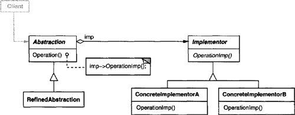
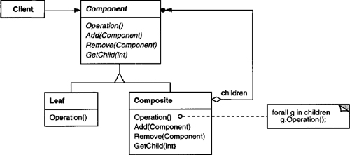
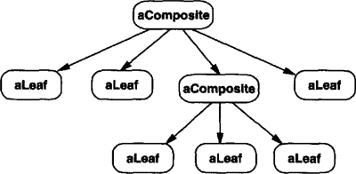
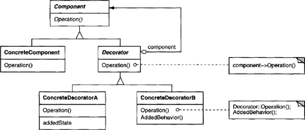
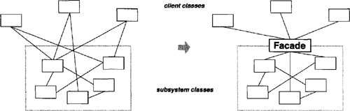
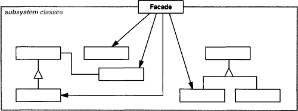
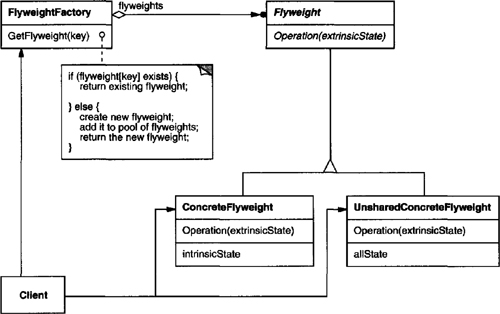
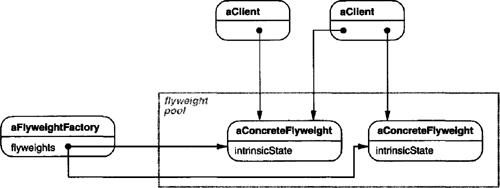

# Chapter 4. Structural Patterns

* Structural patterns: how classes and objects are composed to form larger structures.
* Structural class patterns: use inheritance to compose interfaces or implementations.
  * Making independently developed class libraries work together.
* Structural object patterns: describe how to compose objects to realize new functionality.
  * Change the composition at run-time.

## Class, Object Structural: Adapter

* **Intent**
  * Convert the interface of a class into another interface clients expect -> work together with otherwise incompatible interfaces.
* **Also Known As**
  * Wrapper
* **Motivation**
  * Sometimes a class designed for reuse isn't reusable only because its interface doesn't match the domain-specific interface an application requires.
  * Let existing and unrelated classes work in an application that expects a different interface.
* **Applicability**
  * Use when
    * you want to use an existing class, and its interface does not match the one you need.
    * you want to create a resuable class that cooperates with unrelated or unforeseen classes, that is, classes that don't necessarily have compatible interfaces.
    * (object adpater only) you need to use several existing subclasses, but it's impractical to adapt their interface by subclassing every one. An object adapter can adapt the interface of its parent class.
* **Structure**

* **Participants**
  * **Target**
    * defines the domain-specific interface that Client uses.
  * **Client**
    * collaborates with objects conforming to the Target interface.
  * **Adaptee**
    * deinfes an existing interface that needs adapting.
  * **Adapter**
    * adpats the interface of Adaptee to the Target interface.
* **Collaborations**
  * Clients call operations on an Adapter instance. In turn, the adapter calls Adaptee operations that carry out the request.
* **Consequences**
  * Class adapter:
    * adapts Adaptee to Target by committing to a concrete Adaptee class -> can not adapt a class *and* all its subclasses.
    * lets Adapter override some of Adaptee's behavior.
    * only one object -> no indirection to get to the adaptee.
  * Object adpater:
    * lets a single Adapter work with many Adaptees -> Adaptee itself and all subclasses.
    * harder to override Adaptee behavior.
  * How much adapting does Adapter do?
    * Similarity -> the amount of work.
  * Pluggable adapters.
    * Build interface adaption into classes.
  * Using two-way adapters to provide transparency.
    * An adapted object no longer conforms to the Adaptee interface.
    * The two-way class adapter conforms to both of the adapted classes and can work in either system -> two clients view an object differently ->  transparency.
* **Implementation**
  * Implementing class adapters in C++.
    * Adapter inherits publicly from Target and privately from Adaptee.
  * Pluggable adapters.
    * Find a narrow interface for Adaptee -> three implementation approaches:
      * Using abstract operations.
        * define abstract operations for the narrow Adaptee interface -> let subclasses implement -> subclasses specialize the narrow interface.
      * Using delegate objects.
        * forward requests to a delegate object.
        * subsitute delegate objects to use different strategies.
      * Parameterized adapters.
        * parameterize an adapter with blocks + each block construct supports adaptation to an individual request without subclassing.
* **Related Patterns**
  * Bridge separates an interface from its implementation, while an adapter changes the interface of an existing object.
  * Decorator enhances another object without changing its interface.

## Object Structural: Bridge

* **Intent**
  * Decouple an abstraction from its implementation so that the two can vary independently.
* **Also Known As**
  * Handle/Body
* **Motivation**
  * One abstraction has many implementations -> define the interface to the abstraction -> concrete subclasses implement it in different ways -> bind implementation to the abstraction permanently -> difficult to modify, extend, reuse abstractions and implementations independently.
  * Clients should be able to create an object without committing to a concrete implementation -> putting abstraction and its implementation in separate class hierarchies.
  * The relationship between abstraction and implementation is called a **bridge**.
* **Applicability**
  * Use when
    * you want to avoid a permanent binding between an abstraction and its implementation.
    * both the abstractions and their implementations should be extensible by subclassing.
    * changes in the implementation of an abstraction should have no impact on clients.
    * you have a proliferation of classes within a hierarchy and need to split an object into two parts.
    * you want to share an implementation among multiple objects, and this fact should be hidden from the client.
* **Structure**

* **Participants**
  * **Abstraction**
    * defines the abstraction's interface.
  * **RefinedAbstraction**
    * Extends the interface defined by Abstraction.
  * **Implementor**
    * defines the interface for implementation classes.
      * typically primitive operations.
  * **ConcreteImplementor**
    * implements the Implementor interface and defines its concrete implementation.
* **Collaborations**
  * Abstraction forwards client requests to its Implementor object.
* **Consequences**
  * Decoupling interface and implementation.
    * Eliminate compile-time dependencies on the implementation -> even possible for an object to change its implementation at run-time.
  * Improved extensibility.
  * Hiding implementation details from clients.
* **Implementation**
  * Only one Implementor.
    * where there's only one implementation -> degenerate into one-to-one relationship.
  * Creating the right Implementor object.
    * Decide between them based on parameters passed to its constructor.
    * Choose a default implementation initially and change it later according to usage.
    * Delegate the decision to another object altogether.
  * Sharing implementors.
  * Using multiple inheritance.
    * Use C++ to inherit publicly from Abstraction and privately from a ConcreteImplementor.
* **Related Patterns**
  * An Abstract Factory can create and configure a particular Bridge.
  * Bridge is used up-front in a design.

## Object Structural: Composite

* **Intent**
  * Compose objects into tree structures to represent part-whole hierarchies -> treat individual objects and compositions of objects uniformly.
* **Motivation**
  * Distinguish objects -> complex.
  * Composite pattern: recursive composition -> no distinction.
    * abstract class == primitives + containers.
* **Applicability**
  * Use when
    * you want to represent part-whole hierarchies of objects.
    * you want clients to be able to ignore the difference between compositions of objects and individual objects.
* **Structure**

* **Participants**
  * **Component**
    * declares the interface for objects in the composition.
    * implements default behavior for the interface common to all classes, as appropriate.
    * declares an interface for accessing and managing its child components.
    * (optional) defines an interface for accessing a component's parent in the recursive structure, and implements it if that's appropriate.
  * **Leaf**
    * represents leaf objects in the composition that have no children.
    * Defines behavior for primitive objects in the composition.
  * **Composite**
    * defines behavior for components having children.
    * stores child components.
    * implements child-related operations in the Component interface.
  * **Client**
    * manipulates objects in the composition through the Component interface.
* **Collaborations**
  * Clients use the Component class interface to interact with objects in the compositie structure.
    * If the recipient is a Leaf, then the request is handled directly.
    * If the recipient is a Composite, then it usually forwards requests to its child components, possibly performing addtional operations before and/or after forwarding.
* **Consequences**
  * defines class hierarchies consisting of primitive objects and composite objects.
  * makes the client simple.
  * makes it easier to add new kinds of components.
  * can make your design overly general.
    * can not restrict the components of a composite -> can not rely on the type system to enforce constraints -> run-time checks needed.
* **Implementation**
  * Explicit parent references.
    * Maintain references from child to parent -> simplify the traversal and management of a composite structure.
    * Parent references help support the Chain of Responsibility pattern.
    * Define the parent reference in the Component class.
    * Maintain the invariant that all children of a composite have as their parent the composite that in turn has them as children.
    * Ensure to change a component's parent *only* when it's being added or removed from a composite.
  * Sharing components.
    * The Flyweight pattern solves the problem.
  * Maximizing the Component interface.
    * Define as many common operations for Composite and Leaf classes as possible.
  * Declaring the child management operations.
    * Transparency > safety.
  * Should Component implement a list of Components?
    * Storing child incurs a space penalty.
  * Child ordering.
    * The Iterator pattern can guide you in managing the sequence of children.
  * Caching to improve performance.
    * Cache traversal or search information about children for efficiency.
    * Changes to a component -> invalidate the caches of its parent.
  * Who should delete components?
    * If without garbage collection -> Composite responsible for deleting its children when it's destroyed.
    * Leaf objects are immutable and thus can be shared.
  * What's the best data structure for storing components?
    * Not necessary use a general-purpose data structure.
* **Related Patterns**
  * Often the component-parent link is used for a Chain of Responsibility.
  * Decorator: often used with Composite, often have a common parent class if used together.
  * Flyweight lets you share components, but they can no longer refer to parents.

## Object Structural: Decorator

* **Intent**
  * Attach additional responsibilities to an object dynamically -> a flexible alternative to subclassing for extending functionality.
* **Also Known As**
  * Wrapper
* **Motivation**
  * Extend functionality with inheritance is made statically -> inflexible.
  * Enclose the component in another object (decorator) -> decorator conforms to the interface + decorator forwards requests to the component + add operations for specific functionality before and/or after forwarding + transparency enables unlimited recursive nesting decorators.
* **Applicability**
  * Use when
    * to add responsibility to individual objects dynamically and transparently, that is, without affecting other objects.
    * for responsibilities that can be withdrawn.
    * when extension by subclassing is impractical.
* **Structure**

* **Participants**
  * **Component**
    * defines the interface for objects that can have responsibilities added to them dynamically.
  * **ConcreteComponent**
    * defines an object to which additional responsibilities can be attached.
  * **Decorator**
    * maintains a reference to a Component object and defines an interface that conforms to Component's interface.
  * **ConcreteDecorator**
    * adds responsibilities to the component.
* **Collaborations**
  * Decorator forwards requests to its Component object + optionally perform addtional operations before and after forwarding the request.
* **Consequences**
  * More flexibility than static inheritance.
    * Attach and/or detach decorators -> add and/or remove responsibilities at run-time.
    * Easy to add a property twice.
  * Avoids feature-laden classes high up in the hierarchy.
    * Pay-as-you-go: functionality can be composed from necessary but simple pieces.
  * A decorator and its component aren't identical.
    * You shouldn't rely on object identity when you use decorators.
  * Lots of little objects.
    * Decorator pattern -> lots of little objects differing only in the way they are interconnected -> easy to customize, but hard to learn and debug.
* **Implementation**
  * Interface conformance.
    * Decorator must conform to the interface being decorated.
  * Omitting the abstract Decorator class.
    * If only need to add one responsibility -> no need to define an abstract Decorator class.
  * Keeping Component classes lightweight.
    * Focus on defining an interface, but not storing data.
    * Minimize the feature scope of Component classes.
  * Changing the skin of an object versus changing its guts.
    * An alternative is to change the object's guts: Strategy pattern.
    * if (the component class is heavyweight) -> Strategy > Decorator.
    * Strategy pattern: alter or extend the component's functionality by replacing the strategy object + the component itself knows about possible extensions.
    * The Strategy-based approach might require modifying the component to accommodate new extensions.
* **Related Patterns**
  * Adapter: A decorator is different from an adapter in that decorator only changes an object's responsibilities, not its interface; an adapter will give an object a completely new interface.
  * Composite: A decorator can be viewed as a degenerate composite with only one component. However, a decorator adds additional responsibilities, not intended for object aggregation.
  * Strategy: A decorator lets you change the skin of an object; a strategy lets you change the guts.

## Object Structural: Facade

* **Intent**
  * Provide a unified interface to a set of interfaces in a subsystem -> higher-level interface -> easy to use.
* **Motivation**
  * Dividing a system into subsystems helps reduce complexity.
  * Design goal: minimize the communication and dependencies between subsystems.
  * Introduce a **facade** object -> single, simplified interface -> more general facilities of a subsystem.

* **Applicability**
  * Use when
    * you want to provide a simple interface to a complex subsystem.
      * patterns -> more and smaller classes -> more reusable and easier to customize -> harder to learn and use + some clients don't need to customize them.
    * there are many dependencies between clients and the implementation classes of an abstraction.
      * deoupling the subsystem from clients and other subsystems.
    * you want to layer your subsystems.
      * Facade: entry point to each subsystem level.
* **Structure**

* **Participants**
  * **Facade**
    * knows which subsystem classes are responsible for a request.
    * delegates client requests to appropriate subsystem objects.
  * **subsystem classes**
    * implement subsystem functionality.
    * handle work assigned by the Facade object.
    * have no knowledge of the facade; that is, they keep no references to it.
* **Collaborations**
  * Clients communicate with the subsystem by sending requests to Facade, which forwards them to the appropriate subsystem object(s).
  * Clients that use the facade don't have to access its subsystem objects directly.
* **Consequences**
  * Shield clients feom subsystem components -> reduce number of objects that clients deal with -> easy to use.
  * Promote weak coupling between the subsystem and its clients.
  * It doesn't prevent applications from using subsystem classes.
* **Implementation**
  * Reducing client-subsystem coupling.
    * Making Facade an abstract class with concrete subclasses -> different implementations of a subsystem.
    * An alternative to subclassing is to configure a Facade object with different subsystem objects.
  * Public versus private subsystem classes.
* **Related Patterns**
  * Abstract Factory can be used as an alternative to Facade to hide platform-specific classes.
  * Usually only one Facade object is required -> Facade objects are often Singletons.

## Object Structural: Flyweight

* **Intent**
  * Use sharing to support large numbers of fine-grained objects efficiently.
* **Motivation**
  * A **flyweight** is a shared object that can be used in multiple contexts simultaneously.
    * Acts as an independent object in each context.
    * Stores intrinsic state that's independent of the context.
  * Client objects are responsible for passing extrinsic state to the flyweight when it needs it.
* **Applicability**
  * Depends heavily on how and where it's used.
  * Use when *all* of the following are true:
    * An application uses a large number of objects.
    * Storage costs are high because of the sheer quantity of objects.
    * Most object state can be made extrinsic.
    * Many groups of objects may be replcxaed by relatively few shared objects once extrinsic state is removed.
    * The application doesn't depend on object identity.
* **Structure**

* **Participants**
  * **Flyweight**
    * declares an interface through which flyweights can receive and act on extrinsic state.
  * **ConcreteFlyweight**
    * implements the Flyweight interface and adds storage for intrinsic state, if any.
  * **UnsharedConcreteFlyweight**
    * not all Flyweight subclasses need to be shared.
  * **FlyweightFactory**
    * creates and manages flyweight objects.
    * ensures that flyweights are shared properly.
      * Supplies an existing instance or creates one, if none exists.
  * **Client**
    * maintained a reference to flyweight(s).
    * computes or stores the extrinsic state of flyweight(s).
* **Collaboration**
  * State that a flyweight needs to function must be characterized as either intrinsic or extrinsic. Intrinsic state is stored in the ConcreteFlyweight object; extrinsic state is stored or computed by Client objects. Client s pass this state to the flyweight when they invoke its operations.
  * Clients should not instantiate ConcreteFlyweights directly. Clients must obtain ConcreteFlyweight objects exclusively from the FlyweightFactory object to ensure they are shared properly.
* **Consequences**
  * Run-time costs: transferring, finding, and/or computing extrinsic state.
    * Offset by space savings.
  * Storage savings:
    * the reduction in the total number of instances that comes from sharing.
    * the amount of intrinsic state per object.
    * whether extrinsic state is computed or stored.
  * Sharing reduces the cost of intrinsic state, and you trade extrinsic state for computation time.
* **Implementation**
  * Removing extrinsic state.
    * Ideally, extrinsic state can be computed from a separate object structure, one with far smaller storage requirements.
  * Managing shared objects.
    * FlyweightFactory: locate a particular flyweight + look up flyweights.
    * Might reclaim storage through reference counting or garbage collection.
    * Or, keep around flyweights permanently if the number is fixed and small.
* **Related Patterns**
  * Often combined with Composite to implement a logically hierarchical structure in terms of a directed-acyclic graph with shared leaf nodes.
  * Often best to implement State and Strategy objects as flyweights.
