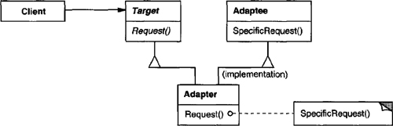
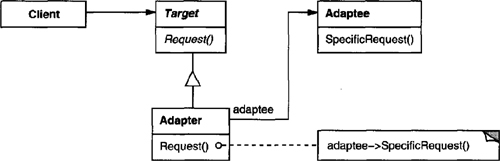

# Chapter 4. Structural Patterns

* Structural patterns: how classes and objects are composed to form larger structures.
* Structural class patterns: use inheritance to compose interfaces or implementations.
  * Making independently developed class libraries work together.
* Structural object patterns: describe how to compose objects to realize new functionality.
  * Change the composition at run-time.

## Class, Object Structural: Adapter

* **Intent**
  * Convert the interface of a class into another interface clients expect -> work together with otherwise incompatible interfaces.
* **Also Known As**
  * Wrapper
* **Motivation**
  * Sometimes a class designed for reuse isn't reusable only because its interface doesn't match the domain-specific interface an application requires.
  * Let existing and unrelated classes work in an application that expects a different interface.
* **Applicability**
  * Use when
    * you want to use an existing class, and its interface does not match the one you need.
    * you want to create a resuable class that cooperates with unrelated or unforeseen classes, that is, classes that don't necessarily have compatible interfaces.
    * (object adpater only) you need to use several existing subclasses, but it's impractical to adapt their interface by subclassing every one. An object adapter can adapt the interface of its parent class.
* **Structure**

* **Participants**
  * **Target**
    * defines the domain-specific interface that Client uses.
  * **Client**
    * collaborates with objects conforming to the Target interface.
  * **Adaptee**
    * deinfes an existing interface that needs adapting.
  * **Adapter**
    * adpats the interface of Adaptee to the Target interface.
* **Collaborations**
  * Clients call operations on an Adapter instance. In turn, the adapter calls Adaptee operations that carry out the request.
* **Consequences**
  * Class adapter:
    * adapts Adaptee to Target by committing to a concrete Adaptee class -> can not adapt a class *and* all its subclasses.
    * lets Adapter override some of Adaptee's behavior.
    * only one object -> no indirection to get to the adaptee.
  * Object adpater:
    * lets a single Adapter work with many Adaptees -> Adaptee itself and all subclasses.
    * harder to override Adaptee behavior.
  * How much adapting does Adapter do?
    * Similarity -> the amount of work.
  * Pluggable adapters.
    * Build interface adaption into classes.
  * Using two-way adapters to provide transparency.
    * An adapted object no longer conforms to the Adaptee interface.
    * The two-way class adapter conforms to both of the adapted classes and can work in either system -> two clients view an object differently ->  transparency.
* **Implementation**
  * Implementing class adapters in C++.
    * Adapter inherits publicly from Target and privately from Adaptee.
  * Pluggable adapters.
    * Find a narrow interface for Adaptee -> three implementation approaches:
      * Using abstract operations.
        * define abstract operations for the narrow Adaptee interface -> let subclasses implement -> subclasses specialize the narrow interface.
      * Using delegate objects.
        * forward requests to a delegate object.
        * subsitute delegate objects to use different strategies.
      * Parameterized adapters.
        * parameterize an adapter with blocks + each block construct supports adaptation to an individual request without subclassing.
* **Related Patterns**
  * Bridge separates an interface from its implementation, while an adapter changes the interface of an existing object.
  * Decorator enhances another object without changing its interface.
