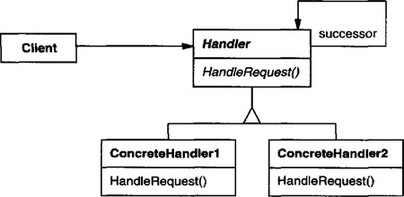
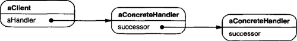
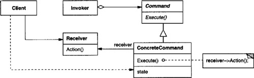
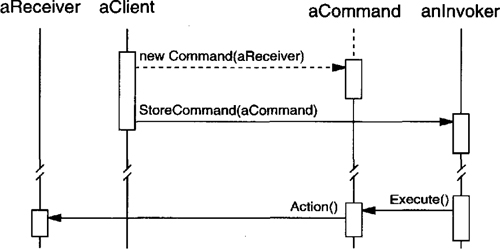

# Chapter 5. Behavioral Patterns

* Behavioral patterns: algorithms and the assignment of responsibilities between objects + communication between them.
* Behavioral class patterns: use inheritance to distribute behavioral between classes.
* Behavioral object patterns: use object composition rather than inheritance.
  * How do peer objects know who to cooperate to perform some tasks with?

## Object Behavioral: Chain of Responsibility

* **Intent**
  * Avoid coupling the sender of a request to its receiver by giving more than one object change to handle the request.
  * Chain the receiving objects and pass the request along the chain until an object handles it.
* **Motivation**
  * Decouple the object that initiates the request from the objects that might handle the request.
  * The request has an implicit receiver.
  * Each object on the chain shares a common interface for handling requests and for accessing its **successor** on the chain.
* **Applicability**
  * Use then
    * more than one object may handle a request, and the handler isn't known *a priori*.
    * you want to issue a request to one of several objects without specifying the receiver explicitly.
    * the set of objects that can handle a request should be specified dynamically.
* **Structure**

* **Participants**
  * **Handler**
    * defines an interface for handling requests.
    * (optional) implements the successor link.
  * **ConcreteHandler**
    * handles requests it is responsible for.
    * can access its successor.
    * if the ConcreteHandler can handle the request, it does so; otherwise it forwards the request to its successor.
  * **Client**
    * initiates the request to a ConcreteHandler object on the chain.
* **Collaborations**
  * When a client issues a request, the request propagates along the chain until a ConcreteHandler object takes responsibility for handling it.
* **Consequences**
  * Reduced coupling.
    * Keep a single reference to their successor -> simplify object inter-connections.
  * Added flexibility in assigning responsibilities to objects.
    * Add or change responsibilities by adding or changing the chain at run-time.
  * Receipt isn't guaranteed.
    * The chain should be configured properly.
* **Implementation**
  * Implementing the successor chain.
    * Define new links.
    * Use existing links.
  * Connecting successors.
    * The Handler might provide a default implementation to forward the request to the successor -> ConcreteHandler doesn't have to override the operation if not interested in.
  * Representing requests.
    * Hardcode operation invocation -> convenient, safe.
    * A single handler function that takes a request code -> open-ended set of requests.
    * Separate request objects that bundle request parameters -> safer parameter-passing.
      * Define request kinds and parameters by subclassing.
* **Related Patterns**
  * Often applied in conjunction with Composite.

## Object Behavioral: Command

* **Intent**
  * Encapsulate a request as an object, thereby letting you parameterize clients with different requests, queue, or log requests, and support undoable operations.
* **Also Known As**
  * Action, Transaction
* **Motivation**
  * It's necessary to issue requests to objects without knowing anything about the operation being requested or the receiver of the request.
  * Command pattern: turn request into an object -> can be stored and passed around.
  * Command declares an interface for executing operations (Execute), while the receiver has the knowledge to carry out the request.
  * MacroCommand: a concrete Command subclass executing a sequence of Commands.
* **Applicability**
  * Use when
    * parameterize objects by an action to perform.
      * **callback**: register a function to be called at a later point.
    * specify, queue, and execute requests at different times.
      * let you transfer the request to a different process and fulfill the request there.
    * support undo.
      * Execute: store state for reversing its effects.
      * Executed commands are stored in a history list.
    * support logging changes so that they can be reapplied in case of a system crash.
      * support load and store operations -> persistent log of changes -> reloading logged commands from disk and reexecuting them with Execute.
    * structure a system aroung high-level operations built on primitives operations.
      * **transaction**: encapsulate a set of operations + common interface + easy to extend.
* **Structure**

* **Participants**
  * **Command**
    * declares an interface for executing an operation.
  * **ConcreteCommand**
    * defines a binding between a Receiver object and an action.
    * implements Execute by invoking the corresponding operation(s) on Receiver.
  * **Client**
    * creates a ConcreteCommand object and sets its receiver.
  * **Invoker**
    * asks the command to carry out the request.
  * **Receiver**
    * knows how to perform the operations associated with carrying out a request.
* **Collaborations**
  * The client creates a ConcreteCommand object and specifies its receiver.
  * An Invoker object stores the ConcreteCommand object.
  * The invoker issues a request by calling Execute on the command.
  * The ConcreteCommand object invokes operations on its receiver to carry out the request.

* **Consequences**
  * Command decouples the object that invokes the operation from the one that knows how to perform it.
  * Commands are first-class object and thus can be manipulated and extended.
  * You can assemble commands into a composite command.
  * It's easy to add new Commands.
* **Implementation**
  * How intelligent should a command be?
    * Depends on its knowledge to find the receiver dynamically.
  * Supporting undo and redo.
    * Store additional state in ConcreteCommand.
    * Last command versus history list.
    * An undoable command might have to be copied before it can be placed on the history list.
  * Avoiding error accumulation in the undo process.
    * Errors can accumulate as commands are executed, unexecuted, and reexecuted repeatedly -> eventual state diverges from the original ones.
    * The Memento patterns: give the command access to the state information without exposing the internals of other objects.
  * Using C++ templates.
* **Related Patterns**
  * Composite: implement MacroCommands.
  * Memento: keep state the command requires to undo its effect.
  * A command that must be copied before being placed on the history list acts as a Prototype.