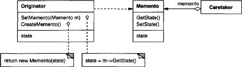

# Chapter 5. Behavioral Patterns

* Behavioral patterns: algorithms and the assignment of responsibilities between objects + communication between them.
* Behavioral class patterns: use inheritance to distribute behavioral between classes.
* Behavioral object patterns: use object composition rather than inheritance.
  * How do peer objects know who to cooperate to perform some tasks with?

## Object Behavioral: Chain of Responsibility

* **Intent**
  * Avoid coupling the sender of a request to its receiver by giving more than one object change to handle the request.
  * Chain the receiving objects and pass the request along the chain until an object handles it.
* **Motivation**
  * Decouple the object that initiates the request from the objects that might handle the request.
  * The request has an implicit receiver.
  * Each object on the chain shares a common interface for handling requests and for accessing its **successor** on the chain.
* **Applicability**
  * Use then
    * more than one object may handle a request, and the handler isn't known *a priori*.
    * you want to issue a request to one of several objects without specifying the receiver explicitly.
    * the set of objects that can handle a request should be specified dynamically.
* **Structure**

* **Participants**
  * **Handler**
    * defines an interface for handling requests.
    * (optional) implements the successor link.
  * **ConcreteHandler**
    * handles requests it is responsible for.
    * can access its successor.
    * if the ConcreteHandler can handle the request, it does so; otherwise it forwards the request to its successor.
  * **Client**
    * initiates the request to a ConcreteHandler object on the chain.
* **Collaborations**
  * When a client issues a request, the request propagates along the chain until a ConcreteHandler object takes responsibility for handling it.
* **Consequences**
  * Reduced coupling.
    * Keep a single reference to their successor -> simplify object inter-connections.
  * Added flexibility in assigning responsibilities to objects.
    * Add or change responsibilities by adding or changing the chain at run-time.
  * Receipt isn't guaranteed.
    * The chain should be configured properly.
* **Implementation**
  * Implementing the successor chain.
    * Define new links.
    * Use existing links.
  * Connecting successors.
    * The Handler might provide a default implementation to forward the request to the successor -> ConcreteHandler doesn't have to override the operation if not interested in.
  * Representing requests.
    * Hardcode operation invocation -> convenient, safe.
    * A single handler function that takes a request code -> open-ended set of requests.
    * Separate request objects that bundle request parameters -> safer parameter-passing.
      * Define request kinds and parameters by subclassing.
* **Related Patterns**
  * Often applied in conjunction with Composite.

## Object Behavioral: Command

* **Intent**
  * Encapsulate a request as an object, thereby letting you parameterize clients with different requests, queue, or log requests, and support undoable operations.
* **Also Known As**
  * Action, Transaction
* **Motivation**
  * It's necessary to issue requests to objects without knowing anything about the operation being requested or the receiver of the request.
  * Command pattern: turn request into an object -> can be stored and passed around.
  * Command declares an interface for executing operations (Execute), while the receiver has the knowledge to carry out the request.
  * MacroCommand: a concrete Command subclass executing a sequence of Commands.
* **Applicability**
  * Use when
    * parameterize objects by an action to perform.
      * **callback**: register a function to be called at a later point.
    * specify, queue, and execute requests at different times.
      * let you transfer the request to a different process and fulfill the request there.
    * support undo.
      * Execute: store state for reversing its effects.
      * Executed commands are stored in a history list.
    * support logging changes so that they can be reapplied in case of a system crash.
      * support load and store operations -> persistent log of changes -> reloading logged commands from disk and reexecuting them with Execute.
    * structure a system aroung high-level operations built on primitives operations.
      * **transaction**: encapsulate a set of operations + common interface + easy to extend.
* **Structure**

* **Participants**
  * **Command**
    * declares an interface for executing an operation.
  * **ConcreteCommand**
    * defines a binding between a Receiver object and an action.
    * implements Execute by invoking the corresponding operation(s) on Receiver.
  * **Client**
    * creates a ConcreteCommand object and sets its receiver.
  * **Invoker**
    * asks the command to carry out the request.
  * **Receiver**
    * knows how to perform the operations associated with carrying out a request.
* **Collaborations**
  * The client creates a ConcreteCommand object and specifies its receiver.
  * An Invoker object stores the ConcreteCommand object.
  * The invoker issues a request by calling Execute on the command.
  * The ConcreteCommand object invokes operations on its receiver to carry out the request.

* **Consequences**
  * Command decouples the object that invokes the operation from the one that knows how to perform it.
  * Commands are first-class object and thus can be manipulated and extended.
  * You can assemble commands into a composite command.
  * It's easy to add new Commands.
* **Implementation**
  * How intelligent should a command be?
    * Depends on its knowledge to find the receiver dynamically.
  * Supporting undo and redo.
    * Store additional state in ConcreteCommand.
    * Last command versus history list.
    * An undoable command might have to be copied before it can be placed on the history list.
  * Avoiding error accumulation in the undo process.
    * Errors can accumulate as commands are executed, unexecuted, and reexecuted repeatedly -> eventual state diverges from the original ones.
    * The Memento patterns: give the command access to the state information without exposing the internals of other objects.
  * Using C++ templates.
* **Related Patterns**
  * Composite: implement MacroCommands.
  * Memento: keep state the command requires to undo its effect.
  * A command that must be copied before being placed on the history list acts as a Prototype.

## Class Behavioral: Interpreter

* **Intent**
  * Given a language, define a representation for its grammer along with an interpreter that uses the representation to interpret sentences in the language.
* **Motivation**
  * Express problems as sentences in a simple language -> interpret these sentences with an interpreter.
  * The pattern describes how to define a grammar, represent a particular expression, and how to interpret the expression.

* **Applicability**
  * Use when there is a language to interpret, and you can represent statements in the language as abstract syntax trees. It works best when
    * the grammar is simple.
      * parser generator: a better alternative for complex grammer hierarchy.
    * efficiency is not a critical concern.
      * translating languages > interpreting parse trees.
* **Structure**

* **Participants**
  * **AbstractExpression**
    * declares an abstract Interpret operation that is common to all nodes in the abstract syntax tree.
  * **TerminalExpression**
    * implements an Interpret operation associated with terminal symbols in the grammar.
    * an instance is required for every terminal symbol in a sentence,
  * **NonterminalExpression**
    * one such class is required for every rule in the grammar.
    * maintains instance variables of type AbstractExpression for each of the symbols.
    * implements an Interpret operation for nonterminal symbols in the grammar.
  * **Context**
    * contains information that's global to the interpreter.
  * **Client**
    * builds an abstract syntax tree representing a particular sentence in the language that the grammar defines.
    * invokes the Interpret operation.
* **Collaborations**
  * The client builds the sentence as an abstract syntax tree of NonterminalExpression and TerminalExpression instances. Then the client initializes the context and invokes the Interpret operation.
  * Each NonterminalExpression node defines Interpret in terms of Interpret on each subexpression. The Interpret operation of each TerminalExpression defines the base case in the recursion.
  * The Interpret operations at each node use the context to store and access the state of the interpreter.
* **Consequences**
  * It's easy to change and extend the grammar.
    * Use inheritance to change or extend.
    * Modify existing expression incrementally.
    * Define new expressions as variations on old ones.
  * Implementing the grammar is easy, too.
  * Complex grammars are hard to maintain.
  * Adding new ways to interpret expressions.
    * e.g., pretty printing, type-checking.
* **Implementation**
  * Creating the abstract syntax tree.
    * By a table-driven parse, hand-crafted parser, or directly by the client.
  * Defining the Interpret operation.
    * Use a visitor to avoid defining operations on every grammar class.
  * Sharing terminal symbols with the Flyweight pattern.
    * Terminal nodes don't store information about their position, while parent nodes pass them the context during interpretation -> Flyweight pattern applies.
* **Related Patterns**
  * Composite: The abstract syntax tree is an instance of the Composite pattern.
  * Flyweight: share terminal symbols.
  * Iterator: traverse the structure.
  * Visitor: maintain the behavior in each node in one class.

## Object Behavioral: Iterator

* **Intent**
  * Provide a way to access the elements of an aggregate object sequentially without exposing its underlying representation.
* **Also Known As**
  * Cursor
* **Motivation**
  * Give a way to access elements without exposing internal structure.
  * Traverse an aggregate object in different ways.
  * **Iterator**: access + traverse out of an aggregate object.
* **Applicability**
  * Use when
    * to access an aggregate object's contents without exposing its internal representation.
    * to support multiple traversals of aggregate object.
    * to provide a uniform interface for traversing different aggregate structures (polymorphic iteration).
* **Structure**

* **Participants**
  * **Iterator**
    * defines an interface for accessing and traversing elements.
  * **ConcreteIterator**
    * implements the Iterator interface.
    * keeps track of the current position in the traversal of the aggregate.
  * **Aggregate**
    * defines an interface for creating an Iterator object.
  * **ConcreteAggregate**
    * implements the Iterator creation interface to return an instance of the proper ConcreteIterator.
* **Collaborations**
  * A ConcreteIterator keeps track of the current object in the aggregate and can compute the succeeding object in the traversal.
* **Consequences**
  * It supports variations in the traversaal of an aggregate.
    * Replace the iterator instance to change the traversal algorithm.
  * Iterators simplify the Aggregate interface.
  * More than one traversal can be pending on an aggregate.
* **Implementation**
  * Who controls the iteration?
    * external iterator: clients advance the traversal and request the next element explicitly from the iterator.
    * internal iterator: the client hands an internal operation to perform, and the iterator applies operation to every element in the aggregate.
    * external iterators > internal iterators.
  * Who defines the traversal algorithm?
    * cursor: the aggregate defines the traversal algorithm and use the iterator to store the state of the iteration -> might violate the encapsulation of the aggregate.
  * How robust is the iterator?
    * modify an aggregate during traversal -> dangerous.
    * simple solution: copy the aggregate and traverse the copy -> expensive.
    * **robust iterator**: insertions, removals won't interfere with traversal.
  * Additional Iterator operations.
    * minimal interface: First, Next, IsDone, CurrentItem.
    * additional operations: Previous, SkipTo.
  * Using polymorphic iterators in C++.
    * polymorphic iterators: allocated dynamically by a factory method + have their cost.
    * The client is responsible for deleting the polymorphic iterators -> error-prone to forget to free heap-allocated iterator objects.
  * Iterators may have priviledged access.
    * The iterator and the aggregate are tightly coupled.
    * The Iterator class can include `protected` operations for accessing important but publicly unavailable members of the aggregate -> Iterator subclasses gain privileged access to the aggregate.
  * Iterators for composites.
    * Use an internal iterator -> record current position by calling itself recursively -> suitable for recursive aggregate structures.
    * cursor-based iterator: a better alternative if a Composite have an interface for moving from a node to its siblings, parents, and children.
    * Common traversal patterns: preorder, postorder, inorder, breadth-first.
  * Null iterators.
    * **NullIterator**: a degenerate iterator -> *always* done with traversal -> handling boundary conditions.
* **Related Patterns**
  * Composite: often applied to recursive structures such as Composite.
  * Factory Method: instantiate the appropriate Iterator subclass with factory methods -> polymorphic iterators.
  * Memento: in conjunction with the Iterator pattern -> capture the state of an iteration.

## Object Behavioral: Mediator

* **Intent**
  * Define an object that encapsulates how a set of objects interact -> keeping objects from referring to each other explicitly -> promote loose coupling -> vary their interaction independently.
* **Motivation**
  * Proliferating interconnections -> can not work without others' support -> reduce reusability.
  * **mediator**: a separate object encapsulating collective behavior.
    * Controlling and coordinating the interactions of a group of objects.
    * Keeps object in the group from referring to each other explicitly.
    * The objects only know the mediator -> reducing the number of interconnections.
* **Applicability**
  * Use when
    * a set of objects communicate in well-defined but complex ways.
    * reusing an object is difficult because it refers to and communicates with many other objects.
    * a behavior that's distributed between several classes should be customizable without a lot of subclassing.
* **Structure**

* **Participants**
  * **Mediator**
    * defines an interface for communicating with Colleague objects.
  * **ConcreteMediator**
    * implements cooperative behavior by coordinating Colleague objects.
    * knows and maintains its colleague.
  * **Colleague classes**
    * each Colleague class knows its Mediator object.
    * each colleague communicates with its mediator whenever it would have otherwise communicated with another colleague.
* **Collaborations**
  * Colleagues send and receive requests from a Mediator object. The mediator implements the cooperative behavior by routing requests between the appropriate colleague(s).
* **Consequences**
  * It limits subclassing.
    * A mediator localizes behavior -> subclassing Mediator only to change behavior.
  * It decouples colleagues.
  * It simplifies object protocols.
    * One-to-many: easier to understand, maintain, and extend.
  * It abstracts how objects cooperate.
  * It centralizes control.
    * mediator: monolith -> hard to maintain.
* **Implementation**
  * Omitting the abstract Mediator class.
    * There's no need to define an abstract Mediator class if colleagues work with only one mediator.
  * Colleague-Mediator communication.
    * Observer pattern: the colleague sends notifications to the mediator whenever they change state -> the mediator propagates the effects to other colleagues.
    * A specialized notification interface.
* **Related Patterns**
  * Colleagues can communicate with the mediator using the Observer pattern.

## Object Behavioral: Memento

* **Intent**
  * Without violating encapsulation, capture and externalize an object's internal state so that the object can be restored to this state later/
* **Also Known As**
  * Token
* **Motivation**
  * Implementing checkpoints and undo mechanisms -> save state information somewhere -> restore objects to their previous states in the future.
  * **memento**: stores a snapshot of the internal state of the memento's **originator**.
* **Applicability**
  * Use when
    * a snapshot of an object's state must be saved so that it can be restored to that state later, *and*
    * a direct interface to obtaining the state would expose implementation details and break the object's encapsulation.
* **Structure**

* **Participants**
  * **Memento**
    * stores internal state of the Originator object.
    * protects against access by objects other than the originator.
      * Caretaker sees a *narrow* interface to the Memento, it can only pass the memento to other objects.
      * Originator sees a wide interface, one that lets it access all the data necessary to restore itself to its previous state.
      * Ideally, only the originator that produced the memento would be permitted to access the memento's internal state.
  * **Originator**
    * creates a memento containing a snapshot of its current internal state.
    * uses the memento to restore its internal state.
  * **Caretaker**
    * is responsible for the memento's safekeeping.
    * never operates on or examines the contents of a memento.
* **Collaborations**
  * A caretaker requests a memento from an originator, holds it for a time, and passes it back to the originator.
  * Mementos are passive. Only the originator that created a memento will assign or retrieve its state.

* **Consequences**
  * Preserving encapsulation boundaries.
    * Shields other objects from complex Originator internals.
  * It simplifies Originator.
    * If Originator keeps the versions of internal state, it puts all the storage management burden on Originator.
    * Caretaker keeps clients from having to notify originators when they're done.
  * Using mementos might be expensive.
    * Mementos might incur considerable overhead if a large amounts of copy is a must.
  * Defining narrow and wide interfaces.
    * Difficult for some languages to ensure the interface gap.
  * Hidden costs in caring for mementos.
    * A caretaker might incur large storage costs.
* **Implementation**
  * Language support.
    * Wide interface versus narrow interface.
  * Storing incremental changes.
    * incremental change: the history list defines a specific order in which commands can be undone and redone.
* **Related Patterns**
  * Command: Commands can use mementos to maintain state for undoable operations.
  * Iterator: Mementos can be used for iteration.

## Object Behavioral: Observer

* **Intent**
  * Define a one-to-many dependency between objects so that when one object changes state, all its dependents are notified and updated automatically.
* **Also Known As**
  * Dependents, Publish-Subscribe
* **Motivation**
  * Observer pattern: **subject** + **observer**.
  * subject -> many dependent observers.
  * subject undergoes a change -> notify all observers.
  * each observer will query the subject to synchronize its state with the subject's state.
  * **publish-subscribe**
* **Applicability**
  * Use in any of the following situations:
    * When an abstraction has two aspects, one dependent on the other.
    * When a change to one object requires changing others, and you don't know how many objects need to be changed.
    * When an object should be able to notify other objects without making assumptions about who these objects are.
* **Structure**

* **Participants**
  * **Subject**
    * knows its observers.
    * provides an interface for attaching and detaching Observer objects.
  * **Observer**
    * defines an updating interface for objects that should be notified of changes in a subject.
  * **ConcreteSubject**
    * stores state of interest to ConcreteObserver objects.
    * sends a notification to its observers when its state changes.
  * **ConcreteObserver**
    * maintains a reference to a ConcreteSubject object.
    * stores state that should stay consistent with the subject's.
    * implements the Observer updating interface to keep its state consistent with the subject's.
* **Collaborations**
  * ConcreteSubject notifies its observers whenever a change occurs that could make its observers' state inconsistent with its own.
  * After being informed of a change in the concrete subject, a ConcreteObserver object may query the subject for information. ConcreteObserver uses this information to reconcile its state with that of the subject.

* **Consequences**
  * Abstract coupling between Subject and Observer.
    * Loosely coupled -> Subject and Observer can belong to different layers of abstraction.
  * Support for broadcast communication.
  * Unexpected updates.
    * An operation on the subject -> a cascade of updates to observers and their dependent objects.
    * Spurious update -> hard to track down.
    * Simple update protocol provides no detail on *what* changed in the subject -> additional protocol required to deduce the changes.
* **Implementation**
  * Mapping subjects to their observers.
    * Store references to observers explicitly in the subject -> expensive storage when there are many subjects and few observers.
    * Solution: use associative look-up (e.g., hash table) -> overhead when accessing the observers.
  * Observing more than one subject.
    * Extend Update interface (like pass subject as a parameter) -> to know *which* subject is sending the notification.
  * Who triggers the update?
    * Have state-setting operations on Subject call Notify after they change the subject's state.
    * Make clients responsible for calling Notify at the right time.
  * Dangling references to deleted subjects.
    * Make the subject notify its observers as it is deleted -> reset & avoid dangling references.
  * Making sure Subject state is self-consistent before notification.
    * Template methods in abstract Subject -> define a primitive operation for subclasses to override, and make Notify the last operation in the template method -> object is self-consistent.
    * Good => document which Subject operations trigger notifications.
  * Avoiding observer-specific update protocols: the push and pull models.
    * push model versus pull models.
  * Specifying modification of interest explicitly.
    * Allow registering observers for specific events of interest.
    * Use notion of **aspects** for Subject objects.
  * Encapsulating complex update semantics.
    * **Change-Manager**: an instance of the Medirator -> maintains relationships required between subjects and observers -> minimize the work to make observers relfect a change in their subject.
  * Combining the Subject and Observer classes.
* **Related Patterns**
  * Mediator: By encapsulating complex update semantics, the ChangeManager acts as a mediator between subjects and observers.

## Object Behavioral: State

* **Intent**
  * Allow an object to alter its behavior when its internal state changes. The object will appear to change its class.
* **Also Known As**
  * Objects for States
* **Motivation**
  * Introduce an abstract class to represent the states, which declares an interface common to all operational states and subclasses implement state-specific behavior.
* **Applicability**
  * Use in either of the following cases:
    * An object's behavior depends on its state, and it must change its behavior at run-time depending on that state.
    * Operations have large, multipart conditional statements that depend on the object's state.
      * State: usually represented by enumerated constants.
      * Multiple operations contain the same conditional structure -> conditional into a separate class.
* **Structure**

* **Participants**
  * **Context**
    * defines the interface of interest to clients.
    * maintains an instance of a ConcreteState subclass that defines the current state.
  * **State**
    * defines an interface for encapsulating the bebavior associated with a particular state of the Context.
  * **ConcreteState subclasses**
    * each subclass implements a behavior associated with a state of the Context.
* **Collaborations**
  * Context delegates state-specific requests to the current ConcreteState object.
  * A context may pass itself as an argument to the State object handling the request to let it access the context if necessary.
  * Context is the primary interface for clients to configure states.
  * Either Context or the ConcreteState subclasses can decide which state succeeds another and under what circumstances.
* **Consequences**
  * It localizes state-specific behavior and partitions behavior for different states.
    * Easy to add new states and transitions -> define new subclasses.
    * Structure state-specific code -> no monolithic statements.
  * It makes state transition explicit.
    * atomic transition: rebinding one State variable.
  * State objects can be shared.
    * states: flyweights with no intrinsic state, only behavior.
* **Implementation**
  * Who defines the state transition?
    * Let State subclasses specify their successor state and when to make the transition -> decentralizing the transition logica -> easy to modify or extend the logic + implementation dependencies between subclasses.
  * A table-based alternative.
    * Focus on defining state transitions.
    * A table look-up is often less efficient than a function call.
  * Creating and destroying State objects.
    * to create State objects only when they are needed and destroy them thereafter *versus* creating them ahead of time and never destroying them.
  * Using dynamic inheritance.
* **Related Patterns**
  * Flyweight: explains when and how State objects can be shared.

## Object Behavioral: Strategy

* **Intent**
  * Define a family of algorithms, encapsulate each one, and make them interchangeable -> let the algorithm vary independently from client that use it.
* **Also Known As**
  * Policy
* **Motivation**
  * Define classes that encapsulate different algorithms.
  * **Strategy**: an encapsulated algorithm.
* **Applicability**
  * Use when
    * many related class differ only in their behavior.
    * you need different variants of an algorithm.
    * an algorithm uses data that clients shouldn't know about.
    * a class defines many behaviors, and these appear as multiple conditional statements in its operation.
* **Structure**

* **Participants**
  * **Strategy**
    * declares an interface common to all supported algorithm.
  * **ConcreteStrategy**
    * implements the algorithm using the Strategy interface.
  * **Context**
    * is configured with a ConcreteStrategy object.
    * maintains a reference to a Strategy object.
    * may define an interface that lets Strategy access its data.
* **Collaborations**
  * Strategy and Context interact to implement the chosen algorithm.
    * Context: pass data and/or itself to strategy operations.
  * A context forwards requests from its clients to its strategy. Clients usually create and pass a ConcreteStrategy object to the context; thereafter, clients interact with the context exclusively.
* **Consequences**
  * Families of related algorithms.
  * An alternative to subclassing.
  * Strategies eliminate conditional statements.
  * A choice of implementations.
  * Clients must be aware of different Strategies.
  * Communication overhead between Strategy and Context.
    * Some ConcreteStrategies won't use all the information passed to them.
  * Increased number of objects.
    * Share strategies as stateless objects -> reduce overhead.
* **Implementation**
  * Defining the Strategy and Context interfaces.
    * Have Context pass data in parameters to Strategy operations.
    * Have Context pass itself as an argument, and the strategy requests data from the context explicitly.
  * Strategies as template parameters.
    * Bind a Strategy to its Context statically -> efficiency.
  * Making Strategy objects optional.
    * Default behavior.
* **Related Patterns**
  * Flyweight: Strategy objects often make good flyweights.

## Class Behavioral: Template Method

* **Intent**
  * Define the skeleton of an algorithm in an operation, deferring some steps to subclasses -> let subclasses redefine certain steps of an algorithm witout changing the algorithm's structure.
* **Motivation**
  * **template method**: define each step with ordering in terms of abstract operations -> subclasses override it to provide concrete behavior.
* **Applicability**
  * Use when
    * to implement the invariant parts of an algorithm once and leave it up to subclasses to implement the behavior that can vary.
    * when common behavior among subclasses should be factored and localized in a common class to avoid code duplication.
    * to control subclasses extentions.
      * hook operation: permitting extension only at specific points.
* **Structure**

* **Participants**
  * **AbstractClass**
    * defines abstract **primitive operations** that concrete subclasses define to implement steps of an algorithm.
    * implements a template method defining the skeleton of an algorithm.
  * **ConcreteClass**
    * implements the primitive operations to carry out subclass-specific steps of the algorithm.
* **Collaborations**
  * ConcreteClass relies on AbstractClass to implement the invariant steps of the algorithm.
* **Consequences**
  * Code reuse.
  * the Hollywood principle: don't call us, we'll call you.
* **Implementation**
  * Using C++ access control.
    * template method: not be overridden.
  * Minimizing primitive operations.
    * less override -> less tedious.
  * Naming conventions.
    * You can identify the operations that should be overridden by adding a prefix to their names.
* **Related Patterns**
  * Factory Methods: often called by template methods.
  * Strategy: template methods use inheritance to vary part of an algorithm. Strategies use delegation to vary the entire algorithm.

## Object Behavioral: Visitor

* **Intent**
  * Represent an operation to be performed on the elements of an object structure -> let you define a new operation without changing the classes of the elements on which it operates.
* **Motivation**
  * **visitor**: pass it to elements as it's traversed.
  * an element accepts the visitor -> sends a request to the visitor and includes the element as an argument -> the visitor executes the operation for that element.
  * with the visitor pattern, you define two class hierarchies:
    * one for the elements being operated on and one for the visitors that define operations on the elements.
    * you create a new operation by adding a new subclass to the visitor class hierarchy.
* **Applicability**
  * Use when
    * an object structure contains many classes of objects with differing interfaces, and you want to perform operations on these objects that depend on their concrete classes.
    * many distinct and unrelated operations need to be performed on objects in an object structure, and you want to avoid polluting their classes with these operations.
    * the classes defining the object structure rarely change, but you often want to defien new operations over the structure.
* **Structure**

* **Participants**
  * **Visitor**
    * declares a Visit operation for each class of ConcreteElement in the object structure.
      * The operation's name and signature identifies the class that sends the Visit request to the visitor.
  * **ConcreteVisitor**
    * implements each operation declared by Visitor.
      * Each operation implements a fragment of the algorithm defined for the corresponding class of object in the structure.
      * ConcreteVisitor provides the context for the algorithm and stores its local state, which often accumulates results during the traversal of the structure.
  * **Element**
    * defines an Accept operation that takes a visitor as an argument.
  * **ConcreteElement**
    * implements an Accept operation.
  * **ObjectStructure**
    * can enumerate its elements.
    * may provide a high-level interface to allow the visitor to visit its elements.
    * may either be a composite or a collection such as a list or a set.
* **Collaborations**
  * A client that uses the Visitor pattern must create a ConcreteVisitor object and then traverse the object structure, visiting each element with the visitor.
  * When an element is visited, it calls the Visitor operation that corresponds to its class. The element supplies itself as an argument to this operation to let the visitor access its state, if necessary.

* **Consequences**
  * Visitor makes adding new operations easy.
  * A visitor gathers related operations and separates unrelated ones.
  * Adding new ConcreteElement classes is hard.
    * Each new ConcreteElement gives rise to a new abstract operation on Visitor and a corresponding implementation in every ConcreteVisitor clas.
  * Visiting across class hierarchies.
    * An iterator can't work across object structures with different types of elements, while Visitor does not have this restriction.
  * Accumulating State.
  * Breaking encapsulations.
    * The pattern forces you to provide public operations that access an element's internal state.
* **Implementation**
  * Double dispatch.
    * double dispatch: depends on the Visitor's and the Element's type -> let visitors request different operations on each class of element.
  * Who is responsible for traversing the object structure?
    * in the object structure, in the visitor, or in a separate iterator.
* **Related Patterns**
  * Composite: Visitors can be used to apply an operation over an object structure defined by the Composite pattern.
  * Interpreter: Visitor may be applied to do the interpretation.

## Discussion of Behavioral Patterns

* **Encapsulating Variation**
  * A theme of many behavioral patterns:
    * a Strategy object encapsulates an algorithm.
    * a State object encapsulates a state-dependent behavior.
    * a Mediator object encapsulates the protocol between objects.
    * an Iterator object encapsulates the way you access and traverse the components of an aggregate object.
  * Chain of Responsibility: communicate between an open-ended number of objects -> not all define static communication relationships between classes.
* **Objects as Arguments**
  * Use an object as an argument.
    * A Visitor object is the argument to a polymorphic Accept operation on the objects it visits.
  * Command and Memento objects can be passed around and invoked at a later time.
    * Command: polymorphic Execute operation.
    * Memento: can only be passed as a value -> no polymorphic operations at all.
* **Should Communication be Encapsulated or Distributed?**
  * Mediator and Observer are competing patterns.
    * Observer pattern: the Observer and the Subject must cooperate to maintain the constraint.
    * Mediator pattern: centralizes the responsibility for maintaining a constraint.
  * It is easier to make reusable Observer than Mediators.
    * Observer: promote partitioning and loose coupling -> finer-grained classes.
    * Easier to understand the flow of communication in Mediator.
* **Decoupling Senders and Receivers**
  * Command, Observer, Mediator, and Chain of Responsibility address how you decouple senders and receivers.
    * Command: binding a sender and a receiver with a Command object -> let the sender work with different receivers + can reuse the Command object to parameterize a receiver with different senders.
    * Observer: defining an interface for signaling changes in subjects -> looser binding -> a subject may have multiple observers -> best for decoupling objects when there are data dependencies between them.
    * Mediator: having objects refer to each other indirectly through a Mediator object -> centralizing the communication -> the mediator implements own dispatching scheme -> reduce subclassing + decrease type safety.
    * Chain of Responsibility: passing the request along a chain of potential receivers -> best for existing chain structure.