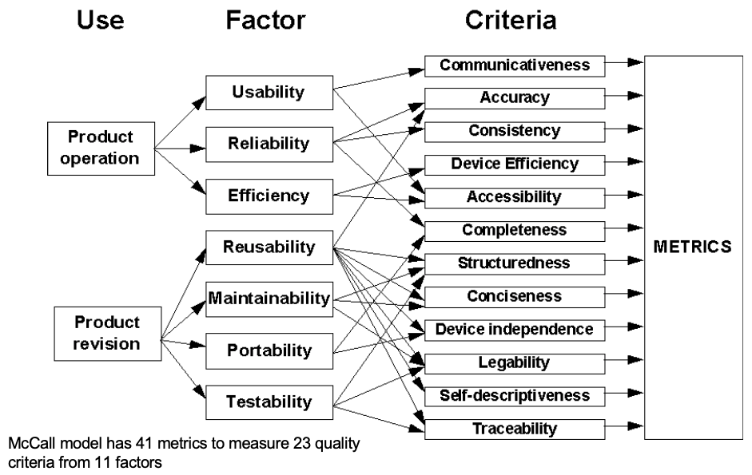
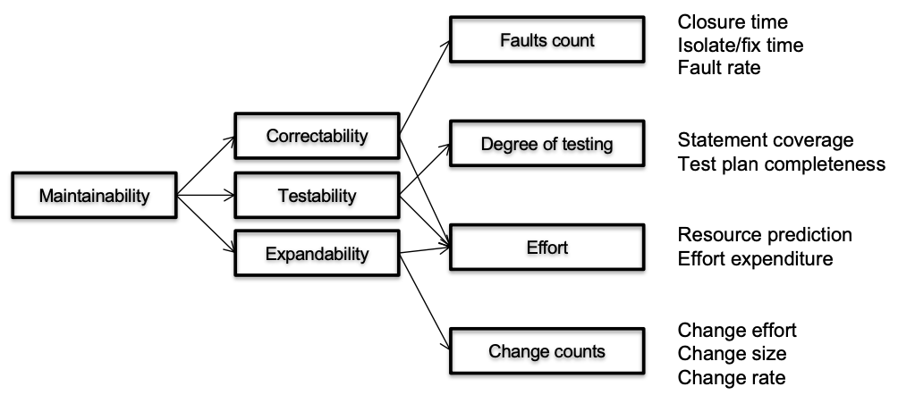

# Lecture 2 Metrics and Measurement

## Measurement

* A quantitatively expressed reduction of uncertainty based on one or more observations
* A software quality metric is a function whose inputs are software data and whose output is a single numerical value that can be interpreted as the degree to which software processes a given attribute that affects its quality

### Object-Oriented Metrics

* Number of Methods per Class
* Depth of Inheritance Tree
* Number of Child Classes
* Coupling between Object Classes
* Calls to Methods in Unrelated Classes

### Quality Metrics

* Comment density
* Test coverage
* Component balance (system breakdown optimality and component size uniformity)
* Code churn (number of lines added, removed, changed in a file)

## Everything is Measurable

* Measurement for decision making
  * fund project?
  * more testing?
  * fast enough?
  * code quality sufficient?
  * which feature to focus on?
  * developer bonus?
  * time and cost estimation?
* Trend analysis
* Benchmark-based metrics
  * Monitor many projects or many modules, get typical values for metrics
  * Report deviations

## Measurement is Difficult

### The streetlight effect

* A known observational bias
* People tend to look for something only where it’s easiest to do so

### Measurements Validity

* Construct
* Predictive
* External validity

### Measurement Scales

* Nominal: categories
* Ordinal: order, but no magnitude
* Interval: order, magnitude, but no zero
* Ratio: order, magintude, and zero
* Absolute: special case of ratio

## Metrics and Incentives

* When a measure becomes a target, it ceases to be a good measure
* Metrics tracked using tools and processes
* Expert assessment or human-subject experiments
* Mining software repositories, defect databases, especially for trend analysis or defect prediction
* Benchmarking