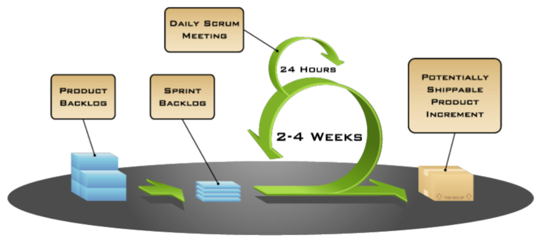

# Lecture 4 Intro to Process

## Process

### How to Develop Software

* Discuss the software that needs to be written
* Write some code
* Test the code to identify the defects
* Debug to find causes of defects
* Fix the defects
* If not done, return to step 1

### Process Decisions

* Writing down all requirements
* Require approval for all changes to requirements
* Use version control for all changes
* Track all reported bugs
* Review requirements and code
* Break down development into smaller tasks and schedule and monitor them
* Planning and conducting quality assurance
* Have dailty status meeting
* Use Docker containers to push code between developers and operation

### Process Issues

* Change control
  * Mid-project informal agreement to changes suggested by customer or manager
* Quality assurance
  * Late detection of requirements and design issues
  * Test-debug-reimplement cycle limits development of new features
  * Release with known defects
* Defect tracking
  * Bug reports collected informally, forgotten
* System integration
  * Integration of independently developed components at the very end of the project
* Source Code Control
  * Accidentally overwritten changes, lost work
* Scheduling
  * When project is behind, developers are asked weekly for new estimates

## Planning

## Estimating Effort

* Revise time estimate
  * Do you have comparable experience to base an estimate off of?
  * How much design do you need for each task?
  * Break down the task into smaller tasks and estimate them
* Measuring progress
  * Developer judgment: x% done
  * Lines of code?
  * Functionality?
  * Quality?

### Milestones and Deliverables

* Milestone
  * Clear end point of subtasks
  * For project manager
  * Reports, prototypes, completed subprojects
  * "80% done" not a suitable milestone
* Deliverable
  * Similar to milestone, but for customers
  * Reports, prototypes, completed subprojects

### Scrum

* Product
  * Product backlog
    * All the features for the product
  * Sprint backlog
    * All the features that will be worked on for that sprint
      * Fine-graned
      * Estimated
      * Assigned to individual team members
      * Acceptance criteria should be defined
    * User stories are often used
* Process
  * Sprint Planning Meeting
    * Entire team decides together what to tackle for that sprint
  * Daily Scrum Meeting
    * Quick meeting to touch
    * What have I done?
    * What am I doing next?
    * What am I stuck on/need help?
  * Sprint Retrospective
    * Review sprint process
  * Sprint Review Meeting
    * Review product

### User Stories

* Card: As a [role], I want [function], so that [value]
* Conversation: An open dialog between everyone working on the project and the client
  * Split up Epic Stories if needed
* Confirmation: A confirmation criterion that will show when the task is completed
* Evaluate user story
  * Independent
    * Schedule in any order
  * Negotiable
    * Capture the essence, not the details
  * Valuable
    * Relevant to splitting up issues
  * Estimable
    * Helps keep the size small
  * Small
    * At most two person-weeks of work
  * Testable
    * We know when we can mark task "Done"

## Teamwork

### Expectations

* Meet initially and then regularly
* Review **team policy**
* Divide work and integrate
* Establish a process
* **Set and document clear responsibilities and expectations**
  * Possible roles: Coordinator, Scribe, Checker, Monitor
* Every team member should undertand the entire solution

### Dealing with Problems

* Openly report even minor team issues in individual part of assignments
* Dicussions and case studies