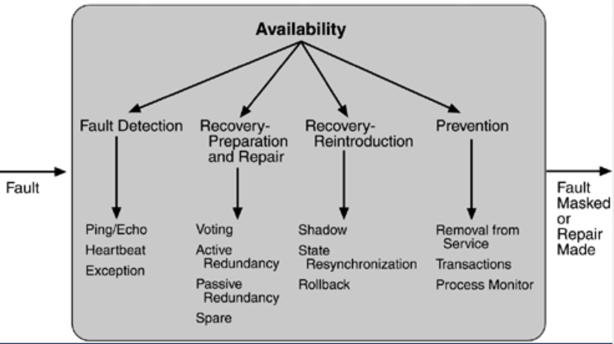
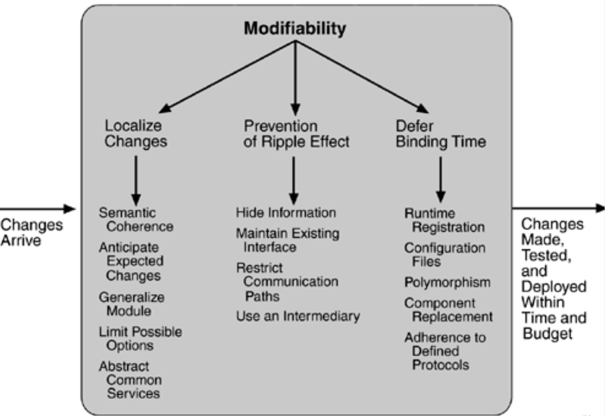
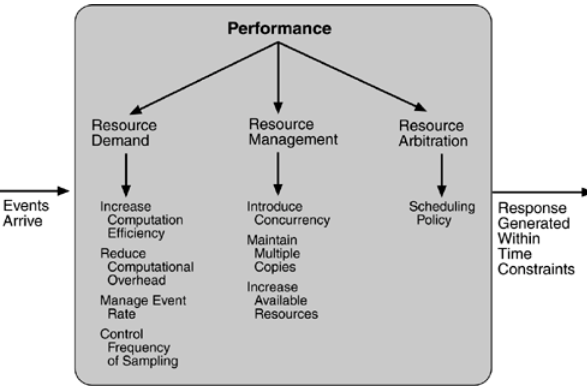
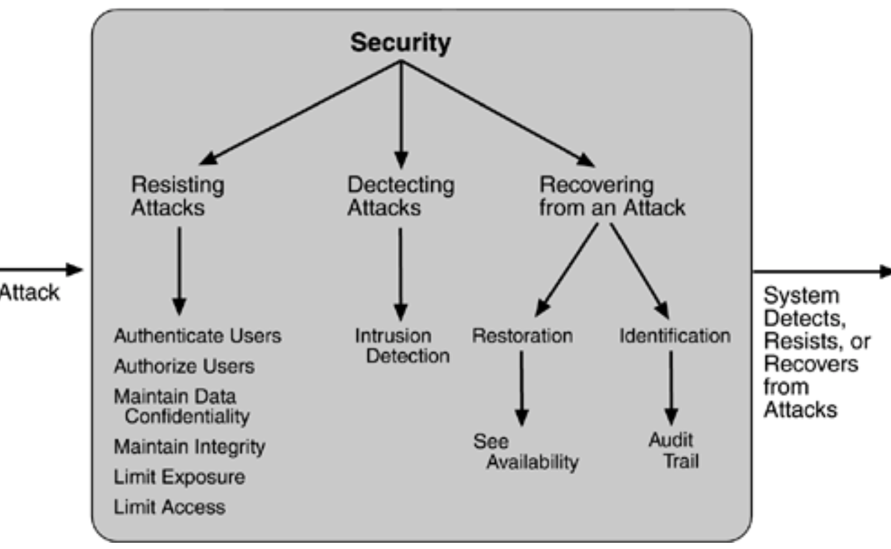
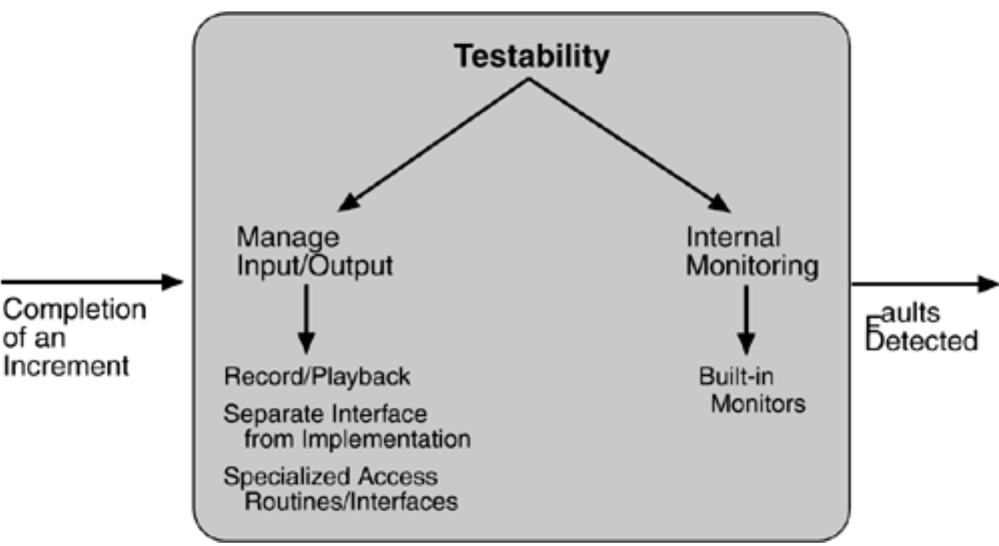
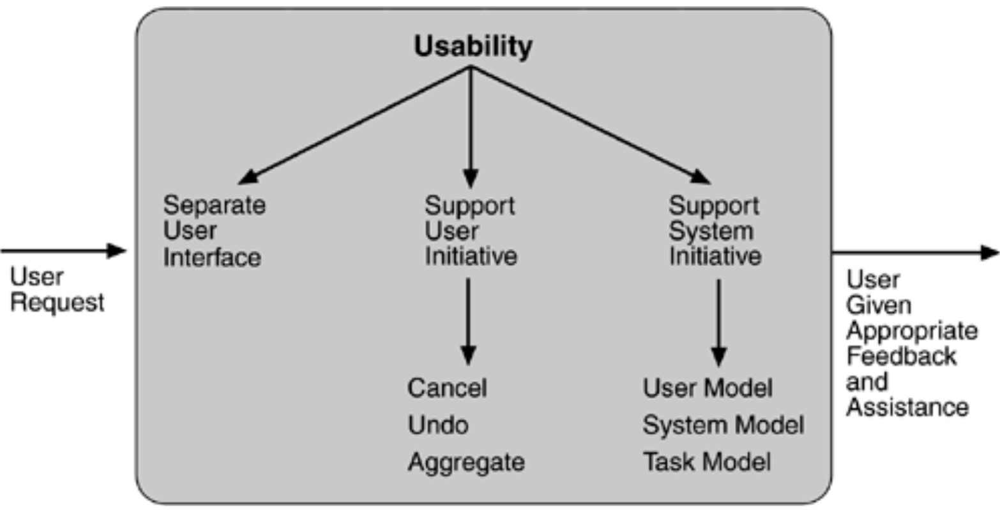

# Lecture 12 Architectural Documentation, Views and Tradeoffs, Patterns

## Architecture Styles/Patterns

* Compiler architecture
  * Input
  * Lexical analysis and parsing
  * Expansion
  * Command execution
  * Exit status
* Client-Server system
* Layered system
* Tiered architecture

## Architectural Tactics

* Smaller scope than architectural patterns

## Design Doc

* Make sure you are implementing the right thing, and also not implementing the wrong thing
* A key element of design documentation is **feedback**
* Common pitfalls
  * Too little detail, expecially on rationale
  * Too much detail, expecially on the specifics of code
  * Documentation that fails to evolve with the real system