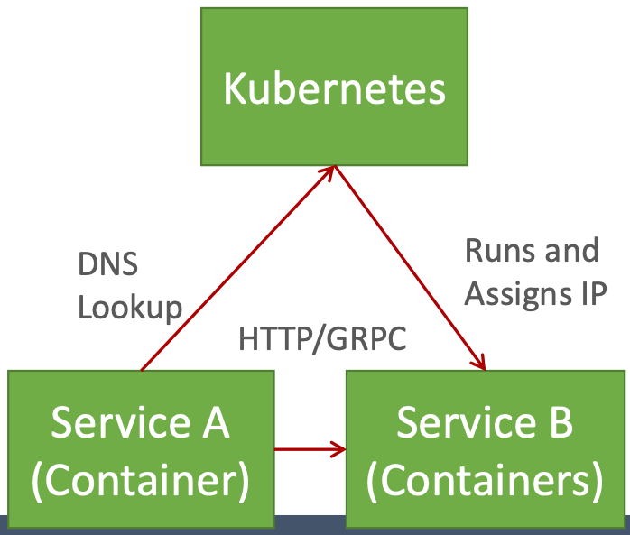
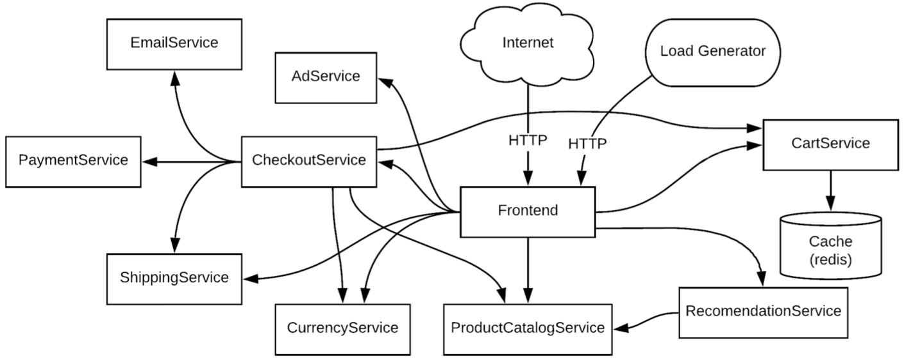

# Lecture 14 Architecture Styles and Hypes

## Microservices

* Building applications as suite of small and easy to replace services
  * fine grained, one functionality per service
  * composable
  * easy to develop, test, and understand
  * fast restart, fault isolation
  * modelled around business domain
* Interplay of different systems and languages
* Easily deployable and replicable
* Embrace automation, embrace faults
* Highly observable

## Service Oriented Architectures (SOA)

* Service: seld-contained functionality
* Remote invocation, language-independent interface
* Dynamic lookup possible
* Often used to wrap legacy systems

## Microservice Architecture

* Service: self-contained functionality
* Language-independent interface
* Dynamic lookup

* HTTP/REST/JSON/GRPC for communication
* Independent development and deployment
* Self-contained services (each with own database)
  * Multiple instances behind load-balancer
* Streamline deployment
* Drawbacks
  * Complexities of distributed systems
  * Resource overhead, RPCs
  * Shifting complexities to the network
  * Operational complexity
  * Frequently adopted by breaking down monolithic application

## Serverless (Functions-as-a-Service)

* Extreme use of microservices
* Instead of writing minimal services, write just functinos
* No state, rely completely on cloud storage or other cloud services
* Pay-per-invocation billing with elastic scalability
* Drawback: more ways things can fail, state is expensive
* Examples: AWS lambda, CloudFlare workers, Azure functions