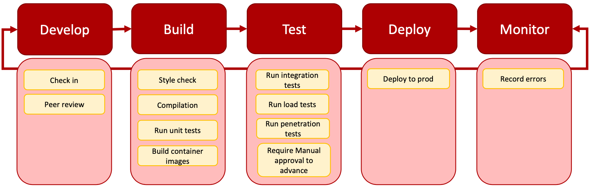
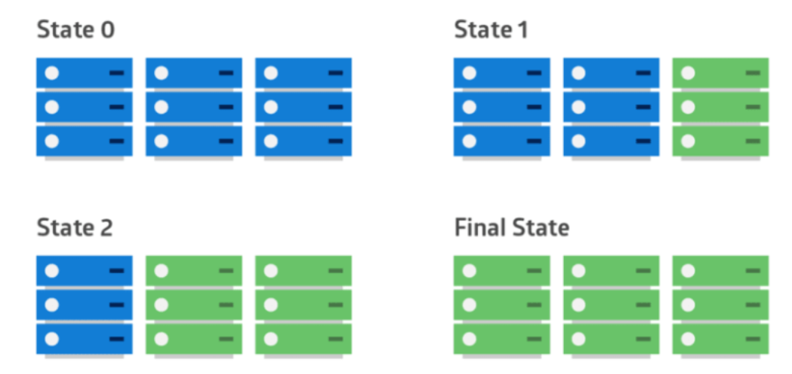
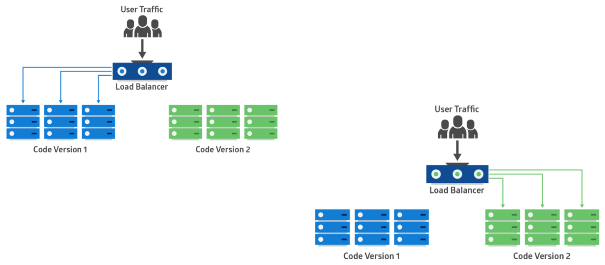
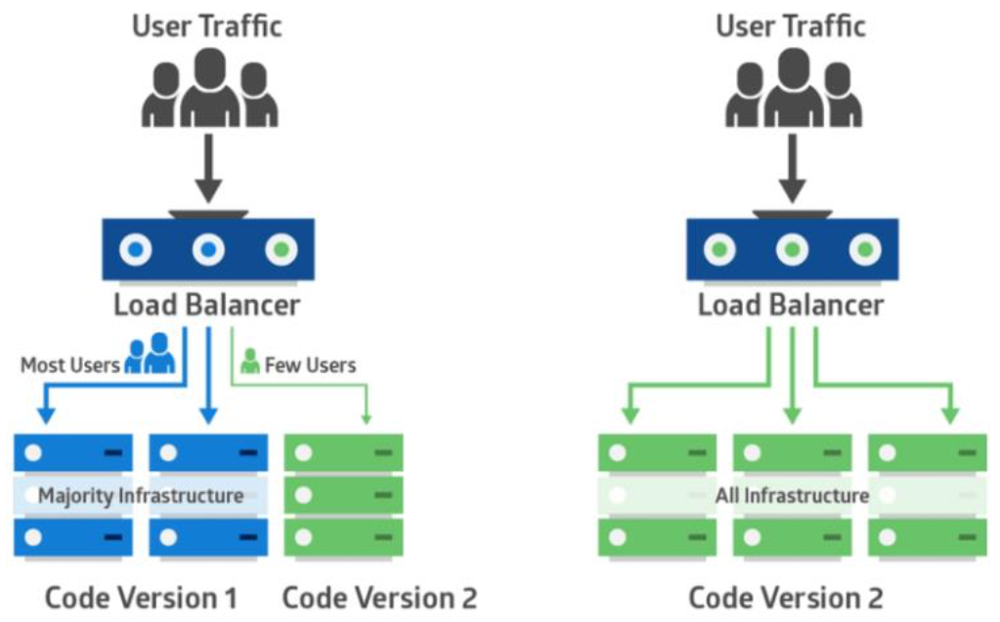

# Lecture 15 DevOps

## What is DevOps?

* Bringing together two traditionally separate groups within software organizations
  * **Development**, typically measured on features completed, code shipped
  * **Operations**, typically measured through stability, reliability, availability
* Benefits: Increased velocity & quality
* Automated process for moving code from dev to release
* Building cohesive, multi-disciplinary teams

## Practice for DevOps

* **Continuous Integration (CI)**
  * Constant testing as code is checked-in/pushed to the repository
  * Verify the build process works
  * Verify unit tests pass, style checks pass, other static analysis tools
  * Build artifacts
* **Continuous Delivery & Deployment (CD)**
  * Moving build artifacts from test -> stage -> prod environments
  * Gate code, if necessary, from advancing without manual approval
* **Infrastructure as Code**
  * Required resources (e.g., cloud services, access policies) are created by code
  * Immutable Infrastructure
    * No update-in-place
    * Replace with new instances, decommission old instances
  * Nothing to prod without it being in code, checked-in, versioned along side code
* **Observability (Monitoring, Logging, Tracing, Metrics)**
  * Be able to know how your application is running in production
  * Track and analyze low-level metrics on performance, resource allocation
  * Capture high-level metrics on application behavior

### CI/CD

* **Continuous Integration (CI)**
  * Commit and check-in code frequently (always can squash later)
  * Commits build on previous commits (know precisely where the build breaks)
  * Automated feedback and testing on commits
  * Artifact creation (e.g., container images, WAR files)
  * Ensure code, supporting infrastructure, documentation are all versioned together
* **Continuous Deployment (CD)**
  * Artifacts automatically shipped into test, stage, production environments
  * Prevent manual deployment, avoids manual steps, early detection of problems
  * Can be tied to a manual promotion technique to advance through environmentys
  * Multi-stage deployment with automatic rollback on failure detection

## Deploying Code

### Nightly Build

* Build code and run smoke test
* Benefits
  * it minimizes integration risk
  * it reduces the risk of low quality
  * it supports easier defect diagnosis
  * it improves morale
* Ring Deployment: Microsoft
  * Dev Channel (weekly builds of Windows 10)
  * Beta Channel (dev + validated updates by Microsoft)
  * Release Preview Channel (highest quality, validated updates)

### Rapid Release

* Four channels: nightly, alpha, beta, release candidate
* Code flows every 2 weeks to next channel, unless fast tracked by release engineer

### Deployments

#### Rolling Deployments

#### Red/Black (Blue/Green) Deployments

#### Canary Deployments

