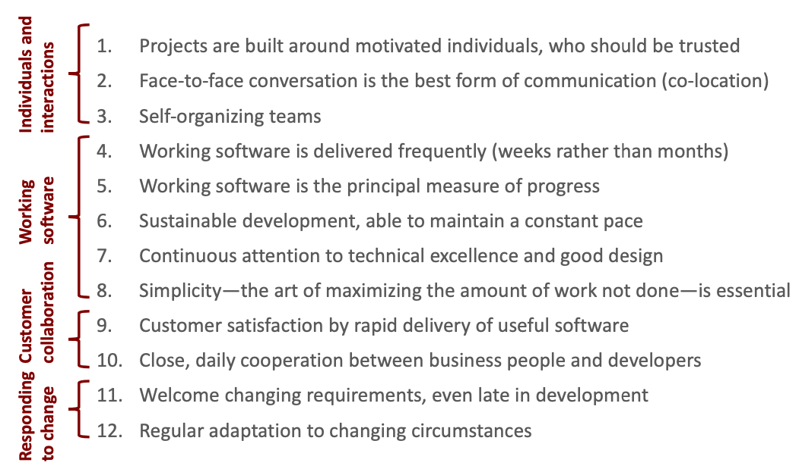

# Lecture 24 Process: Linear to Agile

## The Waterfall Model

* Requirements engineering
* Architectural design
* Detailed design
* Coding
* Unit testing
* Integration testing
* Operation and maintenance

## Iterative Process

* Early and frequent feedback
* Support for constant adaptation
* Address risks first

## Agile

* Value individuals and interactions over processes and tools
* Value working software over comprehensive documentation
* Customer collaboration over contract negotiation
* Responding to change over folloing a plan

* 40-hour week
* Planning poker
* Collective ownership
* Kanban board
* Simple design
* On-site customer
* Pair programming
* Short development cycle
* Small releases
* Continuous Integration (CI)
* Test-driven development
* Open workspace
* Scrum

