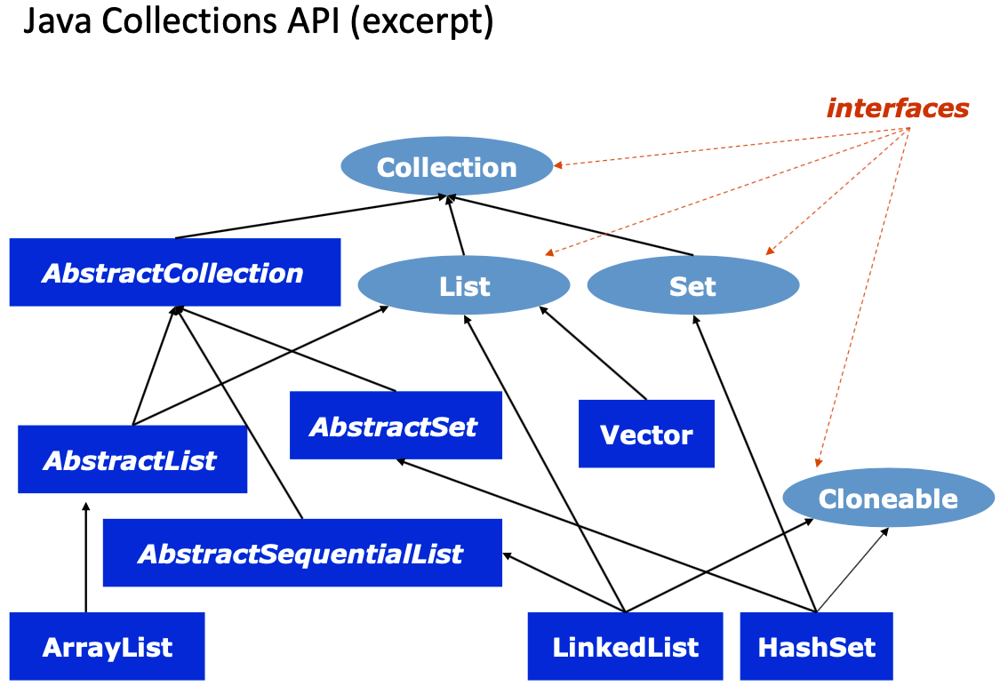

# Lecture 05 Delegation and Inheritance

## Behavioral Subtyping

* "Let q(x) be a property provable about objects x of type T. Then q(y) should be provable for objects y of type S where S is a subtype of T" - Barbara Liskov
* Subtypes must have:
  * **Same or stronger invariants**
  * **Same or stronger postconditions for all methods**
  * **Same or weaker preconditions for all methods**
* e.g., Compiler-enforced rules in Java:
  * Subtypes can add, but not remove methods
  * Concrete class must implement all undefined methods
  * Overriding method must return same type or subtype
  * Overriding method must accept the same parameter types
  * Overriding method may not throw additional exceptions

## Delegation

* **Delegation** is simply when one object relies on another object for some subset of its functionality

* Judicious delegation enables code reuse

  * e.g., here, the `Sorter` is delegating functionality to some `Order`

  * ```java
    interface Order {
      boolean lessThan(int i, int j);
    }
    
    final Order ASCENDING = (i, j) -> i < j;
    final Order DESCENDING = (i, j) -> i > j;
    
    static void sort(int[] list, Order cmp) {
      ...
    	boolean mustSwap = cmp.lessThan(list[i], list[j]);
    	...
    }
    ```

* Using delegation to extend functionality

  * Consider the java.util.List (excerpted):

  * ```java
     public interface List<E> {
       public boolean add(E e);
       public E       remove(int index);
       public void    clear();
       ...
    }
    ```

  * Suppose we want a list that logs its operations to the console

  * ```java
    public class LoggingList<E> implements List<E> {
    	private final List<E> list;
    	public LoggingList<E>(List<E> list) { this.list = list; }
      public boolean add(E e) {
    		System.out.println("Adding " + e);
    		return list.add(e);
      }
    	public E remove(int index) {
        System.out.println("Removing at " + index);
        return list.remove(index);
    	}
      ...
    }
    ```

* Small interfaces with clear contracts

* Classes to encapsulate algorithms, behaviors

## Subtype Polymorphism

* Different kinds of objects can be treated uniformly by client code
* Each object behaves according to its type

## Inheritance

* Interface inheritance for type hierarchy

  * ```java
    public interface Account {
        public long getBalance();
        public void  deposit(long amount);
        public boolean withdraw(long amount);
        public boolean transfer(long amount, Account target);
        public void monthlyAdjustment();
    }
    public interface CheckingAccount extends Account {
        public long getFee();
    }
    public interface SavingsAccount extends Account {
        public double getInterestRate();
    }
    public interface InterestCheckingAccount extends CheckingAccount, SavingsAccount {
    }
    ```

* Implementation inheritance for code reuse

  * ```java
    public abstract class AbstractAccount implements Account {
      protected long balance = 0;
      public long getBalance() {
        return balance;
      }
      abstract public void monthlyAdjustment();
      // other methods...
    }
    
    public class CheckingAccountImpl extends AbstractAccount implements CheckingAccount {
      public void monthlyAdjustment() {
        balance -= getFee();
      }
      public long getFee() { ... }
    }
    ```

* Benefits of inheritance:

  * Reuse of code
  * Modeling flexibility



## Inheritance vs. Subtyping

- Inheritance is for polymorphism and code reuse
  - Write code once and only once
  - Superclass features implicitly available in subclass
- Subtyping is for polymorphism
  - Accessing objects the same way, but getting different behavior
  - Subtype is substitutable for supertype

## Some Java Details

### `final`

* A final field: prevents reassignment to the field after initialization
* A final method: prevents overriding the method
* A final class: prevents extending the class

### Type-casting in Java

* Useful if you know you have a more specific subtype
* e.g., `double pi = 3.14; int indianaPi = (int) pi;`
* **Advice: avoid downcasting types**
  * Never(?) downcast within superclass to a subclass

### `instanceof`

* Operator that tests whether an object is of a given class

* e.g., Warning that this code is bad!

* ```java
  public void doSomething(Account acct) {
  	long adj = 0; Warning:
  	if (acct instanceof CheckingAccount) {
      checkingAcct = (CheckingAccount) acct;
  		adj = checkingAcct.getFee();
  	} else if (acct instanceof SavingsAccount) {
  		savingsAcct = (SavingsAccount) acct; adj = savingsAcct.getInterest();
  	}
  	...
  }
  ```

* **Advice: avoid `instanceof` if possible**

  * Never(?) use instanceof in a superclass to check type against subclass

## Delegation vs. Inheritance

* Inheritance can improve modeling flexibility
* Usually, favor composition/delegation over inheritance
  * Inheritance violates information hiding
  * Delegation supports information hiding
* Design and document for inheritance, or prohibit it
  * Document requirements for overriding any method