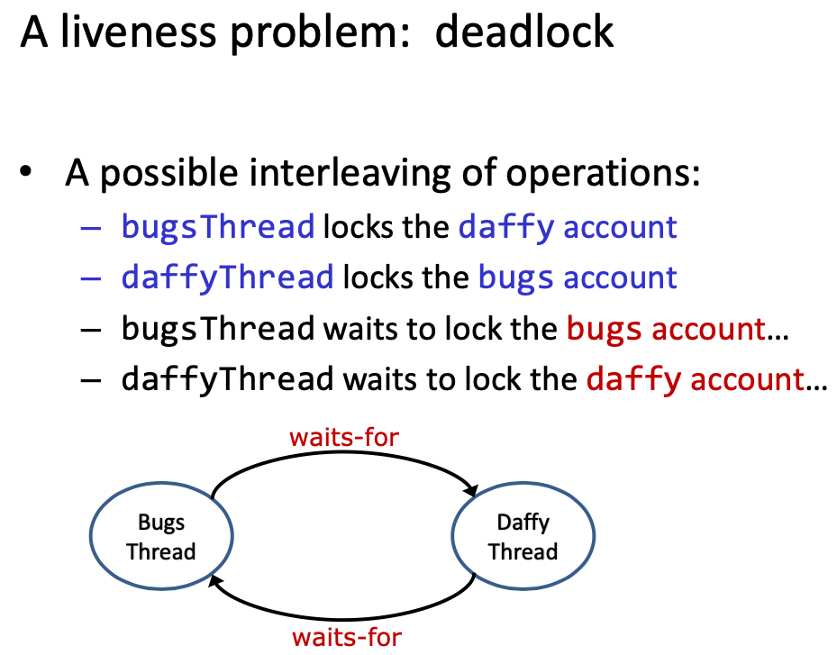

# Lecture 19 Concurrency: Java Primitives, continued

## Challenges of Concurrency

### A Liveness Problem: Poor Performance

```java
public class BankAccount {
  private long balance;
	public BankAccount(long balance) {
    this.balance = balance;
	}
  static synchronized void transferFrom(BankAccount source, BankAccount dest, long amount) {
		source.balance -= amount;
		dest.balance += amount;
  }
  public synchronized long balance() {
    return balance;
	}
}
```

* Lock on class

```java
public class BankAccount {
  private long balance;
	public BankAccount(long balance) {
    this.balance = balance;
	}
	static void transferFrom(BankAccount source, BankAccount dest, long amount) {
    synchronized(BankAccount.class) {
			source.balance -= amount;
			dest.balance += amount;
    }
  }
  public synchronized long balance() {
    return balance;
  }
}
```

* A proposed fix: lock splitting

```java
public class BankAccount {
  private long balance;
	public BankAccount(long balance) {
    this.balance = balance;
	}
	static void transferFrom(BankAccount source, BankAccount dest, long amount) {
    synchronized(source) {
			synchronized(dest) {
        source.balance -= amount;
			}
    }
	}
}
```

### A liveness problem: deadlock



#### Avoiding deadlock

* The **waits-for graph** represents dependencies between threads
  * Each node in the graph represents a thread
  * An edge T1->T2 represents that thread T1 is waiting for a lock T2 owns
* Deadlock has occurred iff the waits-for graph contains a cycle
* One way to avoid deadlock: **locking protocols that avoid cycles**

* Avoiding deadlock by **ordering lock acquisition**

```java
public class BankAccount {
	private long balance;
	private final long id = SerialNumber.generateSerialNumber();
  
	public BankAccount(long balance) {
    this.balance = balance;
	}
  
  static void transferFrom(BankAccount source, BankAccount dest, long amount) {
    BankAccount first = (source.id < dest.id) ? source : dest;
    BankAccount second = (first == source) ? dest : source;
		synchronized (first) {
    	synchronized (second) {
				source.balance -= amount;
				dest.balance += amount;
      }
    }
  }
}
```

### Another subtle problem: The lock object is exposed

* An easy fix: **Use a private lock**

```java
public class BankAccount {
	private long balance;
	private final long id = SerialNumber.generateSerialNumber();
  private final Object lock = new Object();
  
	public BankAccount(long balance) { this.balance = balance; }
  
  static void transferFrom(BankAccount source, BankAccount dest, long amount) {
		BankAccount first = source.id < dest.id ? source : dest;
    BankAccount second = first == source ? dest : source;
    synchronized (first.lock) {
			synchronized (second.lock) {
        source.balance -= amount;
        dest.balance += amount;
			}
    }
	}
}
```

## Concurrency and Information Hiding

* Encapsulate an object's state - Easier to implement invariants
  * Encapsulate synchronization - Easier to implement synchronization policy
* `@ThreadSafe`
  * Place this annotation on methods that can safely be called from more than one thread concurrently
  * The method implementer must ensure thread safety using a variety of possible techniques including immutable data, synchronized shared data, or not using any shared data at all
* `@GuardedBy`
  * Denotes that the annotated method or field can only be accessed when holding the referenced lock
* `@Immutable`
  * Immutable objects are constructed once, in a consistent state, and can be safely shared
  * Immutable objects are naturally thread-safe and can therefore be safely shared among threads

## JUnit does not well-support concurrent tests

### Puzzler: "Racy Little Number"

```java
import org.junit.Test;
import static org.junit.Assert.assertEquals;

public class LittleTest {
  int number;
  
  @Test
  public void test() throws InterruptedException {
		number = 0;
		Thread t = new Thread(() -> {
   	 assertEquals(2, number); // JUnit never sees exception!
		});
		number = 1;
    t.start();
    number++;
    t.join();
 	}
}
```

* It always passes – but it tells us nothing
* **JUnit doesn’t see assertion failures in other threads**
* A possible fix:

```java
// Keep track of assertion failures during test
volatile Exception exception;
volatile Error error;

// Triggers test case failure if any thread asserts failed
@After
public void tearDown() throws Exception {
	if (error != null)
		throw error; // In correct thread
	if (exception != null)
		throw exception; // " " "
}

Thread t = new Thread(() -> {
  try {
          assertEquals(2, number);
  } catch(Error e) {
    error = e;
  } catch(Exception e) {
    exception = e;
  }
});
```

* **Now it** **sometimes** **passes** due to the race condition
* Thus, write JUnit test with a false sense of security
* Concurrent clients beware

## Concurrent Programming can be hard to get right

* Invoke `Thread.start`, not `Thread.run`
  * Can be very difficult to diagnose
* **This is a severe API design bug**
* **Thread should not have implemented Runnable**
  * This confuses is-a and has-a relationships
  * Thread's `runnable` should have been private
* Thread violates the "Minimize accessibility" principle
