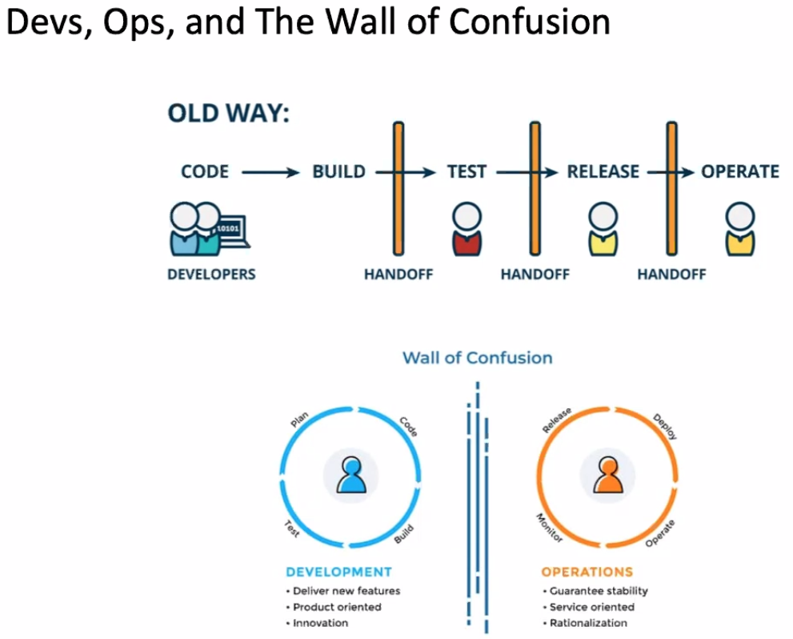
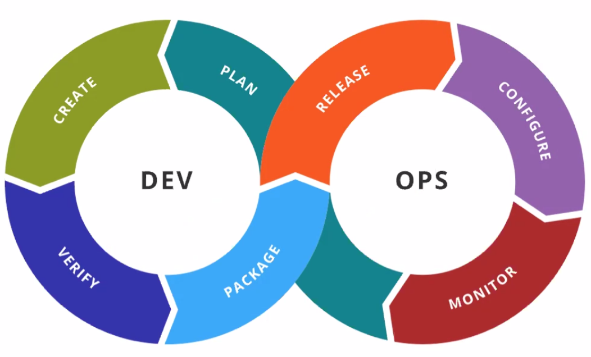
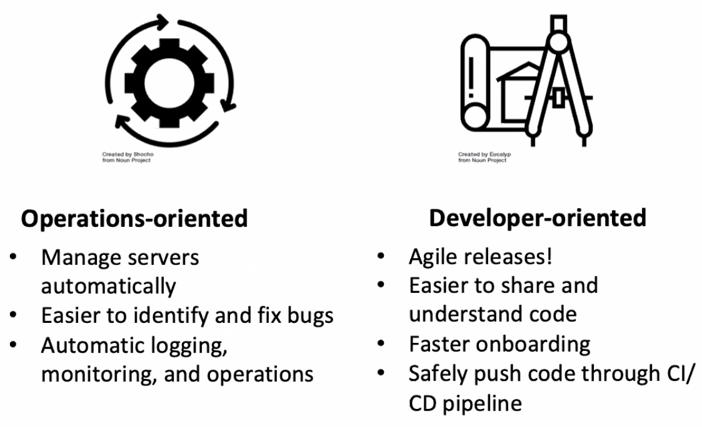

# Lecture 24 DevOps, Git

## Version Management Using Feature Flags

* Feature might be dangerous
* Version control + workflows -> Build managers -> Package managers -> Deployment managers + VM/Containers -> APP market + Update managers

## Devs, Ops, and The Wall of Confusion

* Old way:
  * Code -> Build -> Test -> Release -> Opearte
* Wall of confusion:
  * Development | Operations







### Principles of DevOps

* Breakdown the wall of confusion
* Improve collaboration between dev and ops teams
* Remove the manual and ceremonial aspects from releases
* Get feedback on your changes ASAP
* Configuration as code
  * Manage deployment config files in the version control system
  * Packaging and installation
  * Infrastructure and deployment
    * Docker compose, Ansible, Puppet
    * Docker and Dockerhub
      * Build an image for each release
      * Quickly rollback to stable versions
      * `docker pull mysql:8.0`
      * `docker push christimperleu/darjeeling`
* Automation everywhere
* Continuous deployment is increasingly common
* Exploit opportunities of continuous deployment; perform testing in production and quickly rollback
  * Experiment, measure, and improve

## A Java Puzzeler

```java
public class PrintWords {
  public static void main(String[] args) {
    System.out.println(Words.FIRST + " " + Words.SECOND + " " + Words.THIRD) // Would print "the chemistry set"
  }
  
  public class Words {
    public static final String FIRST = "the"; // Constant variable
    public static final String SECOND = null; // Not a constant variable
    public static final String THIRD = "set"; // Constant variable
  }
  
  public class Words {
    public static final String FIRST = "physics";
    public static final String SECOND = "chemistry";
    public static final String THIRD = "biology";
  }
}
```

* A final primitive of `String` variable whose value is a compile-time constant

* Surprisingly, `null` isn't compile-time constant

* How to fix this?

  * ```java
    // Utility function that simply returns its argument
    private static String ident(String s) {
      return s;
    }
    
    public class Words {
    	public static final String FIRST = ident("the");
    	public static final String FIRST = ident(null);
    	public static final String FIRST = ident("the");
    }
    ```

## Monolithic Repositories

* Huge repository
* Exponential growth