# Lecture 25 Design Pattern Tour

## Design Pattern Illustrations

* Intent - the aim of this pattern
* Use case - a motivating example
* Types - the types that define pattern
* JDK - examples of this pattern in the JDK
* Code sample, diagram, or drawing

## Creational Patterns

### Abstract factory

* Intent - allow creation of **families of related objects independent of implementation**
* Use case - look-and-feel in a GUI toolkit
* Types - *Factory* with methods to create each family member; *Products*, the family members
* JDK - not common

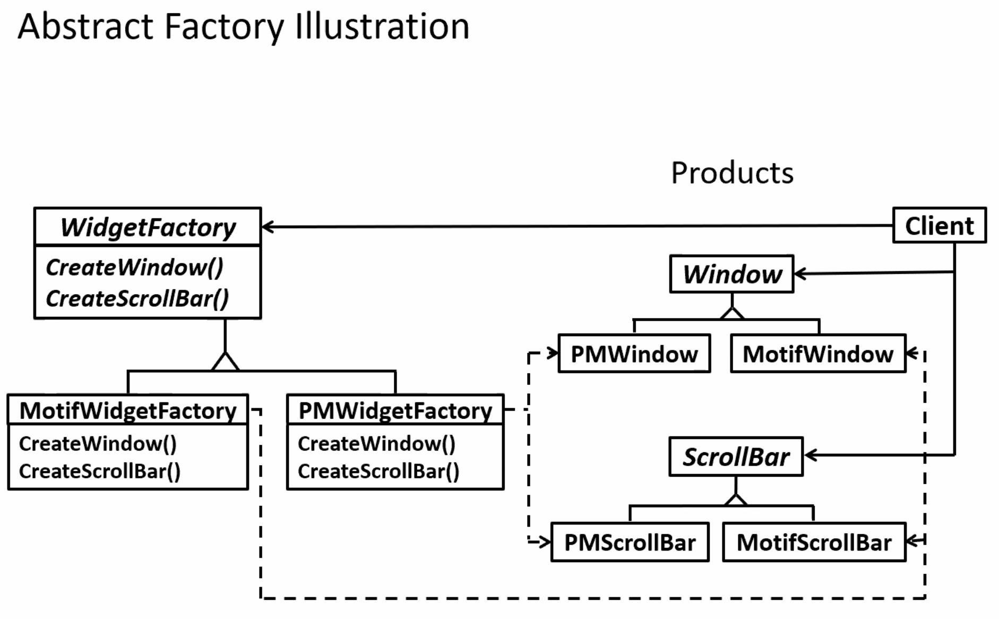

### Builder

* Intent - separate construction of a complex object from its representation so same creation process can create different representations
* Use case - converting rich text to various formats
* Types - Builder, ConcreteBuilders, Director, Products
* JDK - StringBuilder
* EJ Item 1
  * Emulates named parameters in languages that don't support them
  * Emulates $2^n$ constructors or factories with $n$ builder methods, by allowing them to be combined freely
  * Cost is an intermediate (Builder) object
  * Not the same as GoF pattern, but related

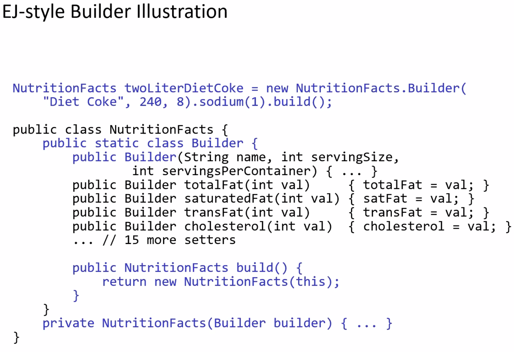

### Factory method

* Intent - abstract creational method that lets subclasses decide which class to instantiate
* Use case - creating documents in a framework
* Types - *Creator*, contains abstract method to create an instance
* JDK - `Iteratble.iterator()`
* Related **Static Factory pattern** is very common
  * Technically not a GoF pattern, but close enough

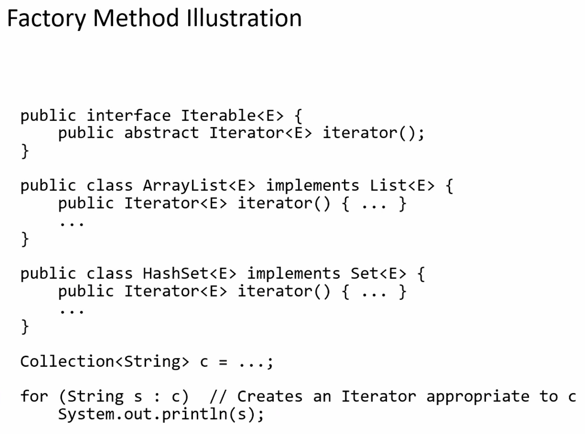

### Prototype

* Intent - create an object by cloning another and tweaking as necessary
* Use case - writing a music score editor in a graphical editor framework
* Types - *Prototype*
* JDK - `Cloneable`, but avoid it (except on arrays)
  * Java and *Prototype* pattern are a poor fit

### Singleton

* Intent - ensuring a class has only one instance
* Use case - GoF say print queue, file system, company in an accounting system
  * **Compelling uses are rare** but they do exist
* Types - *Singleton*
* JDK - `java.lang.Runtime`
* Take
  * It's an **instance-controlled class**; others include
    * Static utility class - non-instantiable
    * Enum - one instance per value, all values known at compile time
    * Interned class - one canonical instance per value, new values created at runtime
  * There is a duality between singleton and static utility class

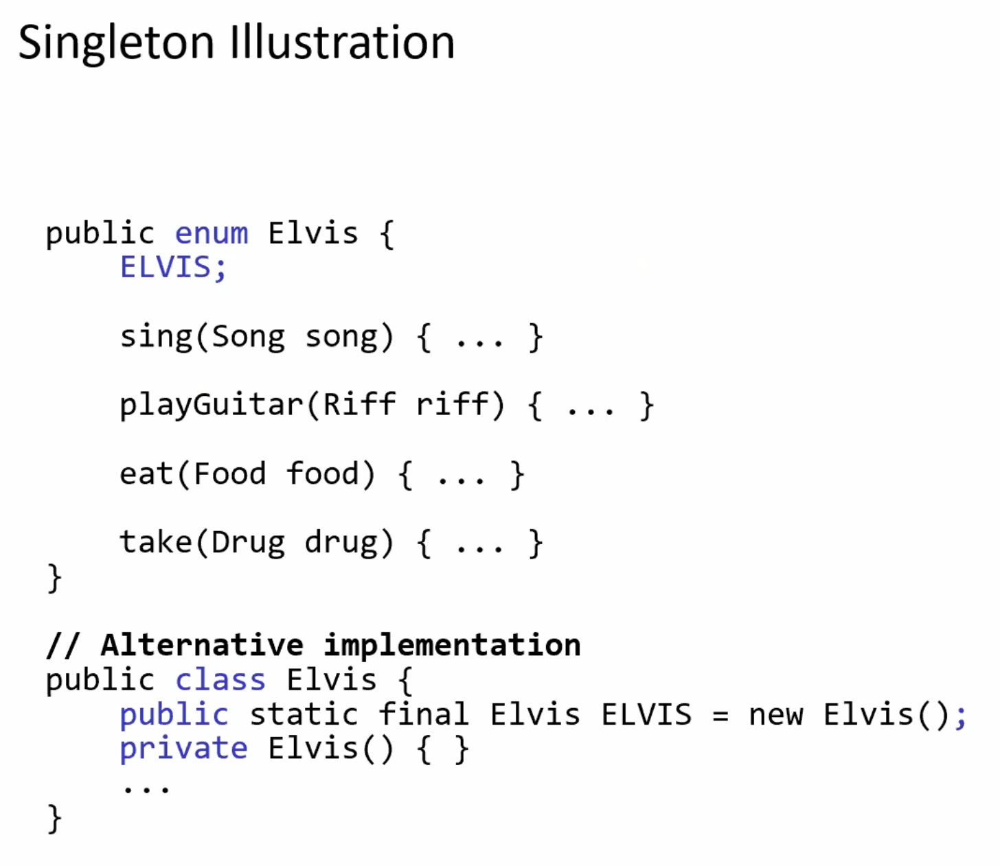

## Structural Patterns

### Adapter

* Intent - convert interface of a class into one that another class requires, allowing interoperability
* Use case - numerous, e.g., arrays vs. collections
* Types - Target, Adaptee, Adapter
* JDK - `Arrays.asList(T[])`

### Bridge

* Intent - decouple an abstraction from its implementation so they can vary independently
* Use case - protable windowing toolkit
* Types - Abstraction, *Implementor*
* JDK - JDBC, Java Cryptography Extension (JCE), Java Naming & Directory Interface (JNDI)
* Bridge pattern very similar to Service Provider
  * Abstraction ~ API, *Implementer* ~ SPI

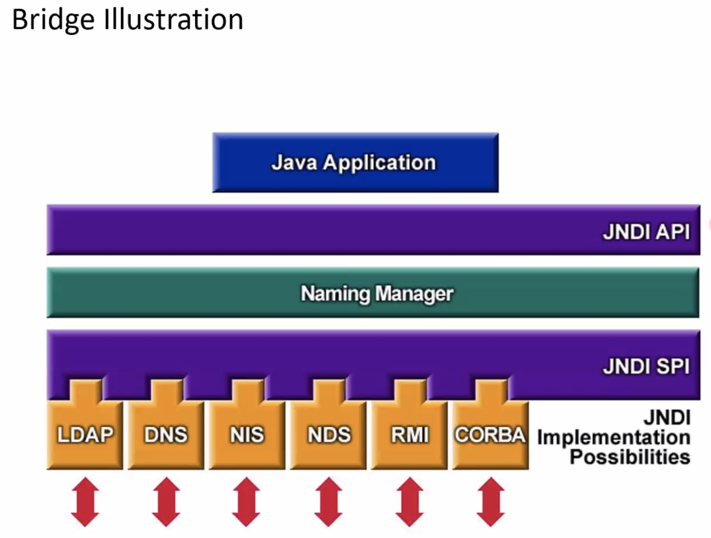

### Composite

* Intent - compose objects into tree structure. **Let clients treat primitives & compositions uniformly**
* Use case - GUI toolkit (wdigets and containers)
* Key type - *Component* that represents both primitives and their containers
* JDK - `javax.swing.JComponent`

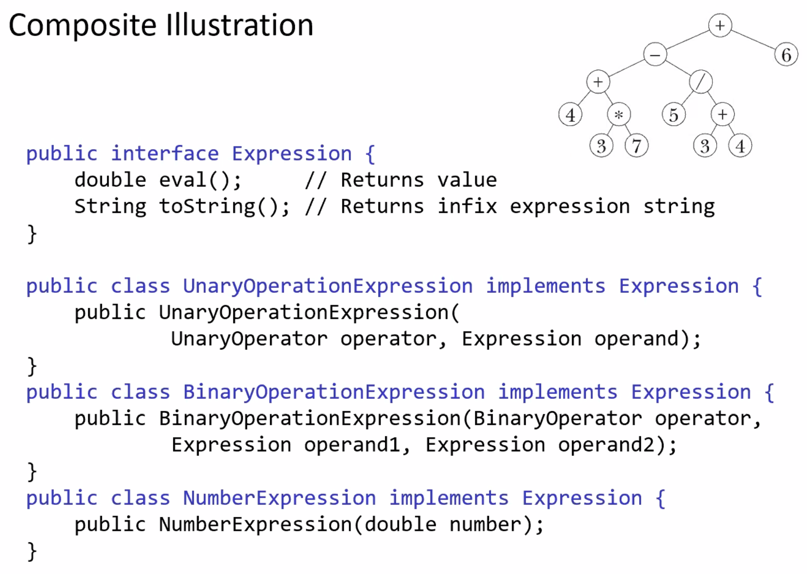

### Decorator

* Intent - attach features to an object dynamically
* Use case - attaching borders in a GUI toolkit
* Types - *Component*, implemented by decorator and decorated
* JDK - Collections (e.g., `Unmodifiable` wrappers), `java.io` streams, Swing components

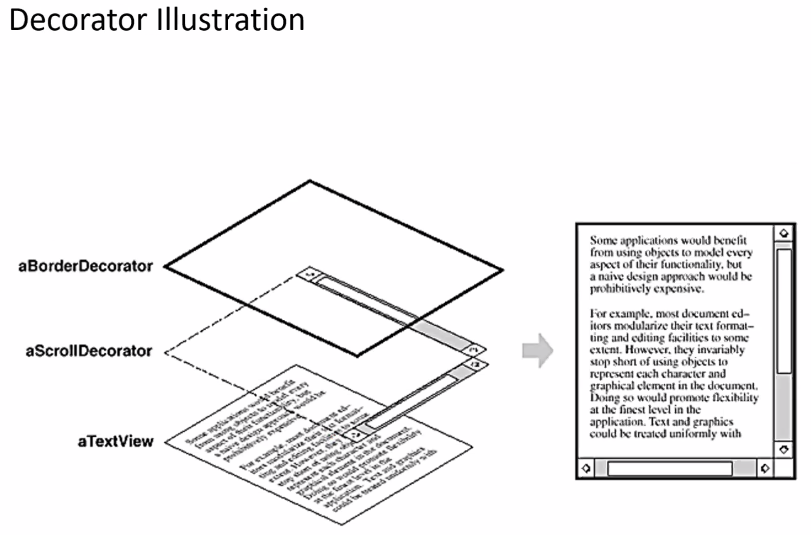

### Facade

* Intent - provide a simple unified interface to a complex set of interfaces in a subsystem
  * GoF allow for variants where complex underpinnings are exposed and hidden
* Use case - any complex system; GoF use compiler
* Types - *Facade* (the simple unified interface)
* JDK - `java.util.concurrent.Executors`

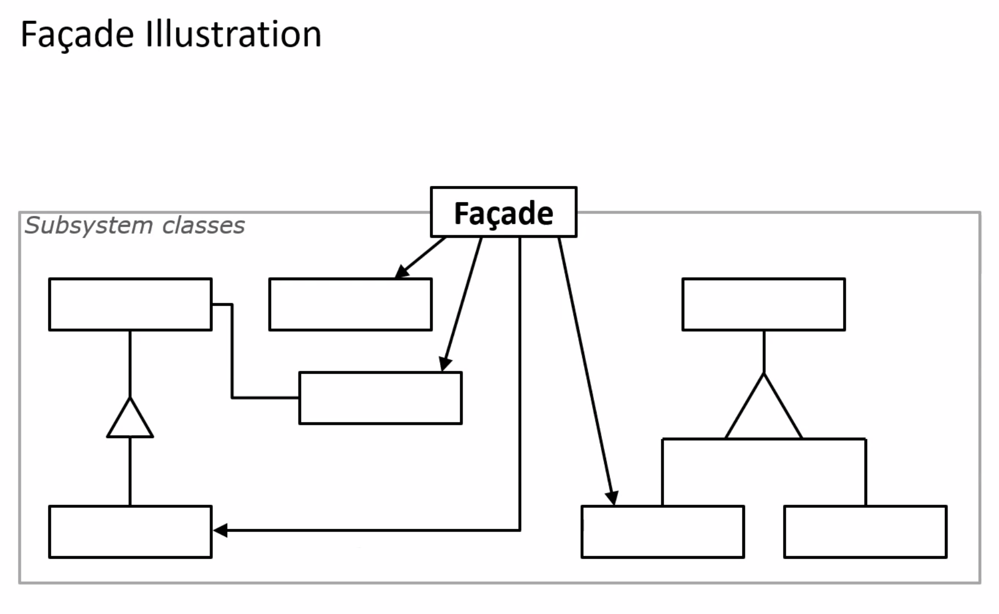

### Flyweight

* Intent - use sharing to support large numbers of fine-grained objects efficiently
* Use case - characters in a document
* Types - Flyweight (instance-controlled)
  * Some state can be extrinsic to recude number of instances
* JDK - Common! All enums, many others
  * `java.util.concurrent.TimeUnit` has number of units as extrinsic state

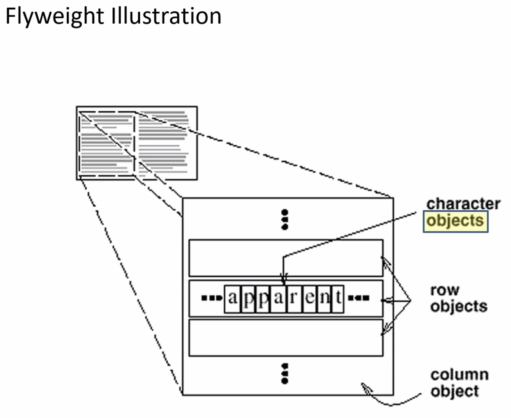

### Proxy

* Intent - surrogate for another object
* Use case - delay loading of images till needed
* Types - *Subject*, Proxy, RealSubject
* GoF mention several flavors
  * virtual proxy - stand-in that instantiates lazily
  * remote proxy - local representative for remote objects
  * protection proxy - denies some operations to some users
  * smart reference - does locking or reference counting
* JDK - RMI, collections wrappers

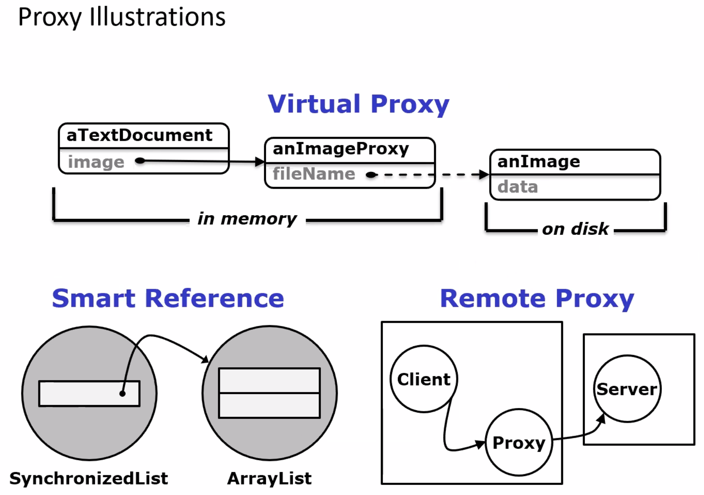

## Behavioral Patterns

### Chain of Responsibility

* Intent - avoid coupling sender to receiver by passing request along until someone handles it
* Use case - context-sensitive help facility
* Types - *RequestHandler*
* JDK - `ClassLoader`, `Properties`
* Exception handling could be considered a form of Chain of Responsibility pattern

### Command

* Intent - encapsulate a request as an object, letting you parametrize one action with another, queue or log request, etc
* Use case - menu tree
* Key type - *Command* (`Runnable`)
* JDK - Common! Executor framework

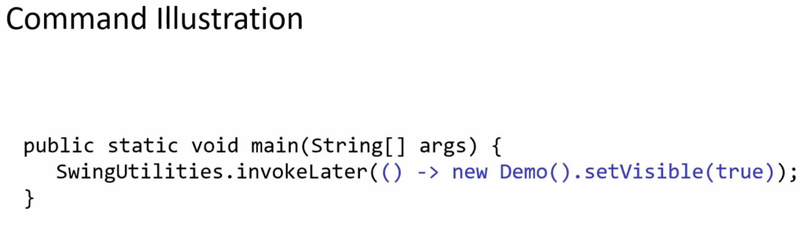

### Interpreter

* Intent - given a language, define class hierarchy for parse tree, recursive methods to interpret it
* Use case - regular expression matching
* Types - *Expression*, *NonterminalExpression*, *TerminalExpression*
* JDK - no uses
* Necessarily uses Composite pattern

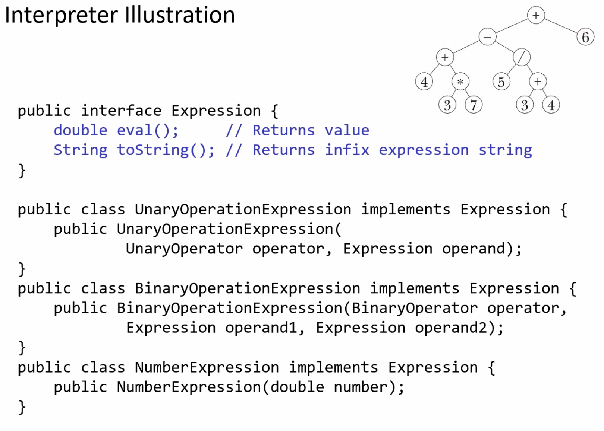

### Iterator

* Intent - provide a way to access elements of a collection without exposing representation
* Use case - collections
* Types - *Iterable*, *Iterator*
  * Bute GoF discuss internal iteration, too
* JDK - collections, for each-statement

### Mediator

* Intent - define an object that encapsulates how a set of objects interact, to reduce coupling
* Use case - dialog box where change in one component affects behavior of others
* Types - Mediator, Components
* JDK - unclear

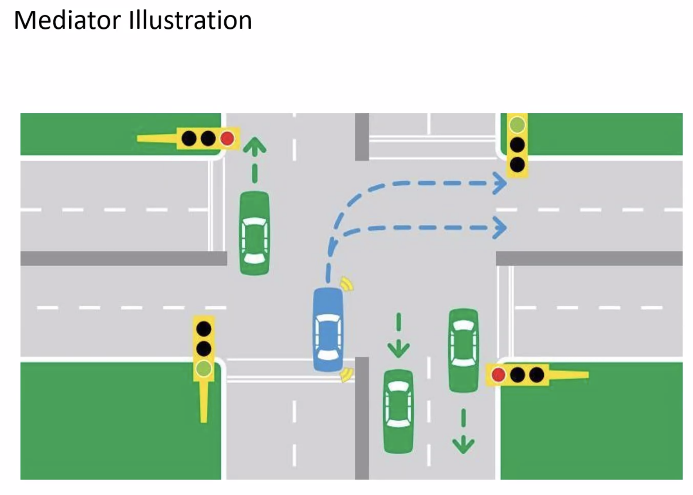

### Memento

* Intent - without violating encapsulation, allow client to capture an object's state, and restore
* Use case - undo stack for operations that aren't easily undone, e.g., line-art editor
* Key type - Memento (opaque state object)
* JDK - none

### Observer

* Intent - let objects observe the behavior of other objects so they can stay in sync
* Use case - mutiple views of a data object in a GUI
* Types - *Subject*, *Observer* (AKA *Listener*)
* JDK - Swing

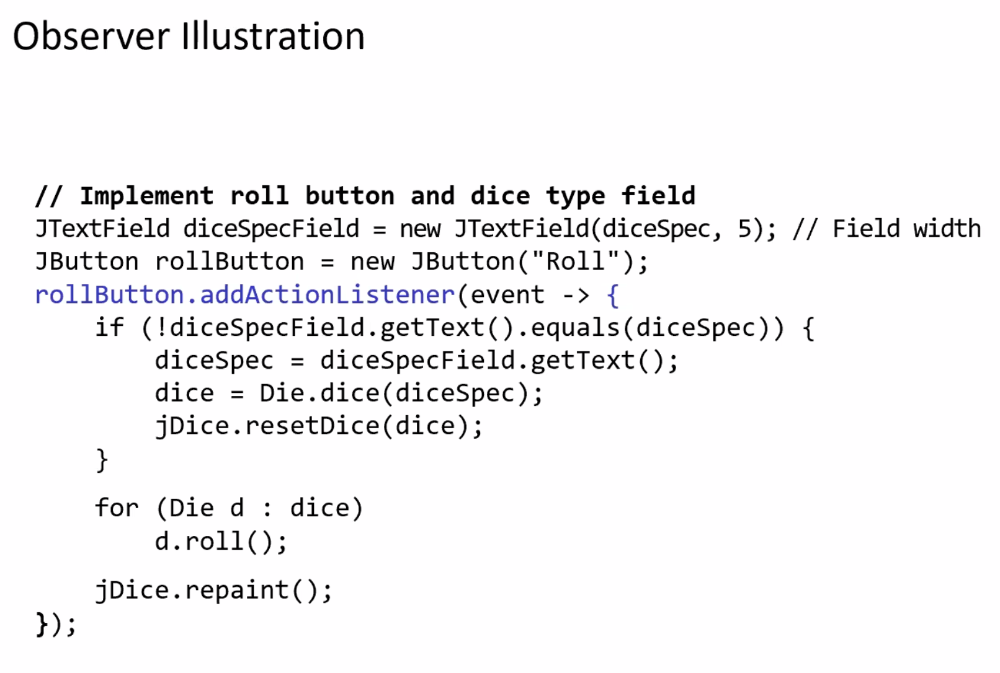

### State

* Intent - allow an object to alter its behavior when internal state changes "Object will appear to change class"
* Use case - TCP Connection (which is stateful)
* Key type - *State* (Object delegates to state)
* JDK - none
  * Works great in Java
  * Use enums as states
  * Use `AtomicReference<State>` to store it (if you need thread-safety)

### Strategy

* Intent - represent a behavior that parameterizes an algorithm for behavior or performance
* Use case - line-breaking for text compositing
* Types - *Strategy*
* JDK - `Comparator`

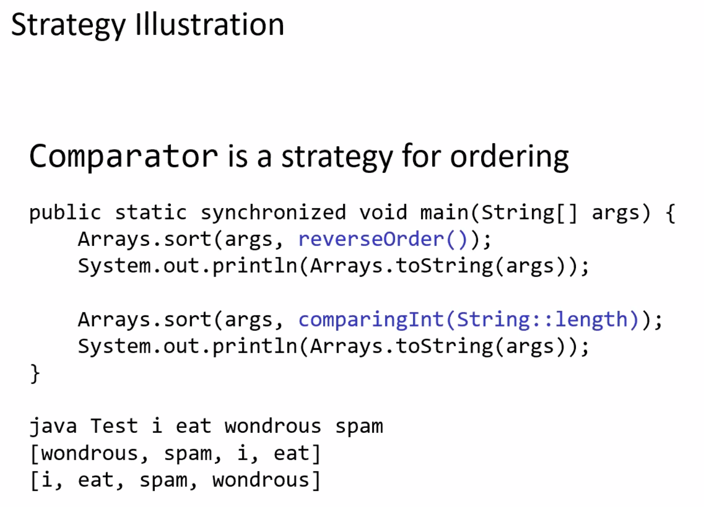

### Template Method

* Intent - define skeleton of an algorithm or data structure, deferring some decisions to subclasses
* Use case - application framework that lets plugins implement all operations on documents
* Types - *AbstractClass*, *ConcreteClass*
* JDK - skeletal collection implementations (e.g., `AbstractList`)

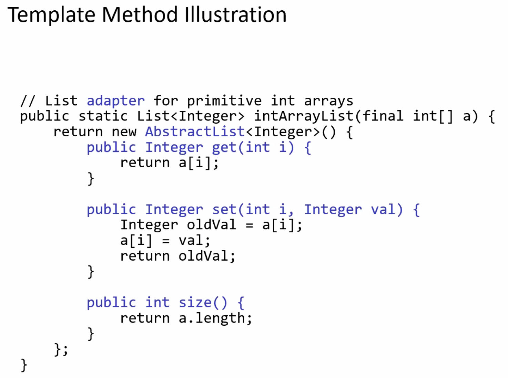

### Visitor

* Intent - represent an operation to be performed on elements of an object structure (e.g., a parse tree)
  * **Visitor let you define a new operation without modifying the type hierarchy**
* Use case - type-checking, pretty-printing, etc
* Types - *Visitor*, *ConcreteVisitors*, all element types that get visited
* JDK - none
* Visitor is NOT merely traversing a graph and applying a method
  * That's Iterator
  * Knowing this can prevent you from flunking a jobs interview
* The essence of visitor is double-dispatch
  * First dynamically dispatch on the Visitor
  * Then on the element being visited

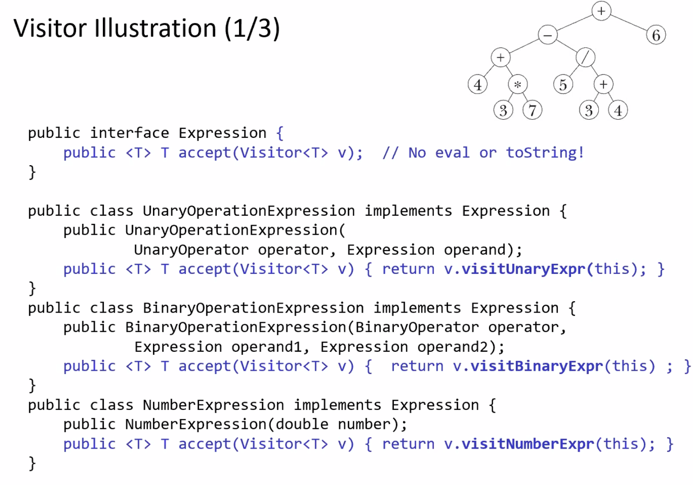

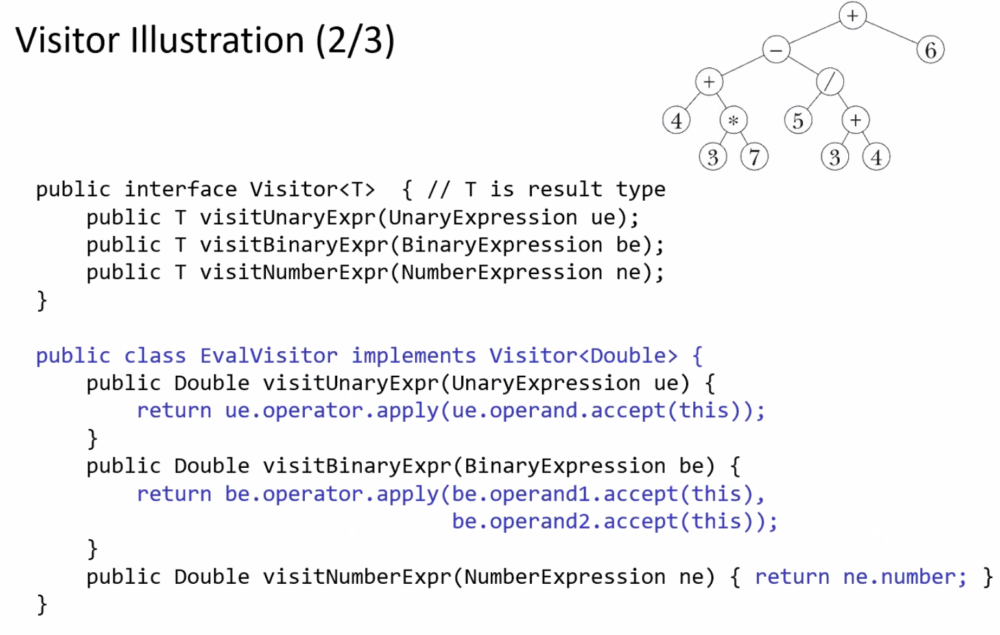

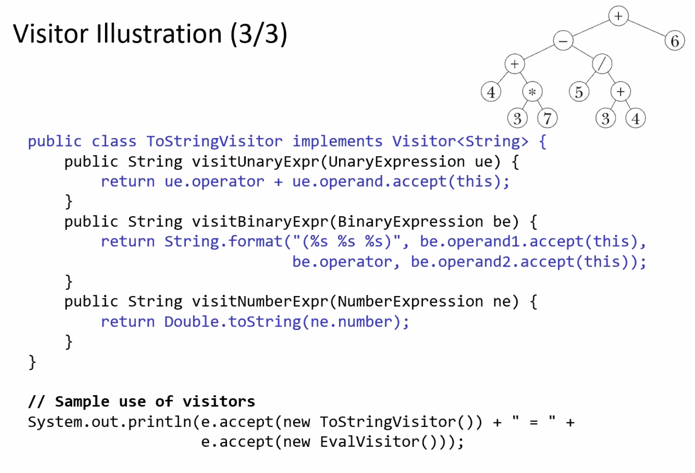

