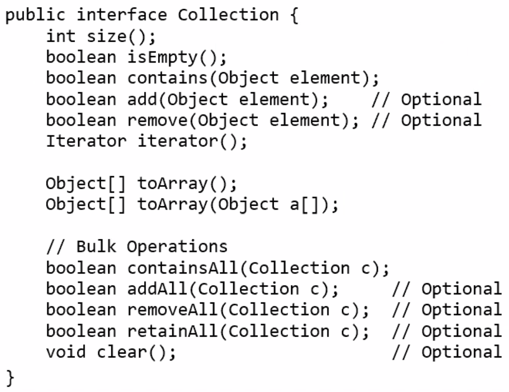

# Lecture 19 Case Study: Java Collections

## Architecture Overview

* Core Collection Interfaces
* General-Purpose Implementations
* Wrapper Implementations
* Abstract Implementations

## Interfaces

### Collection Interface



### Iterator Interface

* Replacement for `Enumeration` interface
  * Adds `remove` method

```java
for (Iterator i = c.iterator(); i.hasNext(); ) {
  if (i.next() == null) {
    i.remove();
  }
}
```

### Set Interface

* Adds no methods to `Collection`
* Adds stipulation: no duplicate elements
* Mandates `equals` and `hashCode` calculation
* `public interface Set extends Collection {}`

### Map Interface

* A key-value mapping

## Collection Idioms

* Set Idioms
* Shuffle Idioms
* List Idioms
* Map Idioms

## Implementation Behavior

* Fail-fast iterator
* Null elements, keys, values permitted
* Not thread-safe

### Synchronization Wrappers

* A new approach to thread safety
* Anonymous implementations, one per core interface
* Static factories take collection of appropriate type
* Thread-safety assured if all access through wrapper
* Must manually synchronize iteration
* Synchronization wrappers are largely obsolete
  * Made obsolete by concurrent collections

## Compatibility

* Upward compatibility
* Backward compatibility