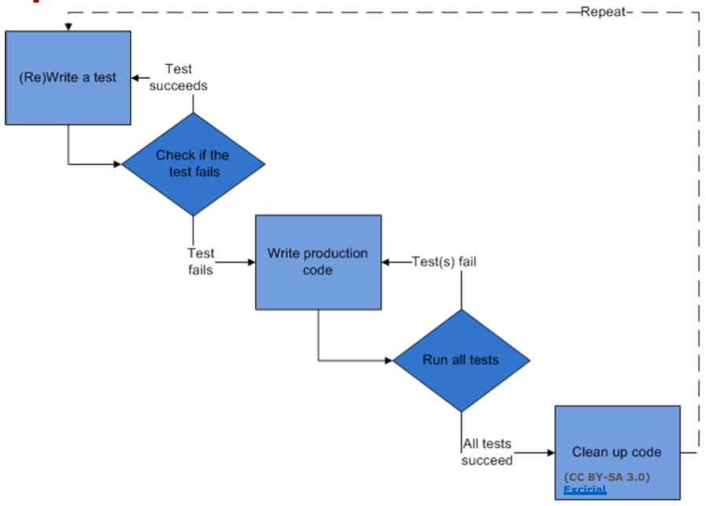

# Lecture 16 Intro to QA, Testing

## QA is Hard

* A story
  * We had initially scheduled time to write tests for both front end and back end systems, although this never happened.
  * Due to the lack of time, we could only conduct individual pages' unit testing. Limited testing was done using use cases. Our team felt that this testing process was rushed and more time and effort should be allocated.
  * We failed completely to adhere to the initial testing plan. From the onset of the development process, we were more concerned with implementing the necessary features than the quality of our implementation, and as a result, we delayed, and eventually, failed to write any tests.
  * We did not end up using Github Issues and Milestones for progress tracking, because of our concern for implementing features. Additionally, once we started the development process, we felt that Github Issues and Milestones had too much overhead for only a week-long development process

## QA Has Many Facets

* Verification: Does the system meet its specification?
* Verification: Are there flaws in design or code?
* Validation: Does the system meet the needs of users?
* Validation: Are there flaws in the specification?
* Systematic examination
  * Automated: Regression testing, static analysis, dynamic analysis
  * Manual: Manual testing, inspection, modeling
  * Code, system, module, execution trace, test case, design or requirements document
  * Functional: code correctness
  * Non-functional: evolvability, safety, maintainability, security, reliability, performance
* Principle techniques
  * Dynamic:
    * Testing: Direct execution of code of code on test data in a controlled environment
    * Analysis: Tools extracting data from test runs
  * Static:
    * Inspection: Human evaluation of code, design documents, modifications
    * Analysis: Tools reasoning about the program without executing it
* Traditional coverage
  * Statement
  * Branch
  * Function
  * Path

## Classic Testing

* Direct execution of code on test data in a controlled environment
* Principle goals:
  * Validation: program meets requirements, including quality attributes
  * Defect testing: reveal failures
* Other goals:
  * Reveal bugs
  * Access quality (hard to quantify)
  * Clarify the specification, documentation
* "Testing shows the presence, not the absence of bugs" - Edsger W. Dijkstra

### What Are We Covering?

* Program/system functionality:
  * Execution space (white box)
  * Input or requirements space (black box)
* The expected user experience (usability)
  * GUI testing, A/B testing
* The expected performance envelope
  * Security, robustness, fuzz, and infrastructure testing
  * Performance and reliability: soak and stress testing
  * Integration and reliability: API/protocol testing

### Testing Levels

* Unit testing
* Integration testing
* System testing

### Test Driven Development

* Tests first
* Write tests as specifications before code
* Never write code without a failing test

### Regression Testing

* Usual model:
  * Introduce regression tests for bug fixes
  * Compare results as code evolves
    * Code1 + TestSet -> TestResults1
    * Code2 + TestSet -> TestResults2
  * As code evolves, compare TestResults1 with TestResults2
* Benefits:
  * Ensure bug fixes remain in place and bugs do not reappear
  * Reduces reliance on specifications
* Measure execution time of critical components

### Fuzz Testing

* Negative software testing method that feeds malformed and unexpected input data to a program, device, or system with the purpose of finding security-related defects, or any critical flaws leading to denial of service, degradation of service, or other undesired behavior

### Stress Testing

* Robustness testing technique: test beyond the limits of normal operation
* Can apply at any level of system granularity

### Soak Testing

* Problem: A system may behave exactly as expected under artificailly limited execution conditions
* Soak testing: testing a system with a significant load over a significant period of time (positive)

