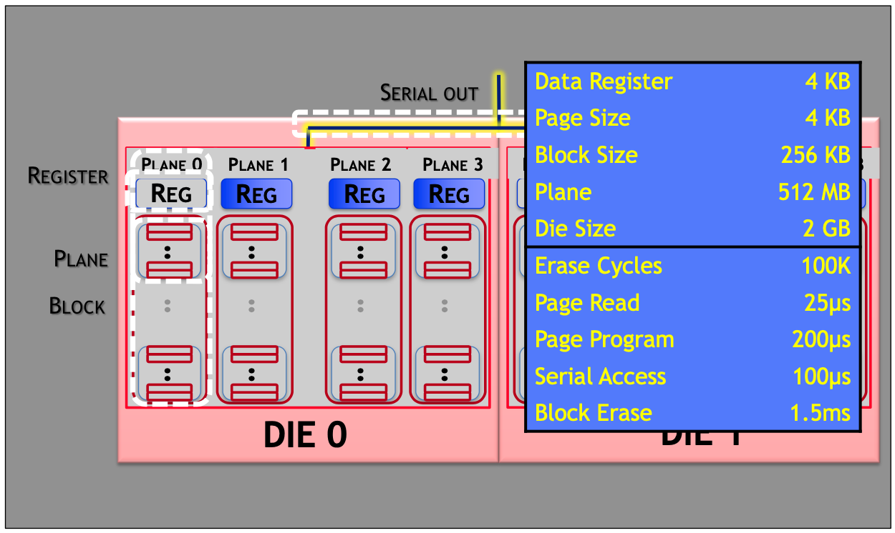
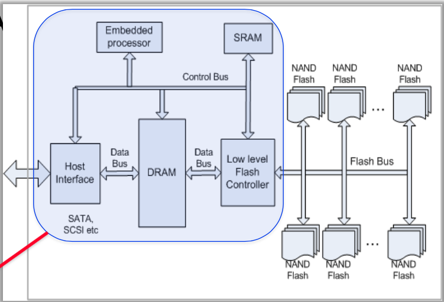

# Lecture 2 Solid-State Disks

## SSD Technologies

* **RAMdisks**: lots of DRAM together with a battery
  * Very expensive, very fast, limited poweroff data retention
    * but, coupled with a disk, battery can allow saving of all data
* **Flash**: Flash != SSD, but most SSD is NAND flash
  * **NOR**: lower density, word accessible, slow write, ~EEPROM
  * **NAND**: write in pages, erase in blocks of pages
* Emerging technologies of note (a.k.a. NVM or SCM)
  * Currently cost as much or more than DRAM

## NAND Flash SSDs

### NAND Flash Circuits

* Add a “floating gate” in a MOSFET cell, insulating it so charge on Floating Gate persists without voltage Vg applied to control gate above it
  * Lasts maybe a year = "long" DRAM refresh
* Read: apply a little control voltage & stored charge
* Erased (1) uses large (-) voltage to flush charge
* Programmed (0) applies large positive voltage to inject charge
* Reading & Writing "wears out" insulation around floating gate

### Flash Storage Organization

* A flash block is a grid of cells (one page per row)
  * Erase: Tunneling releases charge from all cells (Cannot reset bits to 1 except with erase)
  * Program: Tunneling injects charge into some cells
  * Read: NAND operation with a page selected
  * 128 bytes per page hidden for Error Correction Code (ECC), addressing
* A page is the smallest unit for programming and reading, while a block is the smallest unit for erasing
* Planes are parallel in each die, but at most one place performing some operations at one time

### NAND Flash SSD is a little computer

* Storage: flash chips
* Access: multiple independent access channels
* Interface: e.g., SATA
* Controller: computer + RAM
  * Processes cmds
  * Drives channels
  * Write behind
  * Allocation
  * Wear leveling

## SSD Performance

### Performance is really interesting

* Single-page random reads
  * Much, much **lower average latency** than mechanical disk
  * orders of magnitude **higher throughput** than mechanical disks
    * only if exploit device parallelism
* Peak bandwidth
  * depends on **interface speed** and **chip parallelism**
  * varies widely across products
* Write performance is much more complicated

### Write Amplification

* Read-erase-modify-write
* Application worst for small, random writes
* Strategy: freely remap between host & NAND addresses
  * Write LBAs to some place other than where they were before
    * Map granularity **depends** on available DRAM for holding map
    * Read-modify-write
  * Group bunch of different small writes into full blocks
  * Leaves holes in other blocks (where old data was)
  * Rate of cleaning depends on amount of unallocated space
    * Controller reserves X% hidden space or assume host does not use all the space

### Storage Device Interface

* Storage exposed as linear array of logical blocks (LBAs)
  * Common block sizes: sector (0.5-4KB), memory page (4KB), bigger (8-16KB)

### Block Cleaning

* Move remaining valid pages so block can be erased
* Efficiency: Choose blocks to minimize page traffic
* Over-provisioning
* Have host provide "delete" notifications (a.k.a. TRIM)
  * By using TRIM, host reduces cleaning costs and need for over-provisioning

## Media Wearout

### Wear Leveling: spread writing evenly in SSD

* Floating gate insulator degrades, accumulating charge that interferes, even when just reading
* Blocks not written for a long time need to be **rewritten**
  * Read-erase-write or read-move/clean-erase
* Each block can only survive a given number of **erase/program cycles**
* Each block wears **independently**, so a heavily written block can wear out long before a mostly-read block
* **Wear leveling** is remapping of addresses to better balance the number of erase/program cycles seen by each block
* Simple algorithm: if remaining(block-A) >= migrate-threshold, then clean block-A

### Increased Density through more bits per cell

* Smaller feature size (Moore's law)
* More bits (more distinct drain current levels)
* More bits per cell generally means lower cost-per-bit, but also lower endurance and lower performance