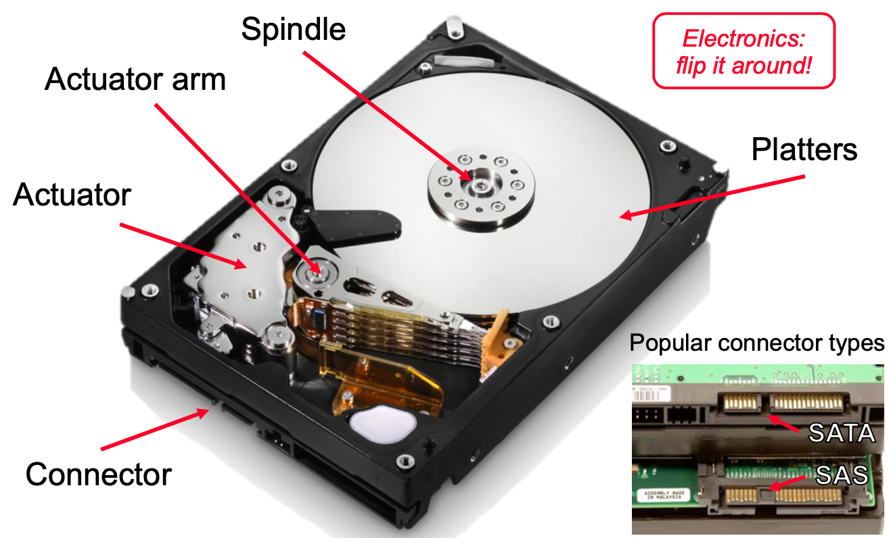
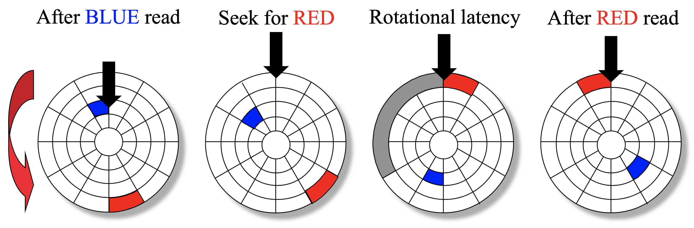
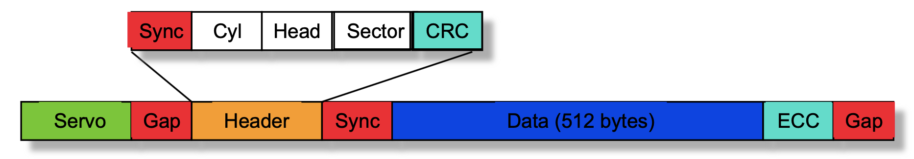

# Lecture 3 Hard Disk Drives

## Hard Disk Drive

* Disk electronics is just like a small computer: processor, memory, network I/F

* Disk structure - top view of single platter
  * Surface organized into tracks
  * Tracks organized into sectors
  * Head in position above a track
  * Rotation in counter-clockwise
  * About to read blue sector
  * Red request scheduled next
* Access Time: Seek Time + Rotational Latency + Data Transfer
* GB = 1 billion bytes = 10^9 bytes
  * That's not 2^30 or 1 GiB
  * The difference is 7%

### Tracks & Sectors

* Adjacent tracks separated by an isolation zone

* Addressable unit is a sector
* Servo = bit pattern used for centering on track
* Sector breaks down into several different fields
  * Typical data portion sizze - was 512-520 bytes, now 4096 bytes
  * Typical format
    * `sync` followed by address field (`cyl`, `head`, `sector`, `crc`)
    * `crc` used to verify `cyl`, `head`, `sector` info (but can not fix the problem)
    * `gap` followed by the data
    * `ecc` over the data to verify data and correct bit errors
    * `header`, `ecc`, `gap` typically use between 40 and 100 bytes

#### ECC

* At such high densities, problems occur frequently
* ECC detects and can allow on-the-fly correction
* When writing a sector, one ends up with one of three states (all written, all not written, sector destroyed)

