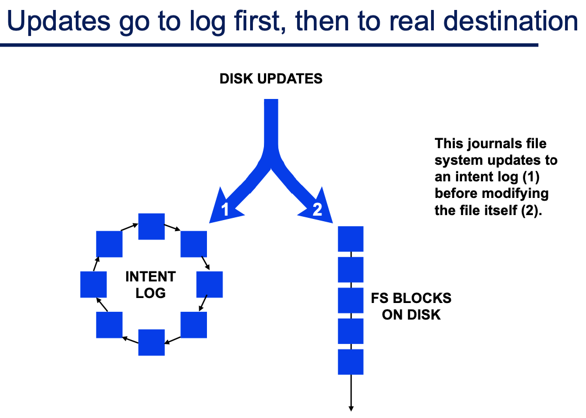

# Lecture 6 Caching and FS Integrity

## Disk Block Caching

* A few very expensive accesses dominate average
* Miss Ratio is a more useful concept than Hit Ratio
  * halving miss ratio can nearly halve average
* Among read requests
  * reads for which not all data is in cache
  * prefetches go to disk but in the background
* Among write requests
  * just put new data into cache and move on
  * writer only waits if no cache space is available for new data
    * or if only read existing block because only subset being written

## Challenges to Internal Consistency

* Concurrent modifications
  * Two processes or systems could induce race conditions
  * Solution: proper use of concurrency control mechanisms
* Media defect growth
  * contents of newly-defective sectors are lost
  * Solution: redundancy of some sort
* Transient storage subsystem oopsies
  * flipped bits on bus, writes to wrong sector
  * Solution: integrity checks plus redundancy
* System crashes
  * volatile main memory contents lost upon system failure
    * only the stuff on stable storage is there upon restart
  * such failures are unpredictable and can happen at any time
  * Solution: on-disk image must always be sufficiently consistent

## Tools for Protecting Internal Consistency

* static mappings
  * if they do not change, they do not cause problems
* "atomicity" of writes
  * in the style of the tri-state post-write guarantee of per-sector ECC
* update ordering
  * simply ensuring that one update propagates before another
* real atomicity
  * ensuring that a set of updates all occur or none do

### "Atomicity" of Writes as a Tool

* Unwritten guarantee provided by per-sector ECC
  * because the ECC check will fail if only partially written
* Same trick (checksum) can be used by FS or app
* Good for grouping inter-related updates
  * but increases likelihood of data loss due to the third state

### Update Ordering

* Good for single-direction dependencies
* Problem: not good for bidirectional dependencies
* Solution: some can be converted to single-direction
  * because some directions are more important than others
  * clean-up must be done after system failures

#### Basic Update Ordering Rules

* Purpose: integrity of metadata pointers
  * in face of unpredictable system failures
* Resource Allocation: initialize resource before setting pointer
* Resource De-allocation: nullify previous pointer before reuse
* Resource Movement: set new pointer before nullifying old one

* FS crash recovery given update ordering
  * Traditional recovery examines entire contents
    * walk entire directory hierarchy and each file's block list
    * identify unclaimed resources and incorrect counts
    * rebuild free space/inode bitmaps
  * Post-crash time to mount
    * Traditional: 10s of minutes

#### Implementing update ordering

* Synchronous writes
  * wait for one write to complete before proceeding
  * this was once the common technique in FSs
    * but, the performance overhead is usually huge
* Soft updates
  * use write-back caching for all non-fsync updates
  * make sure updates propagate to disk in the correct order
    * Works great, but only goes as far as update ordering can go

### Real Multi-write Atomicity as a Tool

* Ensure that multiple updates are all reflected or not
  * by a combination of extra writes and post-failure clean-up
* Good at all of the internal consistency issues
  * may be over-kill (in space + code) for simple requirements

#### Write-ahead Logging

* Pre-post intended changes to log (a.k.a. journal)
  * make sure that it is written before correpsonding blocks
  * log space reclaimed via periodic checkpointing
  * during crash recovery, can roll forward intended changes
* Key concept: recording changes to alternate location first so that a safe version is always present
  * can even deal with third state of ECC thing
* Write-ahead logging can be nearly zero overhead
  * requires delayed log/grouped writes and enforced ordering

#### Shadow Paging

* New versions of data blocks written to new locations
  * never overwrite live data in place; instead remap identity
  * during crash recovery, non-remapped writes discarded
  * deprecated versions of data blocks must be garbage collected
* Key concept: write changes to alternate location and replace previous so that safe version is always present
  * can support transaction also

