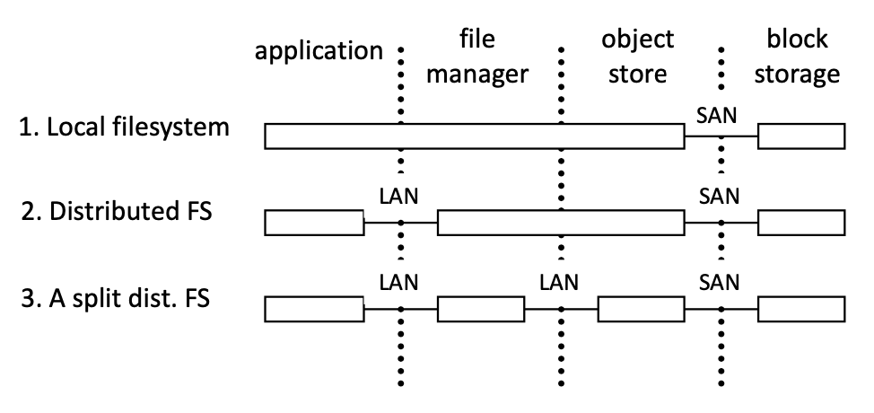

# Lecture 11 Multi-Server Storage

## Partition of Functionality Across Servers

* Two main approaches
  * Do the same thing on each server, but for different data
  * Do something different on each server, for some data
* Common issues
  * Finding the right server for a given task/datum
  * Balancing load across servers and avoiding bottlenecks
  * Avoiding excessive inter-server communication

### Approach #1: Same Function Different Data

* Naming and resource discovery
* **Load balancing**
  * Falls back on data distribution schemes
  * Manual data set placement
  * Striping or pseudo-random distribution

### Approach #2: Different Function Same Data

* Used for flexibility and bottleneck avoidance, rather than load distribution and fault tolerance
* Often combined with approach #1

#### pNFS & NASD

* **pNFS** standardizes Network Attached Secure Disks (**NASD**) concept
* Clients gets a layout from the NFSv4.1 server (aka "metadata server")
* The layout maps the file onto storage devices and addresses
* The client uses the layout to perform direct I/O to storage
* At any time the server can recall the layout
  * Must be done strictly, or may corrupt file system
* Client commits changes and returns the layout when it's done
* pNFS use is **optional**, client can always use regular NFS server I/O

