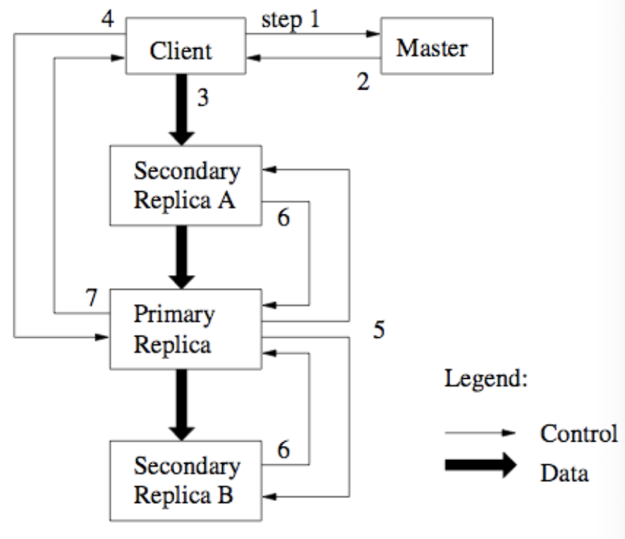

# Lecture 12 Extremely Scalable Storage

## Google's Initial Extreme-scale Storage Design

### Assumptions

* Treat failures as the norm (many cheap server nodes)
  * Design schemes to be less impacted by failure
  * Weaken promises to applications
* Exploit a captive application set, they
  * limited max number of files
  * declared disinterest in small file performance
  * allowed some access patterns to perform poorly
  * changed file system semantics

### Google FS Architecture

* Single GFS master with all metadata in memory
  * all files expected to be large; one block size (64MB)
  * rebuild state often, to allow non-durable state
    * locations of chunks not durable; poll on boot
* Concentrate all synchronization in new operation
  * don't hide inconsistency from application
* Client API is via user-level library (no legacy support)
  * UNIX-like API (but no links, special fast copy)
* Repair/recovery is asynchronous, so over-replicate
  * and spread replicas semi-randomly, considering topology
* No data caching anywhere in Google FS software
  * only in underlying Linux FS on chunk servers

### Dual Ordering

* Chunk transfers & op ordering different
  * one copy of data elected as leader (for ordering)
  * orders writes after data has arrived at all
    * transfer pipeline by distance in IP space
    * design for poor cluster network bisection bandwidth

### Background Maintenance

* Servers periodically confirm their health and their contents
* Background analysis of each chunk (akin to scrubbing)
  * if any replicas are missing, re-replicate
  * gradual slow rebalancing of capacity across chunk servers
  * remove stale chunks with old version numbers
* Delete is just unlink
  * chunks are garbage collected

### Single Metadata Server

* 1:1,000,000 metadata to data size rario
  * essentially forces largs files
* prefix table of pathnames, not directory tree
  * faster, but data management tools all break
* not single threaded
* replicate log & checkpoints

### Hints of GFS2: Colossus

* No longer a single metadata server
  * Shards metadata over many servers
  * Use BigTable to store metadata
* No longer simply replication
  * Use Reed-Solomon (RAID-6 like) encoding
    * File-based, unlike most disk array systems
  * Computes encoding at client
    * Client sends all stripe units rather than chained copying

### Concurrent Sharing

* Concurrent updates can be **undefined**
  * Large transfer split into separate races (like NFS)
* Append as special thin synchronous solution
  * GFS picks and returns append offset (<1/4 chunk)
  * Record appended atomically **at-least-once**
* Applications should validate (**don't trust GFS**)
  * formatting, checkpointing, checksums, sequence numbers (nonces)

|                      | Write                    | Record Append                         |
| -------------------- | ------------------------ | ------------------------------------- |
| Serial success       | defined                  | defined interpersed with inconsistent |
| Concurrent successes | consistent but undefined | ditto                                 |
| Faliure              | inconsistent             | inconsistent                          |

