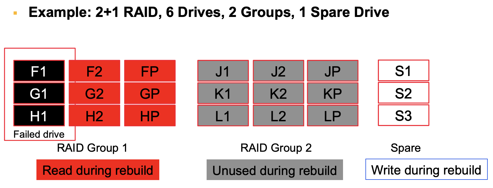
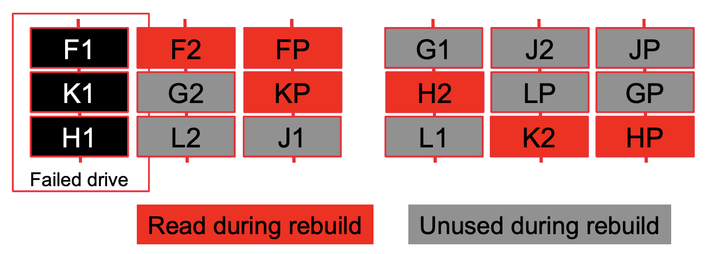
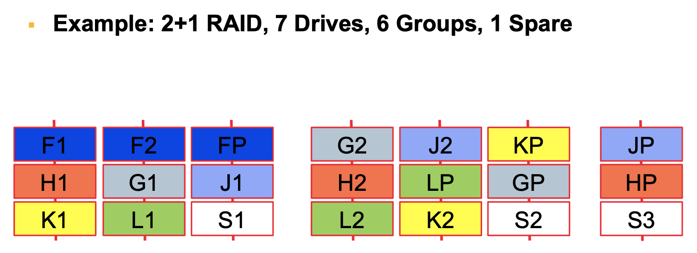

# Lecture 13 RAID Reliability

## Traditional RAID Reliability

* Traditional block-oriented RAID protects and rebuilds entire drives
  * Unfortunately, drive capacity increases have outpaced drive bandwidth
  * Media defects on surviving drives interfere with rebuilds
* RAID rebuild requires **I/O bandwidth**, **memory bandwidth** and **CPU**
  * Rebuild workload creates hotspots

## Declustered Data Placement

* Declustered placement uses the **I/O bandwidth** of many drives
  * Declustering spreads RAID groups over larger number of drives to amplify the disk and network I/O available to the RAID engines

* Declustered spare space improves write I/O bandwidth
  * 1 Disk of data written to 1/3 of 2 or 3 remaining drives
* Spare location places constriants that must be honored
  * Cannot rebuild onto a disk with another element of your group
  * Spread spare space across drives can **reduce MTTR** and **improve throughput**

### Parallel Declustered RAID Rebuild

* Parallel algorithms harness the power of many computers, and for RAID rebuild, the I/O bandwidth of many drives
  * Group rebuild work can be distributed to multiple RAID engines that have access to the data over a network

### Declustering in GoogleFS (HDFS)

* Each chunk replicated across N different nodes
  * Different set of N nodes for each chunk in each file
* **All files** impacted by a failed node have N-1 copies
* Rebuild builds a new copy of each chunk at random
  * Spread evenly over all nodes
* Reconstruction is a distributed algorithm and can scale with more nodes

