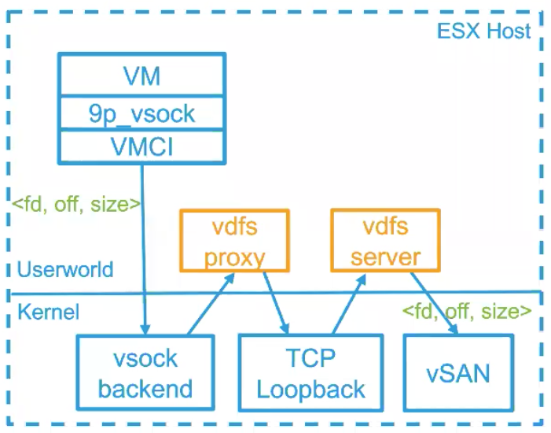
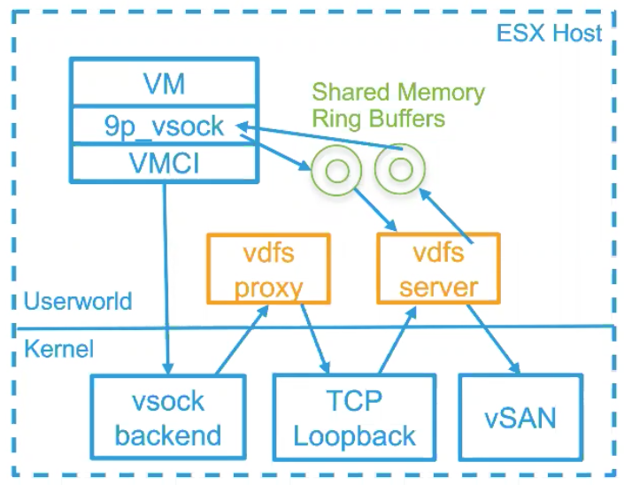

# vSAN, VDFS, and Practical Cache Design in Storage Systems

## vSAN: Distributed Block Storage with High Availability

* Setting failures to tolerate (FTT) to 1 with RAID-5 erausre coding or to 2 with RAID-6
* Guranteed space reduction
* Full stripe write
  * Efficient writes with RAID-6
  * 4 writes -> 6 writes -> 1.5x amplication
* Partial stripe write
  * The difficulty with RAID-6
  * 1 write -> 3 reads, 3 writes -> 6x amplication
  * How to make it correct in failures?
    * Two-phase commit
  * How to make it fast?
    * Log structured file system

## VDFS: Virtual Distributed File System

* VDFS IO path: vdfs proxy, vdfs server
* Multiple data copy in the data path
* Long latency in metadata path
* Crossed: VM address space as a file descriptor
  * Pass <crossfd, offset, size> around
  * vSAN operates on VM buffer indirectly
  * Increased throughput by 10x

* VDFS shared memory metadata path
  * Shared ring buffers between VM and VDFS
  * Poll-based message passing
  * Reduces latency significantly

## Cache: Critical Piece in Storage Data Path

* Many features are added with levels of indirection
  * Directory, File abstraction
  * vSAN Object offset -> Component offset
  * Component offset -> Physical address
  * Deduplication: SHA Hash -> Physical address
* **Any problem can be solved by adding a level of indirection, except the problem of too many levels of indirections**
* **Cache: hide the level of indirection**
  * Cache is a fast storage, but expensive
  * Main storage is slower, large and cheap
  * Cache can be have multiple layers
    * L1 -> L2 -> L3 -> RAM -> Persistent Memory -> NVMe -> SSD -> MD -> S3 -> S3 Glacier -> S3 Glacier Deep Archive
* Workload characteristics
  * Temporal locality
  * Spatial locality
  * Frequency (probability)
  * Sequential scan
  * Large loop
  * Uniform random - difficult to be cached
* Least Recently Used (LRU)
  * Always evict the least recently used item
  * Why production systems rarely use LRU?
    * Lock contention
    * CPU overhead
    * Low hit ratio in workloads with sequential scan, large loop
* Reduce Lock Contention
  * Concurrent access to cache cause lock contention
  * Is a serious problem when hit ratio is high
  * One solution: sharding by block number
  * Hight number of shards do not reduce hit ratio by much
  * Cache speedup = 1 / MissRatio
* Clock - Lower the CPU Overhead of LRU
  * Array of cache entries and each entry has a bit: referenced
  * On hit: set the Ref bit
  * On miss: move clock pointer to look for entries where Ref == 0 and clear Ref bit along the way
  * Similar cache hit ratio as LRU and easy to implement

### Advanced Replacement Algorithms

* 2Q
  * Cache is split into two
    * Hot LRU: 3/4 cache size
    * Cold FIFO: 1/4 cache size
  * Ghost buffer (only storing block number) does not hold data: 1/2 cache size
  * Cold FIFO filters out correlated references

* Clock2Q: A better 2Q
  * How to reduce CPU cost?
    * replace LRU with clock
  * How to reduce memory size?
    * Use array instead of list for FIFO -> Saves 16 bytes per entry for cold & ghost queue
  * Does sharding work for reducing lock contention?
    * Cannot handle reservation

* Concurrent Clock2Q
  * Pre-allocate all entries at cache hit
  * Use atomic variables for clock pointer, FIFO head/tail pointer
  * Each hash bucket has a lock: mutex (user-level) or spinlock (kernel)
  * Average 0.75 nodes per bucket -> Low lock contention
  * Future work: use RCU list
  * Each cache entry has a lock: mutex
  * Cache lookup
    * Lock hash table, then lock cache entry
  * Insert cache entry:
    * Lock cache entry, then lock hash table
  * How to avoid deadlock?
    * Lock order: 1st -> cache entry 2nd -> hash bucket