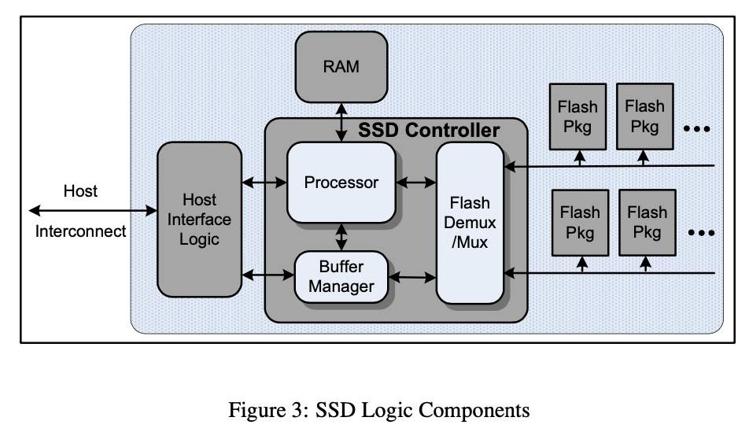

# Design Tradeoffs for SSD Performance

## Flash Memory

* **Flash memory** is an electronic non-volatile computer memory storage medium that can be electrically erased and reprogrammed
* Two main types: **NAND** (Not-And) and **NOR** (Not-Or) logic gates
* **Floating-gate** memory
* Based on **EEPROM** (electrically erasable programmable read-only memory)
* NAND-type flash memory can be erased, written, and read in blocks (or pages)
* NOR-type flash allows a single machine word (byte) to be written to an erased location or read independently
* A flash memory device consists of one or **more** memory chips (aka dies, each holding many flash memory **cells**)
* Comparing to non-flash EEPROM with slow erase cycles, flash memory has significant speed advantage when writing large amounts of data due to **larger block size**

## Background

### Flash Packages

* 4GB Flash Package
  * two 2GB dies
  * sharing an 8-bit serial I/O bus and a number of common control signals
  * each die contains 8192 blocks, organized among 4 planes of 2048 blocks
  * the dies can opearte independently, each performing operations involving one or two planes (0 & 1 or 2 & 3)
  * each block in turn consists of 64 4KB pages
  * each page includes a 128 byte region to store metadata

### Bandwidth and Interleaving

* Interleaving can provide considerable speedups when the operation latency is greater than the serial access latency
* Operations on the same flash plane cannot be interleaved

## SSD Basics

* All NAND-based SSDs are constructed from an array of flash packages
* Each SSD must contain a **host interface logic** to support some form of physical host interface connection (USB, FiberChannel, PCI Express, SATA) and logical disk emulation
* The **bandwidth of the host interconnect** is often a critical constraint on the performance of the device as a whole
* An internal **buffer manager** holds pending and satisfied requests along the primary data path
* A **multiplexer** (Flash Demux/Mux) emits commands and handles transport of data along the serial connection to flash packages
* A processing engine is also required to manage the request flow and **mappings** from disk logical block address to physical flash location
* The processor, buffer manager, and multiplexer are typically implemented in **a discrete component** such as an ASIC or FPGA, and data flow between these logic elements is very fast
* The processor, and its associated RAM, may be **integrated**, as is the case for simple USD flash-stick devices

### Logical Block Map

* To achieve acceptable performance, writes must be performed **sequentially** whenever possible
* Each write of a single **logical-disk block address** (LBA) corresponds to a write of a different flash page, even the simplest SSD must maintain some **mapping** between logical block address and physical flash location
* We assume that the logical block map is head in **volatile** memory and **reconstructed** from stable storage at startup time

